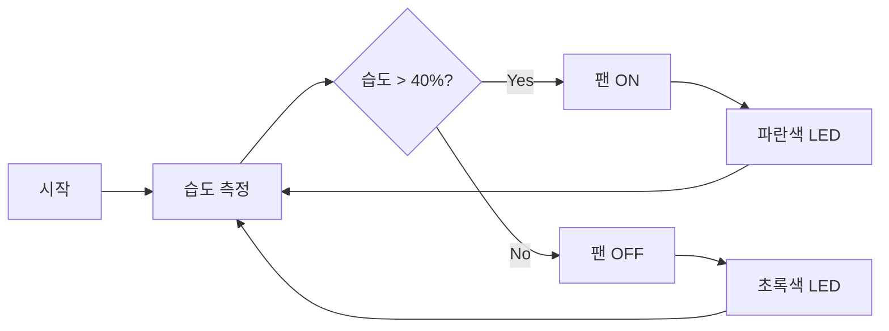

# 고무장갑건조대 (Rubber Glove Dryer)

> 아두이노 기반 자동 고무장갑 건조 시스템 - 초급자 학습 프로젝트

## 📋 프로젝트 개요

고무장갑을 효율적으로 건조시키는 아두이노 기반 자동화 시스템입니다. 
아두이노 초급 개발자가 단계적으로 학습하며 완성할 수 있도록 설계되었습니다.

### 핵심 기능
- ✅ **자동 건조**: 팬을 이용한 공기 순환
- ✅ **습도 감지**: DHT22 센서로 건조 완료 자동 감지
- ✅ **타이머 기능**: 설정 시간 후 자동 종료
- ✅ **LED 상태 표시**: 동작 상태 시각화
- 🔧 **온도 제어**: 히터를 이용한 온풍 건조 (고급 기능)
- 🔧 **IoT 연동**: 스마트폰 원격 제어 (고급 기능)

---

## 🎯 학습 목표

이 프로젝트를 통해 다음을 학습할 수 있습니다:

1. **아두이노 기초**: 디지털/아날로그 입출력, 시리얼 통신
2. **센서 활용**: DHT22 온습도 센서 사용법
3. **액추에이터 제어**: 팬, LED, 릴레이 제어
4. **자동화 로직**: 조건 기반 자동 제어 시스템
5. **IoT 기초**: WiFi 연동 및 원격 제어 (선택)

---

## 📦 필요한 하드웨어 (기본 구성)

| 부품명 | 수량 | 예상 가격 |
|--------|------|-----------|
| Arduino Uno/Nano | 1 | 15,000원 |
| DHT22 온습도 센서 | 1 | 5,000원 |
| 5V DC 팬 | 1-2 | 3,000원 |
| 릴레이 모듈 (5V) | 1 | 2,000원 |
| RGB LED | 1 | 500원 |
| 택트 스위치 | 2-3 | 1,000원 |
| 브레드보드 + 점퍼선 | 1세트 | 6,000원 |
| 5V 전원 어댑터 | 1 | 5,000원 |

**총 예상 비용**: 약 38,000원

---

## 🚀 빠른 시작

### 1단계: 개발 환경 설정
```bash
1. Arduino IDE 설치 (https://www.arduino.cc/en/software)
2. USB 드라이버 설치 (CH340/CP2102)
3. 아두이노 보드 연결 및 Blink 예제 테스트
```

### 2단계: 라이브러리 설치
Arduino IDE에서 다음 라이브러리 설치:
- DHT sensor library (by Adafruit)
- Adafruit Unified Sensor

### 3단계: 단계별 학습
프로젝트는 4단계로 구성되어 있습니다:
- **Phase 1**: 아두이노 기초 (1-2주)
- **Phase 2**: 센서 및 액추에이터 제어 (2-3주)
- **Phase 3**: 기능 통합 (2-3주)
- **Phase 4**: 고급 기능 (선택, 3-4주)

> 📖 상세한 학습 계획은 [구현 계획서](file:///C:/Users/h/.gemini/antigravity/brain/6fb3ebc4-b387-4e02-b56c-ccc0fae868e9/implementation_plan.md)를 참고하세요.

---

## 💡 기본 동작 원리



---

## 📁 프로젝트 구조 (예정)

```
고무장갑건조대/
├── README.md (이 문서)
├── docs/
│   ├── circuit_diagrams/      # 회로도
│   ├── learning_materials/    # 학습 자료
│   └── troubleshooting.md     # 문제 해결
├── src/
│   ├── phase1_basics/         # 기초 예제
│   ├── phase2_sensors/        # 센서 제어
│   ├── phase3_integration/    # 통합 시스템
│   └── phase4_advanced/       # 고급 기능
└── hardware/
    └── parts_list.md          # 부품 목록
```

---

## ⚠️ 안전 주의사항

> [!CAUTION]
> 전기 안전에 각별히 주의하세요!

- ⚡ 아두이노와 고전력 부품(팬, 히터)의 전원 분리
- ⚡ 고전력 부품은 반드시 릴레이를 통해 제어
- ⚡ 히터 사용 시 온도 센서와 자동 차단 회로 필수
- ⚡ 모든 전기 연결부 절연 처리
- ⚡ 실제 사용 전 충분한 테스트

---

## 📚 학습 자료

### 공식 문서
- [Arduino 공식 튜토리얼](https://www.arduino.cc/en/Tutorial/HomePage)
- [Arduino 언어 레퍼런스](https://www.arduino.cc/reference/ko/)

### 추천 학습 순서
1. Arduino IDE 설치 및 기본 예제 (Blink, Button)
2. 센서 입력 및 시리얼 통신
3. DHT22 센서 사용법
4. 릴레이/모터 제어
5. 기본 자동화 로직 구현
6. 타이머 및 상태 관리

---

## 🎓 예상 학습 기간

- **최소 (기본 기능)**: 6-8주
- **권장 (고급 기능 포함)**: 10-12주
- **1일 학습 시간**: 1-2시간

---

## 🔧 다음 단계

### 즉시 시작 가능한 작업
- [ ] Arduino IDE 설치
- [ ] 아두이노 보드 구매 (Uno 또는 Nano)
- [ ] 기본 부품 구매 (DHT22, 팬, 릴레이, LED)
- [ ] Blink 예제로 보드 테스트
- [ ] 구현 계획서 검토

---

## 📞 문의 및 기여

개선 사항이나 질문이 있다면 언제든 공유해주세요!

**Happy Making! 🚀**

---

*Last Updated: 2026-02-01*
