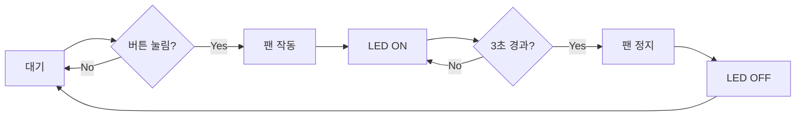

# 고무장갑 벗기는 바람 장치

> 아두이노 기반 고무장갑 탈착 보조 장치 - 초급자 학습 프로젝트

## 📋 프로젝트 개요

### 문제 정의
안에 면이 없는 고무장갑을 벗을 때 손에 땀이 차서 잘 벗겨지지 않는 문제를 해결합니다.

### 해결 방안
고무장갑 내부에 공기를 불어넣어 손과 장갑 사이에 공간을 만들어 쉽게 벗을 수 있도록 합니다.

### 핵심 기능
- ✅ **버튼 활성화**: 버튼을 누르면 블로워 팬 작동
- ✅ **공기 주입**: 고무장갑 손목 부분에 공기 주입
- ✅ **자동 정지**: 3초 후 자동 종료
- ✅ **LED 상태 표시**: 동작 중 시각적 피드백
- 🔧 **속도 조절**: 가변저항으로 풍량 조절 (고급)
- 🔧 **자동 감지**: 손 감지 자동 작동 (고급)

---

## 🎯 학습 목표

이 프로젝트를 통해 다음을 학습할 수 있습니다:

1. **아두이노 기초**: 디지털 입출력, 버튼 입력 처리
2. **모터 제어**: DC 모터 드라이버 사용법, PWM 속도 제어
3. **타이머 구현**: millis() 함수를 이용한 비차단 타이머
4. **3D 프린팅**: 실용적인 케이스 및 노즐 설계
5. **문제 해결**: 디버깅 및 최적화 경험

---

## 💡 동작 원리



---

## 📦 필요한 하드웨어

### 전자 부품 (기본 구성)

| 부품명 | 수량 | 예상 가격 | 사양 |
|--------|------|-----------|------|
| Arduino Uno/Nano | 1 | 15,000원 | 5V |
| DC 블로워 팬 | 1 | 8,000원 | 5015 또는 유사, 저소음 |
| 모터 드라이버 | 1 | 3,000원 | L298N 또는 L9110S |
| 택트 스위치 | 1 | 500원 | 순간 접촉 |
| LED (파란색) | 1 | 200원 | 5mm |
| 저항 220Ω | 1 | 100원 | LED용 |
| 다이오드 1N4007 | 1 | 100원 | 역기전력 보호 |
| 브레드보드 + 점퍼선 | 1세트 | 6,000원 | 프로토타이핑 |
| 전원 어댑터 | 1 | 6,000원 | 12V 1A 또는 5V 2A |

**총 예상 비용**: 약 39,000원

### 3D 프린팅 부품
- 공기 주입 노즐
- 팬 하우징
- 본체 케이스

**3D 프린팅 비용**: 약 10,000-15,000원

---

## 🚀 빠른 시작

### 1단계: 개발 환경 설정
```bash
1. Arduino IDE 설치 (https://www.arduino.cc/en/software)
2. USB 드라이버 설치 (CH340/CP2102)
3. 아두이노 보드 연결 및 Blink 예제 테스트
```

### 2단계: 하드웨어 준비
- 위 부품 목록에 따라 구매
- 브레드보드에 회로 구성
- 모터 드라이버 연결

### 3단계: 단계별 학습
프로젝트는 4단계로 구성:
- **Phase 1**: 아두이노 기초 (1주)
- **Phase 2**: 모터 제어 학습 (1-2주)
- **Phase 3**: 기본 시스템 구현 (1-2주)
- **Phase 4**: 3D 프린팅 및 조립 (1-2주)

> 📖 상세한 학습 계획은 `implementation_plan.md`를 참고하세요.

---

## 🔧 기본 회로 구성

```
Arduino Uno
├─ D2 ──── 택트 스위치 ──── GND
├─ D3 ──── 모터드라이버 IN1
├─ D4 ──── 모터드라이버 IN2
├─ D5 ──── 모터드라이버 ENA (PWM)
├─ D13 ─── LED (+) ──── 220Ω ──── GND
├─ 5V ──── 모터드라이버 VCC
└─ GND ─── 모터드라이버 GND

모터 드라이버 (L298N)
├─ OUT1 ──── 블로워 팬 (+)
├─ OUT2 ──── 블로워 팬 (-)
├─ 12V ──── 외부 전원 (+)
└─ GND ──── 외부 전원 (-)
```

---

## 💻 기본 코드 예제

```cpp
#define BUTTON_PIN 2
#define MOTOR_PIN1 3
#define MOTOR_PIN2 4
#define ENABLE_PIN 5
#define LED_PIN 13

const unsigned long RUN_TIME = 3000;  // 3초
unsigned long startTime = 0;
bool isRunning = false;

void setup() {
  pinMode(BUTTON_PIN, INPUT_PULLUP);
  pinMode(MOTOR_PIN1, OUTPUT);
  pinMode(MOTOR_PIN2, OUTPUT);
  pinMode(ENABLE_PIN, OUTPUT);
  pinMode(LED_PIN, OUTPUT);
}

void loop() {
  // 버튼 감지
  if (digitalRead(BUTTON_PIN) == LOW && !isRunning) {
    startMotor();
    isRunning = true;
    startTime = millis();
  }
  
  // 자동 정지
  if (isRunning && (millis() - startTime >= RUN_TIME)) {
    stopMotor();
    isRunning = false;
  }
}

void startMotor() {
  digitalWrite(MOTOR_PIN1, HIGH);
  digitalWrite(MOTOR_PIN2, LOW);
  analogWrite(ENABLE_PIN, 180);  // 속도 조절
  digitalWrite(LED_PIN, HIGH);
}

void stopMotor() {
  digitalWrite(MOTOR_PIN1, LOW);
  digitalWrite(MOTOR_PIN2, LOW);
  digitalWrite(LED_PIN, LOW);
}
```

---

## ⚠️ 안전 주의사항

> [!CAUTION]
> 전기 및 기계 안전에 각별히 주의하세요!

### 전기 안전
- ⚡ 아두이노와 모터 전원 분리
- ⚡ 모터에 역기전력 보호 다이오드 필수
- ⚡ 전원 극성 확인 (+ / -)
- ⚡ 단락 방지 (절연 처리)

### 기계 안전
- 🔧 팬 날개에 손가락 접촉 금지
- 🔧 회전 부품 보호 커버 설치
- 🔧 고정 부품 확실히 체결

---

## 📁 프로젝트 구조 (예정)

```
고무장갑벗기는바람/
├── README.md (이 문서)
├── implementation_plan.md (상세 계획)
├── docs/
│   ├── circuit_diagram.png
│   └── troubleshooting.md
├── src/
│   ├── basic_version/
│   └── final_version/
├── 3d_models/
│   ├── air_nozzle.stl
│   ├── fan_housing.stl
│   └── main_case.stl
└── hardware/
    └── parts_list.md
```

---

## 📚 학습 자료

### 공식 문서
- [Arduino 공식 튜토리얼](https://www.arduino.cc/en/Tutorial/HomePage)
- [Arduino 언어 레퍼런스](https://www.arduino.cc/reference/ko/)

### 추천 학습 순서
1. Arduino IDE 설치 및 Blink 예제
2. 버튼 입력 처리 (디바운싱)
3. 모터 드라이버 사용법
4. PWM 속도 제어
5. 타이머 구현 (millis)
6. 3D 프린팅 기초 (Tinkercad)

---

## 🎓 예상 학습 기간

- **최소 (기본 기능)**: 3-4주
- **권장 (3D 프린팅 포함)**: 5-6주
- **1일 학습 시간**: 1-2시간

**총 투자 시간**: 약 40-60시간

---

## 🔧 다음 단계

### 즉시 시작 가능한 작업
- [ ] Arduino IDE 설치
- [ ] 아두이노 보드 구매 (Uno 추천)
- [ ] 기본 부품 구매 (블로워 팬, 모터 드라이버 등)
- [ ] Blink 예제로 보드 테스트
- [ ] 구현 계획서 검토

---

## 💰 예상 총 비용

| 항목 | 비용 |
|------|------
| 전자 부품 | 39,000원 |
| 3D 프린팅 | 12,000원 |
| 예비 부품 | 5,000원 |
| **총계** | **약 56,000원** |

---

## 📞 문의 및 기여

개선 사항이나 질문이 있다면 언제든 공유해주세요!

**Happy Making! 🚀**

---

*Last Updated: 2026-02-01*
