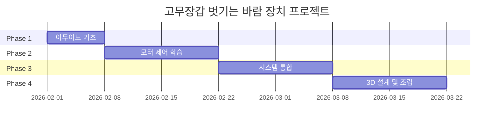

# 고무장갑 벗기는 바람 장치 - 아두이노 프로젝트 계획

아두이노 초급 개발자가 단계적으로 학습하며 완성하는 고무장갑 탈착 보조 장치 프로젝트입니다.

## 프로젝트 개요

### 문제 정의
안에 면이 없는 고무장갑을 벗을 때 손에 땀이 차서 잘 벗겨지지 않는 문제를 해결합니다.

### 해결 방안
고무장갑 내부에 공기를 불어넣어 손과 장갑 사이에 공간을 만들어 쉽게 벗을 수 있도록 합니다.

### 핵심 기능
1. **버튼 활성화**: 버튼을 누르면 블로워 팬 작동
2. **공기 주입**: 고무장갑 손목 부분에 공기 주입
3. **자동 정지**: 일정 시간 후 자동 종료
4. **저소음 설계**: 조용한 팬 사용 및 소음 최소화

---

## 학습 단계별 구현 계획

### 📚 Phase 1: 아두이노 기초 학습 (1주)

#### 1.1 개발 환경 설정
- [ ] Arduino IDE 설치
- [ ] 아두이노 보드 연결 테스트
- [ ] 시리얼 모니터 사용법

#### 1.2 기본 예제 실습
```
학습 순서:
1. Blink - LED 제어
2. Button - 버튼 입력 처리
3. DigitalReadSerial - 입력 상태 확인
```

**핵심 개념**:
- 디지털 입출력
- 풀업/풀다운 저항
- 디바운싱

---

### 🔧 Phase 2: 모터 제어 학습 (1-2주)

#### 2.1 DC 모터 기초
**학습 내용**:
- DC 모터 동작 원리
- 전원 분리의 중요성
- 역기전력 보호 (다이오드)

#### 2.2 모터 드라이버 사용
**추천 모듈**: L298N 또는 L9110S

**실습 코드**:
```cpp
// 기본 모터 제어
#define MOTOR_PIN1 3
#define MOTOR_PIN2 4
#define ENABLE_PIN 5

void setup() {
  pinMode(MOTOR_PIN1, OUTPUT);
  pinMode(MOTOR_PIN2, OUTPUT);
  pinMode(ENABLE_PIN, OUTPUT);
}

void loop() {
  // 모터 정방향 회전
  digitalWrite(MOTOR_PIN1, HIGH);
  digitalWrite(MOTOR_PIN2, LOW);
  analogWrite(ENABLE_PIN, 200);  // 속도 조절 (0-255)
  
  delay(3000);
  
  // 모터 정지
  digitalWrite(MOTOR_PIN1, LOW);
  digitalWrite(MOTOR_PIN2, LOW);
  
  delay(2000);
}
```

#### 2.3 PWM을 이용한 속도 제어
**학습 내용**:
- PWM 원리 이해
- analogWrite() 함수
- 속도 조절 실습

---

### 🎯 Phase 3: 기본 시스템 구현 (1-2주)

#### 3.1 버튼 제어 블로워 시스템
**구현 기능**:
- 버튼 누르면 팬 작동
- 3초 후 자동 정지
- LED로 동작 상태 표시

**핵심 코드**:
```cpp
#define BUTTON_PIN 2
#define MOTOR_PIN1 3
#define MOTOR_PIN2 4
#define ENABLE_PIN 5
#define LED_PIN 13

const unsigned long RUN_TIME = 3000;  // 3초
unsigned long startTime = 0;
bool isRunning = false;

void setup() {
  pinMode(BUTTON_PIN, INPUT_PULLUP);
  pinMode(MOTOR_PIN1, OUTPUT);
  pinMode(MOTOR_PIN2, OUTPUT);
  pinMode(ENABLE_PIN, OUTPUT);
  pinMode(LED_PIN, OUTPUT);
  
  Serial.begin(9600);
}

void loop() {
  // 버튼 감지 (디바운싱 포함)
  static unsigned long lastDebounceTime = 0;
  static int lastButtonState = HIGH;
  int buttonState = digitalRead(BUTTON_PIN);
  
  if (buttonState != lastButtonState) {
    lastDebounceTime = millis();
  }
  
  if ((millis() - lastDebounceTime) > 50) {
    if (buttonState == LOW && !isRunning) {
      // 버튼 눌림 - 팬 시작
      startMotor();
      isRunning = true;
      startTime = millis();
      Serial.println("팬 작동 시작");
    }
  }
  
  lastButtonState = buttonState;
  
  // 자동 정지 체크
  if (isRunning && (millis() - startTime >= RUN_TIME)) {
    stopMotor();
    isRunning = false;
    Serial.println("팬 정지");
  }
}

void startMotor() {
  digitalWrite(MOTOR_PIN1, HIGH);
  digitalWrite(MOTOR_PIN2, LOW);
  analogWrite(ENABLE_PIN, 180);  // 속도 조절
  digitalWrite(LED_PIN, HIGH);
}

void stopMotor() {
  digitalWrite(MOTOR_PIN1, LOW);
  digitalWrite(MOTOR_PIN2, LOW);
  digitalWrite(LED_PIN, LOW);
}
```

#### 3.2 속도 조절 기능
**학습 내용**:
- 가변저항(포텐셔미터) 사용
- analogRead()로 값 읽기
- map() 함수로 값 변환

---

### 🚀 Phase 4: 고급 기능 (선택사항, 1-2주)

#### 4.1 다단계 속도 제어
**구현**:
- 버튼을 여러 번 누르면 속도 변경
- 약풍 → 중풍 → 강풍 순환

```cpp
int speedLevel = 0;
const int speeds[] = {0, 150, 200, 255};

void loop() {
  if (buttonPressed) {
    speedLevel = (speedLevel + 1) % 4;
    analogWrite(ENABLE_PIN, speeds[speedLevel]);
  }
}
```

#### 4.2 LCD 디스플레이
**표시 정보**:
- 현재 속도 레벨
- 남은 작동 시간
- 상태 메시지

#### 4.3 자동 감지 (고급)
**센서 활용**:
- 적외선 센서로 손 감지
- 자동으로 팬 작동
- 손을 빼면 자동 정지

---

## 3D 프린팅 설계 가이드

### 필요한 부품

#### 1. 공기 주입 노즐
**설계 요구사항**:
- 고무장갑 손목 부분에 맞는 크기
- 공기 누출 최소화
- 부드러운 표면 (장갑 손상 방지)

**권장 치수**:
- 내경: 40-50mm (손목 크기에 맞춤)
- 노즐 길이: 30-40mm
- 공기 입구: 블로워 팬 출구와 연결

#### 2. 팬 하우징
**설계 요구사항**:
- 블로워 팬 고정
- 소음 감소 구조
- 공기 흐름 최적화

#### 3. 본체 케이스
**포함 요소**:
- 아두이노 보드 고정부
- 모터 드라이버 장착 공간
- 버튼 및 LED 홀
- 전원 케이블 출구
- 환기구

### 3D 모델링 도구
**초보자 추천**:
- Tinkercad (웹 기반, 무료, 쉬움)
- Fusion 360 (학생/취미용 무료)

**학습 자료**:
- Tinkercad 공식 튜토리얼
- YouTube 3D 프린팅 채널

---

## 필요한 하드웨어

### 전자 부품 (기본 구성)

| 부품명 | 수량 | 예상 가격 | 사양 |
|--------|------|-----------|------|
| Arduino Uno/Nano | 1 | 15,000원 | 5V |
| DC 블로워 팬 | 1 | 8,000원 | 5V/12V, 저소음 |
| 모터 드라이버 | 1 | 3,000원 | L298N 또는 L9110S |
| 택트 스위치 | 1 | 500원 | 순간 접촉 |
| LED | 1 | 200원 | 5mm, 파란색 |
| 저항 220Ω | 1 | 100원 | LED용 |
| 다이오드 1N4007 | 1 | 100원 | 역기전력 보호 |
| 브레드보드 | 1 | 3,000원 | 프로토타이핑 |
| 점퍼 와이어 | 1세트 | 3,000원 | M-M, M-F |
| 전원 어댑터 | 1 | 5,000원 | 12V 1A 또는 5V 2A |
| DC 잭 | 1 | 1,000원 | 전원 연결 |

**기본 구성 총액**: 약 38,900원

### 고급 구성 추가 부품

| 부품명 | 수량 | 예상 가격 | 용도 |
|--------|------|-----------|------|
| 가변저항 10kΩ | 1 | 500원 | 속도 조절 |
| I2C LCD 16x2 | 1 | 8,000원 | 정보 표시 |
| 적외선 센서 | 1 | 2,000원 | 자동 감지 |

### 3D 프린팅 재료
- PLA 필라멘트: 약 5,000원 (100g 사용 예상)
- 또는 3D 프린팅 서비스 이용: 10,000-20,000원

---

## 블로워 팬 선택 가이드

### 저소음 팬 추천

#### 1. 5V USB 팬
**장점**:
- 조용함 (30-40dB)
- 아두이노 전원으로 직접 구동 가능
- 저렴함

**단점**:
- 풍량이 약할 수 있음

#### 2. 12V 블로워 팬
**장점**:
- 강한 풍량
- 다양한 크기 선택 가능

**단점**:
- 별도 12V 전원 필요
- 소음이 클 수 있음

#### 3. 원심 블로워 팬 (추천)
**특징**:
- 집중된 공기 흐름
- 중간 소음 (40-50dB)
- 효율적인 공기 주입

**추천 모델**:
- 5015 블로워 팬 (50x50x15mm)
- 12V 또는 5V 버전

### 소음 감소 팁
1. **팬 속도 조절**: PWM으로 필요한 만큼만 회전
2. **진동 흡수**: 고무 패드 사용
3. **하우징 설계**: 소음 감쇠 구조
4. **팬 품질**: 베어링 타입 선택 (볼 베어링 > 슬리브)

---

## 회로 설계

### 기본 회로도 (텍스트)

```
Arduino Uno
├─ D2 ──── 택트 스위치 ──── GND
├─ D3 ──── 모터드라이버 IN1
├─ D4 ──── 모터드라이버 IN2
├─ D5 ──── 모터드라이버 ENA (PWM)
├─ D13 ─── LED (+) ──── 220Ω ──── GND
├─ 5V ──── 모터드라이버 VCC
└─ GND ─── 모터드라이버 GND

모터 드라이버 (L298N)
├─ OUT1 ──── 블로워 팬 (+)
├─ OUT2 ──── 블로워 팬 (-)
├─ 12V ──── 외부 전원 (+)
└─ GND ──── 외부 전원 (-)
```

### 전원 구성

**옵션 1: 5V 팬 사용**
- USB 전원 또는 5V 어댑터
- 아두이노와 팬 공통 전원

**옵션 2: 12V 팬 사용 (추천)**
- 12V 어댑터
- 아두이노는 USB 또는 모터드라이버의 5V 출력 사용
- 더 강한 풍량

---

## 소프트웨어 구조

### 상태 머신 설계

```cpp
enum State {
  IDLE,      // 대기 상태
  RUNNING,   // 팬 작동 중
  STOPPING   // 정지 중
};

State currentState = IDLE;

void loop() {
  switch(currentState) {
    case IDLE:
      if (buttonPressed) {
        currentState = RUNNING;
        startMotor();
      }
      break;
      
    case RUNNING:
      if (millis() - startTime >= RUN_TIME) {
        currentState = STOPPING;
      }
      break;
      
    case STOPPING:
      stopMotor();
      currentState = IDLE;
      break;
  }
}
```

### 필수 라이브러리
**기본 구성**:
- 내장 라이브러리만 사용 (추가 설치 불필요)

**고급 기능**:
- LiquidCrystal_I2C (LCD 사용 시)

---

## 학습 로드맵

### Week 1: 아두이노 기초
- [ ] Arduino IDE 설치
- [ ] Blink 예제
- [ ] Button 예제
- [ ] 시리얼 모니터 사용

### Week 2: 모터 제어
- [ ] 모터 드라이버 연결
- [ ] 기본 모터 제어
- [ ] PWM 속도 조절
- [ ] 역기전력 보호 이해

### Week 3: 통합 시스템
- [ ] 버튼 + 모터 통합
- [ ] 타이머 기능 구현
- [ ] LED 상태 표시
- [ ] 디버깅 및 테스트

### Week 4: 3D 프린팅 (선택)
- [ ] Tinkercad 학습
- [ ] 노즐 설계
- [ ] 케이스 설계
- [ ] 프린팅 및 조립

### Week 5: 고급 기능 (선택)
- [ ] 속도 조절 추가
- [ ] LCD 디스플레이
- [ ] 최종 조립 및 테스트

**총 예상 기간**: 3-5주

---

## 안전 주의사항

> [!CAUTION]
> 전기 및 기계 안전에 주의하세요!

### 전기 안전
- ⚡ 아두이노와 모터 전원 분리
- ⚡ 모터에는 반드시 역기전력 보호 다이오드 사용
- ⚡ 전원 극성 확인 (+ / -)
- ⚡ 단락 방지 (절연 테이프 사용)

### 기계 안전
- 🔧 팬 날개에 손가락 접촉 금지
- 🔧 회전 부품 보호 커버 설치
- 🔧 고정 부품 확실히 체결

### 사용 안전
- 👤 어린이 사용 시 보호자 감독
- 👤 장시간 연속 사용 금지 (과열 방지)
- 👤 이상 소음 발생 시 즉시 중단

---

## 프로젝트 타임라인



---

## 문제 해결 가이드

### 자주 발생하는 문제

#### 1. 모터가 작동하지 않음
**체크리스트**:
- [ ] 전원 연결 확인 (12V 또는 5V)
- [ ] 모터 드라이버 연결 확인
- [ ] 코드에서 pinMode 설정 확인
- [ ] 모터 드라이버 점퍼 설정 (ENA 활성화)

#### 2. 아두이노가 재부팅됨
**원인**: 전원 부족
**해결**:
- 모터와 아두이노 전원 분리
- 더 큰 용량의 어댑터 사용 (2A 이상)

#### 3. 버튼이 오작동함
**원인**: 디바운싱 문제
**해결**:
```cpp
// 디바운싱 코드 추가
unsigned long lastDebounceTime = 0;
const unsigned long debounceDelay = 50;
```

#### 4. 팬 소음이 큼
**해결**:
- PWM 속도 낮추기
- 저소음 팬으로 교체
- 진동 흡수 패드 추가
- 하우징 개선

---

## 개선 아이디어

### 단계별 업그레이드

#### Level 1: 기본 (완성 후)
- ✅ 버튼 누르면 3초 작동
- ✅ LED 상태 표시

#### Level 2: 편의성
- 🔧 속도 조절 (가변저항)
- 🔧 작동 시간 조절
- 🔧 LCD 정보 표시

#### Level 3: 자동화
- 🚀 손 감지 자동 작동
- 🚀 양손 동시 사용 (팬 2개)
- 🚀 배터리 구동 (휴대용)

#### Level 4: 스마트
- 💡 블루투스 제어
- 💡 사용 횟수 카운터
- 💡 자동 절전 모드

---

## 예상 비용 및 시간

### 비용 분석

| 항목 | 비용 |
|------|------|
| 전자 부품 (기본) | 38,900원 |
| 3D 프린팅 | 10,000원 |
| 예비 부품 | 5,000원 |
| **총계** | **약 54,000원** |

### 시간 투자

| 단계 | 시간 |
|------|------|
| 학습 (아두이노 기초) | 10시간 |
| 회로 구성 및 코딩 | 15시간 |
| 3D 설계 및 프린팅 | 20시간 |
| 조립 및 테스트 | 10시간 |
| **총계** | **약 55시간** |

**1일 2시간 작업 시**: 약 4주 소요

---

## 다음 단계

### 즉시 시작 가능

1. ✅ **Arduino IDE 설치**
2. ✅ **아두이노 보드 구매** (Uno 추천)
3. ✅ **기본 부품 구매**:
   - 블로워 팬 (5015 또는 유사)
   - L298N 모터 드라이버
   - 버튼, LED, 저항
4. ✅ **Blink 예제로 테스트**

### 학습 순서

```
1주차: Arduino 기초 익히기
  ↓
2주차: 모터 드라이버 사용법
  ↓
3주차: 버튼 + 모터 통합
  ↓
4주차: 3D 설계 (선택)
  ↓
5주차: 최종 조립
```

---

## 참고 자료

### 공식 문서
- [Arduino 공식 사이트](https://www.arduino.cc)
- [Arduino 언어 레퍼런스](https://www.arduino.cc/reference/ko/)

### 모터 제어 튜토리얼
- Arduino DC Motor Control Tutorial
- L298N Motor Driver Guide

### 3D 프린팅
- [Tinkercad](https://www.tinkercad.com)
- Thingiverse (3D 모델 공유 사이트)

### 커뮤니티
- 아두이노 공식 포럼
- 네이버 아두이노 카페
- 3D 프린팅 커뮤니티

---

## 기대 효과

### 학습 성과
- ✅ 아두이노 기초 → 중급 단계 학습
- ✅ 모터 제어 실전 경험
- ✅ 3D 프린팅 기초 습득
- ✅ 문제 해결 능력 향상

### 실용적 가치
- 💡 고무장갑 탈착 편의성 대폭 향상
- 💡 손 피부 보호 (무리한 힘 불필요)
- 💡 시간 절약
- 💡 DIY 제작의 성취감

---

## 프로젝트 저장소 구조 (예정)

```
고무장갑벗기는바람/
├── README.md
├── implementation_plan.md (이 문서)
├── docs/
│   ├── circuit_diagram.png
│   ├── wiring_guide.md
│   └── troubleshooting.md
├── src/
│   ├── basic_version/
│   │   └── glove_remover_v1.ino
│   ├── advanced_version/
│   │   └── glove_remover_v2.ino
│   └── final_version/
│       └── glove_remover_final.ino
├── 3d_models/
│   ├── air_nozzle.stl
│   ├── fan_housing.stl
│   └── main_case.stl
└── hardware/
    ├── parts_list.md
    └── assembly_guide.md
```

---

## 라이선스

이 프로젝트는 학습 및 개인 사용 목적으로 자유롭게 사용 가능합니다.

**Happy Making! 🚀**

---

*Last Updated: 2026-02-01*
