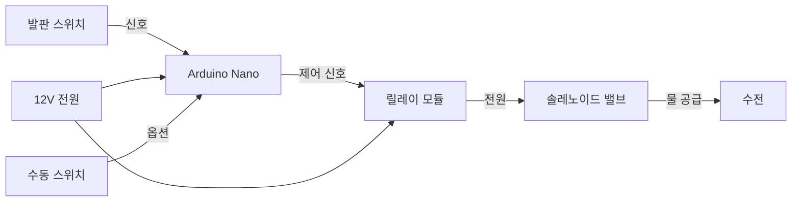

# 발판식 자동 수전 시스템 - Arduino 개발 계획서

## 프로젝트 개요

최신 한국 아파트에 설치된 발판식 자동 수전을 Arduino 환경에서 구현합니다. 발판을 밟으면 솔레노이드 밸브가 작동하여 물이 나오는 시스템으로, 손이 더러울 때나 양손을 사용 중일 때 매우 유용합니다.

### 핵심 기능
- 발판 스위치로 물 ON/OFF 제어
- 솔레노이드 밸브를 통한 자동 급수
- 안전 타이머 (일정 시간 후 자동 차단)
- 유선/무선 통신 옵션
- 수동 오버라이드 기능

---

## Proposed Changes

### 1. 시스템 아키텍처



---

### 2. 하드웨어 컴포넌트

#### 2.1 메인 컨트롤러

**Arduino Nano** (권장)
- **이유**: 
  - 소형 크기 (18mm x 45mm) - 좁은 공간 설치 용이
  - 충분한 I/O 핀 (디지털 14개, 아날로그 8개)
  - 저렴한 가격
  - 5V 동작 (릴레이 모듈과 호환)
- **가격**: 약 3,000원 (호환보드)

**대체 옵션: ESP8266 NodeMCU**
- WiFi 내장 (스마트폰 앱 연동 가능)
- 사용 통계 수집 가능
- **가격**: 약 5,000원

#### 2.2 수압 제어

**솔레노이드 밸브**

**[권장] 1/2인치 12V DC 솔레노이드 밸브**
- **모델**: N/C (Normally Closed) 타입
- **사양**:
  - 작동 전압: 12V DC
  - 소비 전류: 약 500mA
  - 수압 범위: 0.02~0.8 MPa
  - 나사 규격: G1/2" (한국 표준 수도관 호환)
  - 재질: 황동 본체, 실리콘 씰
- **가격**: 약 8,000~12,000원
- **구매처**: 알리익스프레스, 쿠팡

**설치 위치 옵션:**
1. **싱크대 하부 급수관** (권장)
   - 냉수/온수 각각 설치 또는 혼합 후 설치
   - 기존 배관에 T자 연결
   
2. **수전 직전**
   - 가장 간단한 설치
   - 수전 교체 없이 기존 시스템 유지

#### 2.3 발판 스위치

**산업용 풋 스위치**

**[옵션 1] 금속 케이스 풋 스위치** (권장)
- **모델**: HY-402 또는 유사 제품
- **특징**:
  - 견고한 금속 케이스 (방수 IP65)
  - 1NO+1NC 접점 (양방향 제어 가능)
  - 미끄럼 방지 고무 패드
  - 케이블 길이: 2m (연장 가능)
- **가격**: 약 10,000~15,000원

**[옵션 2] DIY 발판 스위치**
- 3D 프린팅 케이스 + 마이크로 스위치
- 저렴하지만 내구성 낮음
- **가격**: 약 3,000원

**설치 위치:**
- 싱크대 앞 바닥 (발이 자연스럽게 닿는 위치)
- 벽면 고정 또는 논슬립 매트 위 배치

#### 2.4 전원 및 제어

**릴레이 모듈**
- **1채널 5V 릴레이 모듈**
- 광절연 (Optocoupler) 내장
- LED 상태 표시
- 최대 부하: 10A @ 250V AC / 10A @ 30V DC
- **가격**: 약 1,500원

**전원 공급**
- **12V 2A 스위칭 어댑터**
  - 솔레노이드 밸브용 (500mA)
  - Arduino용 (Vin 핀으로 공급)
- **가격**: 약 5,000원

**DC-DC 벅 컨버터** (옵션)
- 12V → 5V 변환 (Arduino 안정적 전원)
- **가격**: 약 2,000원

#### 2.5 추가 컴포넌트

**안전 및 편의 기능:**
- **수동 스위치** (비상/수동 모드용): 1,000원
- **LED 표시등** (동작 상태 표시): 500원
- **부저** (경고음, 선택사항): 500원
- **방수 케이블 글랜드**: 1,000원/개
- **방수 정션 박스** (100x68x50mm): 3,000원

**무선 통신 옵션:**
- **433MHz RF 송수신 모듈**: 3,000원 (발판과 제어부 무선 연결)
- **nRF24L01+ 모듈**: 2,000원 (더 안정적)

---

### 3. 배선도

#### 3.1 유선 방식 (권장)

```
┌─────────────────────────────────────────┐
│         12V 2A Power Adapter            │
└────┬────────────────────────────────────┘
     │
     ├──→ 12V → Arduino Nano (Vin)
     │
     └──→ 12V → 릴레이 모듈 (VCC)
     
Arduino Nano Pin Connections:
├─ D2: 풋 스위치 입력 (Pull-up)
├─ D3: 수동 스위치 입력 (Pull-up)
├─ D4: 릴레이 제어 신호
├─ D5: LED 상태 표시
├─ D6: 부저 (옵션)
├─ GND: 공통 접지
└─ Vin: 12V 입력

릴레이 모듈:
├─ IN: Arduino D4
├─ VCC: 5V (Arduino 5V 핀)
├─ GND: 공통 접지
├─ COM: 12V+ (전원에서)
└─ NO: 솔레노이드 밸브 (+)

솔레노이드 밸브:
├─ (+): 릴레이 NO
└─ (-): 12V GND
```

#### 3.2 무선 방식 (433MHz RF)

**발판 송신부:**
```
Arduino Nano (TX)
├─ D2: 풋 스위치
├─ D10: RF TX 모듈 DATA
└─ 3.3V: RF TX VCC

433MHz TX 모듈
├─ DATA: Arduino D10
├─ VCC: 3.3V
└─ GND: GND
```

**제어부 수신부:**
```
Arduino Nano (RX)
├─ D11: RF RX 모듈 DATA
├─ D4: 릴레이 제어
└─ 5V: RF RX VCC

433MHz RX 모듈
├─ DATA: Arduino D11
├─ VCC: 5V
└─ GND: GND
```

---

### 4. 소프트웨어 설계

#### 4.1 핵심 기능 구현

**상태 머신 설계:**
```cpp
enum SystemState {
    IDLE,           // 대기 상태
    WATER_ON,       // 물 공급 중
    SAFETY_TIMEOUT, // 안전 타이머 작동
    MANUAL_MODE     // 수동 모드
};
```

**주요 변수:**
```cpp
const int FOOT_SWITCH_PIN = 2;
const int MANUAL_SWITCH_PIN = 3;
const int RELAY_PIN = 4;
const int LED_PIN = 5;
const int BUZZER_PIN = 6;

const unsigned long MAX_WATER_TIME = 60000;  // 60초 최대 급수
const unsigned long DEBOUNCE_DELAY = 50;     // 스위치 디바운싱

SystemState currentState = IDLE;
unsigned long waterStartTime = 0;
bool manualMode = false;
```

#### 4.2 메인 로직

**[NEW] [foot_pedal_faucet.ino](file:///e:/project/00_Management/Ideas_Backlog/아이디어/주방쪽/따라하기_발빝에물트는발판/firmware/foot_pedal_faucet.ino)**

```cpp
void setup() {
    Serial.begin(9600);
    
    // 핀 모드 설정
    pinMode(FOOT_SWITCH_PIN, INPUT_PULLUP);
    pinMode(MANUAL_SWITCH_PIN, INPUT_PULLUP);
    pinMode(RELAY_PIN, OUTPUT);
    pinMode(LED_PIN, OUTPUT);
    pinMode(BUZZER_PIN, OUTPUT);
    
    // 초기 상태
    digitalWrite(RELAY_PIN, LOW);  // 밸브 닫힘
    digitalWrite(LED_PIN, LOW);
    
    Serial.println("Foot Pedal Faucet System Ready");
}

void loop() {
    // 수동 모드 토글 체크
    if (digitalRead(MANUAL_SWITCH_PIN) == LOW) {
        delay(DEBOUNCE_DELAY);
        if (digitalRead(MANUAL_SWITCH_PIN) == LOW) {
            manualMode = !manualMode;
            beep(manualMode ? 2 : 1);  // 모드 변경 알림
            while(digitalRead(MANUAL_SWITCH_PIN) == LOW);  // 버튼 릴리즈 대기
        }
    }
    
    // 발판 스위치 상태 읽기
    bool footPressed = (digitalRead(FOOT_SWITCH_PIN) == LOW);
    
    // 상태 머신
    switch(currentState) {
        case IDLE:
            if (footPressed) {
                openValve();
                currentState = WATER_ON;
                waterStartTime = millis();
            }
            break;
            
        case WATER_ON:
            // 발판 떼면 물 정지 (수동 모드 아닐 때)
            if (!footPressed && !manualMode) {
                closeValve();
                currentState = IDLE;
            }
            
            // 안전 타이머 체크
            if (millis() - waterStartTime > MAX_WATER_TIME) {
                closeValve();
                currentState = SAFETY_TIMEOUT;
                beep(3);  // 경고음
            }
            break;
            
        case SAFETY_TIMEOUT:
            // 5초 대기 후 복귀
            delay(5000);
            currentState = IDLE;
            break;
            
        case MANUAL_MODE:
            // 수동 모드에서는 한 번 누르면 ON, 다시 누르면 OFF
            if (footPressed) {
                delay(DEBOUNCE_DELAY);
                if (digitalRead(FOOT_SWITCH_PIN) == LOW) {
                    if (currentState == IDLE) {
                        openValve();
                        currentState = WATER_ON;
                    } else {
                        closeValve();
                        currentState = IDLE;
                    }
                    while(digitalRead(FOOT_SWITCH_PIN) == LOW);
                }
            }
            break;
    }
    
    // LED 상태 표시
    updateLED();
    
    delay(10);
}

void openValve() {
    digitalWrite(RELAY_PIN, HIGH);
    Serial.println("Valve OPEN");
}

void closeValve() {
    digitalWrite(RELAY_PIN, LOW);
    Serial.println("Valve CLOSED");
}

void updateLED() {
    if (currentState == WATER_ON) {
        digitalWrite(LED_PIN, HIGH);
    } else if (currentState == SAFETY_TIMEOUT) {
        // 깜빡임
        digitalWrite(LED_PIN, (millis() / 200) % 2);
    } else {
        digitalWrite(LED_PIN, LOW);
    }
}

void beep(int times) {
    for (int i = 0; i < times; i++) {
        digitalWrite(BUZZER_PIN, HIGH);
        delay(100);
        digitalWrite(BUZZER_PIN, LOW);
        delay(100);
    }
}
```

#### 4.3 무선 버전 (433MHz)

**송신부 코드:**
```cpp
#include <RCSwitch.h>

RCSwitch mySwitch = RCSwitch();
const int FOOT_SWITCH_PIN = 2;

void setup() {
    pinMode(FOOT_SWITCH_PIN, INPUT_PULLUP);
    mySwitch.enableTransmit(10);  // D10 핀
}

void loop() {
    static bool lastState = HIGH;
    bool currentState = digitalRead(FOOT_SWITCH_PIN);
    
    if (currentState != lastState) {
        delay(50);  // 디바운싱
        currentState = digitalRead(FOOT_SWITCH_PIN);
        
        if (currentState != lastState) {
            if (currentState == LOW) {
                mySwitch.send(1234, 24);  // 코드 1234 전송
            } else {
                mySwitch.send(5678, 24);  // 코드 5678 전송
            }
            lastState = currentState;
        }
    }
}
```

**수신부 코드:**
```cpp
#include <RCSwitch.h>

RCSwitch mySwitch = RCSwitch();
const int RELAY_PIN = 4;

void setup() {
    pinMode(RELAY_PIN, OUTPUT);
    mySwitch.enableReceive(0);  // D2 핀 (인터럽트 0)
    Serial.begin(9600);
}

void loop() {
    if (mySwitch.available()) {
        long value = mySwitch.getReceivedValue();
        
        if (value == 1234) {
            digitalWrite(RELAY_PIN, HIGH);  // 밸브 열기
            Serial.println("Valve OPEN (Wireless)");
        } else if (value == 5678) {
            digitalWrite(RELAY_PIN, LOW);   // 밸브 닫기
            Serial.println("Valve CLOSED (Wireless)");
        }
        
        mySwitch.resetAvailable();
    }
}
```

---

### 5. 배관 설치 가이드

#### 5.1 설치 위치 선택

**옵션 A: 싱크대 하부 급수관 (권장)**
```
기존 배관: 벽 급수관 → 앵글밸브 → 수전 호스
수정 배관: 벽 급수관 → 앵글밸브 → T자 → 솔레노이드 밸브 → 수전 호스
```

**장점:**
- 기존 수전 유지 가능
- 냉수/온수 독립 제어 가능
- 숨김 설치 (미관 좋음)

**필요 부품:**
- T자 이음 (1/2인치): 2,000원
- 플렉시블 호스 (1/2인치, 30cm): 3,000원
- 테프론 테이프: 1,000원

**옵션 B: 수전 직전 설치**
```
앵글밸브 → 솔레노이드 밸브 → 수전 호스 → 수전
```

**장점:**
- 설치 간단
- 문제 발생 시 쉽게 제거

**단점:**
- 밸브가 노출됨

#### 5.2 설치 순서

1. **급수 차단**
   - 싱크대 하부 앵글밸브 잠금
   - 수전 열어서 잔류 수압 제거

2. **배관 분리**
   - 앵글밸브와 수전 호스 연결 해제
   - 물받이 준비 (잔류 물 배출)

3. **솔레노이드 밸브 설치**
   - T자 이음 설치 (테프론 테이프 감기)
   - 솔레노이드 밸브 연결
   - 화살표 방향 확인 (물 흐름 방향)

4. **누수 테스트**
   - 앵글밸브 천천히 개방
   - 모든 연결부 누수 확인
   - 누수 발견 시 즉시 차단 후 재시공

5. **전기 배선**
   - 솔레노이드 밸브 케이블 연결
   - 케이블 타이로 정리
   - 물 닿지 않는 위치에 고정

6. **최종 테스트**
   - Arduino 전원 켜기
   - 발판 눌러서 동작 확인
   - 릴레이 클릭음 확인
   - 물 나오는지 확인

---

### 6. 케이스 및 설치

#### 6.1 전자 부품 케이스

**방수 정션 박스 배치:**
```
싱크대 하부 벽면 또는 측면 고정
├─ Arduino Nano
├─ 릴레이 모듈
├─ 전원 어댑터 (또는 외부 배치)
└─ 배선 정리
```

**케이블 관통:**
- 발판 스위치 케이블 (2선)
- 솔레노이드 밸브 케이블 (2선)
- 전원 케이블
- 케이블 글랜드로 방수 처리

#### 6.2 발판 설치

**바닥 고정 방법:**

1. **논슬립 매트 위 배치** (권장 - 임대)
   - 미끄럼 방지 매트 구매
   - 발판 스위치 배치
   - 케이블을 벽면을 따라 정리

2. **바닥 고정** (영구 설치)
   - 앵커볼트로 고정
   - 케이블 몰딩으로 배선 숨김

**케이블 정리:**
- 벽면 케이블 몰딩 사용
- 싱크대 하부로 배선
- 케이블 길이 여유 확보 (청소 시 이동 가능)

---

### 7. 안전 기능

#### 7.1 필수 안전 장치

**소프트웨어 안전:**
```cpp
// 최대 급수 시간 제한
const unsigned long MAX_WATER_TIME = 60000;  // 60초

// 연속 사용 제한
const int MAX_CONTINUOUS_USE = 10;  // 10회
int useCount = 0;
unsigned long lastUseTime = 0;

void checkSafety() {
    // 60초 이상 급수 시 강제 차단
    if (millis() - waterStartTime > MAX_WATER_TIME) {
        emergencyStop();
    }
    
    // 1분 내 10회 이상 사용 시 경고
    if (millis() - lastUseTime < 60000) {
        useCount++;
        if (useCount > MAX_CONTINUOUS_USE) {
            beep(5);  // 경고음
            delay(5000);  // 5초 대기
            useCount = 0;
        }
    } else {
        useCount = 0;
    }
    lastUseTime = millis();
}

void emergencyStop() {
    digitalWrite(RELAY_PIN, LOW);
    digitalWrite(BUZZER_PIN, HIGH);
    delay(1000);
    digitalWrite(BUZZER_PIN, LOW);
    Serial.println("EMERGENCY STOP!");
}
```

**하드웨어 안전:**
- 릴레이 모듈 광절연 (Arduino 보호)
- 퓨즈 추가 (12V 라인에 2A 퓨즈)
- 누전차단기 설치 권장

#### 7.2 고장 대비

**수동 우회 밸브:**
- 솔레노이드 밸브와 병렬로 수동 밸브 설치
- 고장 시 수동 밸브로 급수 가능

**전원 차단 시:**
- N/C (Normally Closed) 밸브 사용 → 전원 없으면 닫힘 (안전)
- 수동 밸브로 우회 가능

---

### 8. 예산 및 부품 리스트

#### 8.1 유선 버전 (기본형)

| 항목 | 수량 | 단가 | 합계 |
|------|------|------|------|
| **전자 부품** | | | |
| Arduino Nano (호환) | 1 | 3,000원 | 3,000원 |
| 1채널 5V 릴레이 모듈 | 1 | 1,500원 | 1,500원 |
| 12V 2A 어댑터 | 1 | 5,000원 | 5,000원 |
| LED (5mm) | 1 | 100원 | 100원 |
| 부저 | 1 | 500원 | 500원 |
| 저항 (220Ω, 10kΩ) | 각 2개 | 100원 | 400원 |
| **수압 제어** | | | |
| 솔레노이드 밸브 (1/2", 12V) | 1 | 10,000원 | 10,000원 |
| T자 이음 (1/2") | 1 | 2,000원 | 2,000원 |
| 플렉시블 호스 (30cm) | 1 | 3,000원 | 3,000원 |
| 테프론 테이프 | 1 | 1,000원 | 1,000원 |
| **발판 스위치** | | | |
| 산업용 풋 스위치 | 1 | 12,000원 | 12,000원 |
| **케이스 및 배선** | | | |
| 방수 정션 박스 | 1 | 3,000원 | 3,000원 |
| 케이블 글랜드 (PG7) | 3개 | 1,000원 | 3,000원 |
| 전선 (2C, 5m) | 1 | 3,000원 | 3,000원 |
| 케이블 타이, 나사 등 | 1 | 2,000원 | 2,000원 |
| **합계** | | | **49,500원** |

#### 8.2 무선 버전 (고급형)

추가 비용:
- Arduino Nano 1개 추가: 3,000원
- 433MHz RF 송수신 모듈: 3,000원
- 배터리 홀더 + 건전지 (송신부): 2,000원
- **추가 합계: 8,000원**
- **총합: 57,500원**

#### 8.3 스마트 버전 (ESP8266)

변경 사항:
- Arduino Nano → ESP8266 NodeMCU: +2,000원
- WiFi 기능 추가 (앱 개발 필요)
- **총합: 51,500원**

---

### 9. 제작 일정

**총 예상 기간: 1주일**

| 일차 | 작업 내용 | 소요 시간 |
|------|-----------|-----------|
| **Day 1** | 부품 주문 | 30분 |
| **Day 2-3** | 부품 배송 대기 | - |
| **Day 4** | 회로 조립 및 테스트 | 3시간 |
| | - 브레드보드 프로토타입 | 1시간 |
| | - 펌웨어 업로드 및 테스트 | 1시간 |
| | - 케이스 조립 | 1시간 |
| **Day 5** | 배관 설치 | 2시간 |
| | - 급수 차단 및 배관 분리 | 30분 |
| | - 솔레노이드 밸브 설치 | 1시간 |
| | - 누수 테스트 | 30분 |
| **Day 6** | 발판 및 배선 설치 | 2시간 |
| | - 발판 위치 결정 및 고정 | 30분 |
| | - 케이블 정리 | 1시간 |
| | - 전체 시스템 테스트 | 30분 |
| **Day 7** | 최종 테스트 및 조정 | 1시간 |
| | - 실사용 테스트 | 30분 |
| | - 타이머 값 조정 | 30분 |

---

### 10. 테스트 및 검증

#### 10.1 단위 테스트

**발판 스위치 테스트:**
```cpp
void testFootSwitch() {
    Serial.println("Press foot switch...");
    while(true) {
        if (digitalRead(FOOT_SWITCH_PIN) == LOW) {
            Serial.println("Switch PRESSED");
        } else {
            Serial.println("Switch RELEASED");
        }
        delay(100);
    }
}
```

**릴레이 테스트:**
```cpp
void testRelay() {
    Serial.println("Relay ON");
    digitalWrite(RELAY_PIN, HIGH);
    delay(2000);
    Serial.println("Relay OFF");
    digitalWrite(RELAY_PIN, LOW);
    delay(2000);
}
```

**솔레노이드 밸브 테스트:**
```cpp
void testValve() {
    // 릴레이 없이 직접 12V 연결하여 테스트
    // 클릭음 확인
    // 물 흐름 확인
}
```

#### 10.2 통합 테스트

**테스트 시나리오:**

1. **기본 동작**
   - [ ] 발판 누름 → 물 나옴
   - [ ] 발판 뗌 → 물 멈춤
   - [ ] 반응 시간 < 0.5초

2. **안전 기능**
   - [ ] 60초 후 자동 차단
   - [ ] 경고음 울림
   - [ ] 5초 후 재사용 가능

3. **수동 모드**
   - [ ] 수동 스위치 누름 → 모드 변경
   - [ ] 발판 한 번 누름 → 물 계속 나옴
   - [ ] 발판 다시 누름 → 물 멈춤

4. **내구성**
   - [ ] 100회 연속 작동
   - [ ] 릴레이 과열 체크
   - [ ] 솔레노이드 밸브 온도 체크

5. **누수 테스트**
   - [ ] 모든 배관 연결부 확인
   - [ ] 24시간 후 재확인
   - [ ] 솔레노이드 밸브 씰 확인

---

### 11. 사용자 매뉴얼

#### 11.1 일상 사용

**기본 사용법:**
1. 발판을 밟으면 물이 나옵니다
2. 발판에서 발을 떼면 물이 멈춥니다
3. 60초 이상 사용 시 자동으로 멈추고 경고음이 울립니다

**수동 모드:**
1. 수동 스위치를 누르면 "삐삐" 소리가 2번 울립니다
2. 발판을 한 번 누르면 물이 계속 나옵니다
3. 발판을 다시 누르면 물이 멈춥니다
4. 수동 스위치를 다시 누르면 일반 모드로 돌아갑니다 ("삐" 1번)

#### 11.2 문제 해결

| 증상 | 원인 | 해결 방법 |
|------|------|-----------|
| 발판 눌러도 물 안 나옴 | 전원 문제 | 어댑터 연결 확인, LED 점등 확인 |
| | 릴레이 고장 | 릴레이 LED 확인, 교체 |
| | 솔레노이드 밸브 고장 | 수동 밸브로 우회, 밸브 교체 |
| 물이 계속 나옴 | 릴레이 고착 | 전원 차단, 릴레이 교체 |
| | 소프트웨어 오류 | Arduino 리셋, 펌웨어 재업로드 |
| 누수 발생 | 배관 연결 불량 | 급수 차단, 연결부 재시공 |
| | 솔레노이드 밸브 씰 손상 | 밸브 교체 |
| 발판 반응 없음 | 케이블 단선 | 케이블 연결 확인, 교체 |
| | 스위치 고장 | 스위치 저항 측정, 교체 |

#### 11.3 유지보수

**정기 점검 (월 1회):**
- [ ] 모든 배관 연결부 누수 확인
- [ ] 솔레노이드 밸브 작동음 확인
- [ ] 발판 스위치 청소 (물기 제거)
- [ ] 케이블 손상 확인

**연간 점검:**
- [ ] 솔레노이드 밸브 내부 청소 (스케일 제거)
- [ ] 릴레이 접점 상태 확인
- [ ] 배관 호스 교체 검토

---

### 12. 확장 가능성

#### 12.1 단기 개선

**사용 통계 기록 (ESP8266 사용 시):**
```cpp
// 일일 사용 횟수, 총 급수 시간 기록
// WiFi로 스마트폰 앱에 전송
// 물 절약 효과 확인
```

**음성 피드백:**
- MP3 모듈 추가
- "물이 나옵니다", "60초 경과" 등 음성 안내

**수압 센서:**
- 실제 물 사용량 측정
- 누수 감지 (밸브 열림 상태에서 수압 없으면 경고)

#### 12.2 장기 확장

**스마트 홈 연동:**
- Google Home / Alexa 연동
- "물 틀어줘" 음성 명령
- IFTTT 자동화

**다중 발판:**
- 발판 2개 설치 (좌/우)
- 냉수/온수 독립 제어
- 또는 ON/OFF 전용 발판

**자동 온도 조절:**
- 온수/냉수 솔레노이드 밸브 각각 제어
- 온도 센서로 피드백
- 설정 온도로 자동 혼합

---

## Verification Plan

### Automated Tests

#### 1. 펌웨어 컴파일
```bash
arduino-cli compile --fqbn arduino:avr:nano firmware/foot_pedal_faucet.ino
```

#### 2. 시리얼 모니터 테스트
```cpp
// 모든 이벤트를 시리얼로 출력하여 로그 확인
Serial.println("Foot switch pressed");
Serial.println("Valve opened");
Serial.println("Water time: " + String(millis() - waterStartTime) + "ms");
```

### Manual Verification

#### 1. 기능 테스트
- [ ] 발판 10회 연속 작동 (정상 동작 확인)
- [ ] 안전 타이머 작동 확인 (60초 테스트)
- [ ] 수동 모드 전환 확인

#### 2. 안전 테스트
- [ ] 누수 테스트 (24시간)
- [ ] 과부하 테스트 (100회 연속)
- [ ] 전원 차단 후 재시작

#### 3. 사용성 테스트
- [ ] 가족 구성원 모두 사용 가능 여부
- [ ] 발판 위치 적절성
- [ ] 반응 속도 만족도

---

## 참고 자료

### 배관 설치
- [수도 배관 기초](https://www.youtube.com/results?search_query=수도+배관+설치)
- [솔레노이드 밸브 설치 가이드](https://www.youtube.com/results?search_query=solenoid+valve+installation)

### Arduino 프로젝트
- [릴레이 제어 튜토리얼](https://www.arduino.cc/en/Tutorial/BuiltInExamples)
- [디바운싱 기법](https://www.arduino.cc/en/Tutorial/Debounce)

### 제품 참고
- [한샘 발판식 수전](https://www.hanssem.com) - 상용 제품 참고
- [산업용 풋 스위치](https://www.aliexpress.com/wholesale?SearchText=foot+switch)

---

## 다음 단계

1. ✅ 개발 계획서 작성 완료
2. ⏭️ 부품 구매 (예산 승인 후)
3. ⏭️ 프로토타입 제작
4. ⏭️ 배관 설치
5. ⏭️ 최종 테스트 및 사용

---

**예상 총 비용: 약 50,000원**  
**제작 기간: 약 1주일**  
**난이도: ★★☆☆☆ (중하)**
