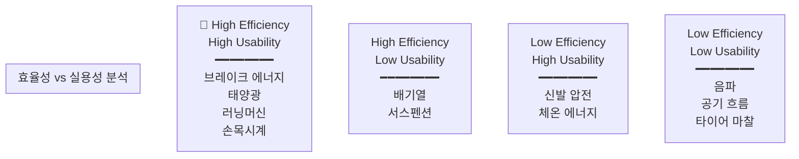
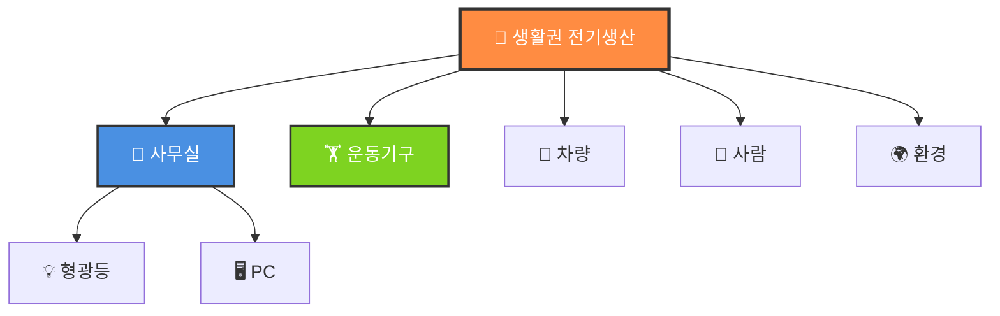

# 🗺️ 생활권 전기 생산 - 마인드맵 & 시각화

업로드하신 이미지의 마인드맵을 Obsidian에서 재현하는 방법입니다.

---

## 방법 1: Mermaid를 이용한 자동 다이어그램

Obsidian에서 다음 코드를 그대로 복사해 사용하면 시각화가 자동 생성됩니다:

```mermaid
graph TB
    Root["🔋 생활권 전기생산<br/>Energy Sources"]
    
    Root --> 사무실["🏢 사무실<br/>Office"]
    Root --> 운동["🏋️ 운동기구<br/>Gym"]
    Root --> 차량["🚗 차량<br/>Vehicle"]
    Root --> 사람["👤 사람<br/>Human"]
    Root --> 환경["🌍 환경<br/>Environment"]
    
    %% 사무실 에너지
    사무실 --> S1["💡 형광등<br/>LED Heat"]
    사무실 --> S2["🖥️ PC 냉각<br/>Server Cooling"]
    사무실 --> S3["🌡️ 체온<br/>Body Heat"]
    사무실 --> S4["💨 공기흐름<br/>Airflow"]
    
    %% 운동기구 에너지
    운동 --> G1["🏃 러닝머신<br/>Treadmill"]
    운동 --> G2["🦵 점프/스쿼트<br/>Jump Energy"]
    운동 --> G3["⚡ 압전타일<br/>Piezo Floor"]
    운동 --> G4["⚙️ 회전축<br/>Rotation"]
    
    %% 차량 에너지
    차량 --> V1["🔥 배기열<br/>Exhaust Heat"]
    차량 --> V2["🛑 브레이크<br/>Brake Energy"]
    차량 --> V3["🛞 타이어<br/>Tire Friction"]
    차량 --> V4["🚗 서스펜션<br/>Suspension"]
    차량 --> V5["⚗️ 연료전지<br/>Fuel Cell"]
    
    %% 사람 (개인활동)
    사람 --> P1["👟 신발<br/>Shoe Pressure"]
    사람 --> P2["⌚ 시계<br/>Wristwatch"]
    사람 --> P3["👕 의류<br/>Cloth Movement"]
    사람 --> P4["❤️ 심박<br/>Heartbeat"]
    
    %% 환경 에너지
    환경 --> E1["☀️ 태양광<br/>Solar"]
    환경 --> E2["🌡️ 온도차<br/>Temperature Diff"]
    환경 --> E3["🔊 음파<br/>Sound Energy"]
    환경 --> E4["💨 바람<br/>Wind"]
    
    %% 스타일
    style Root fill:#FF8C42,stroke:#333,stroke-width:3px,color:#fff
    style 사무실 fill:#4A90E2,stroke:#333,stroke-width:2px,color:#fff
    style 운동 fill:#7ED321,stroke:#333,stroke-width:2px,color:#fff
    style 차량 fill:#F5A623,stroke:#333,stroke-width:2px,color:#fff
    style 사람 fill:#BD10E0,stroke:#333,stroke-width:2px,color:#fff
    style 환경 fill:#50E3C2,stroke:#333,stroke-width:2px,color:#fff
```



---

## 방법 2: Excalidraw를 이용한 손그림 스타일 마인드맵

1. Obsidian에서 **New Excalidraw drawing** 클릭
2. 아래 이미지 정보로 직접 그리기:

**Excalidraw 사용법:**
- 텍스트 박스 추가: T 키 또는 텍스트 도구
- 연결선: 화살표 또는 직선 도구
- 색상: 각 카테고리별로 다른 색 지정
- Export: PNG로 내보내기 가능

**추천 색상 코드:**
```
사무실: #4A90E2 (파란색)
운동기구: #7ED321 (초록색)
차량: #F5A623 (주황색)
사람: #BD10E0 (보라색)
환경: #50E3C2 (청록색)
```

---

## 방법 3: 텍스트 기반 트리 구조

Obsidian에서 마크다운으로 계층 표현:

```markdown
# 🔋 생활권 전기 생산

## 🏢 사무실 환경
### 💡 형광등 폐열 발전 [[형광등폐열발전]]
- 효율성: ⭐⭐
- 실용성: ⭐⭐

### 🖥️ 컴퓨터 냉각열 회수 [[컴퓨터냉각열]]
- 효율성: ⭐⭐⭐
- 실용성: ⭐⭐⭐

### 🌡️ 사람 체온 에너지 [[사람체온에너지]]
- 효율성: ⭐⭐
- 실용성: ⭐⭐⭐⭐

### 💨 실내 공기 흐름 [[실내공기흐름]]
- 효율성: ⭐
- 실용성: ⭐

## 🏋️ 운동기구실
### 🏃 러닝머신/자전거 발전 [[러닝머신발전]]
- 효율성: ⭐⭐⭐⭐
- 실용성: ⭐⭐⭐⭐

[... 계속]
```

---

## 방법 4: 표 형식 비교표

```markdown
# 📊 에너지 생산 방법 비교 분석

| 분류 | 방법 | 효율 | 실용 | 난이도 |
|------|------|------|------|--------|
| **사무실** | 형광등 폐열 | ⭐⭐ | ⭐⭐ | 중간 |
| | 컴퓨터 냉각 | ⭐⭐⭐ | ⭐⭐⭐ | 높음 |
| | 체온 에너지 | ⭐⭐ | ⭐⭐⭐⭐ | 낮음 |
| | 공기 흐름 | ⭐ | ⭐ | 높음 |
| **운동기구** | 러닝머신 | ⭐⭐⭐⭐ | ⭐⭐⭐⭐ | 중간 |
| | 점프/스쿼트 | ⭐⭐⭐ | ⭐⭐⭐ | 높음 |
| | 압전 타일 | ⭐⭐⭐ | ⭐⭐⭐⭐ | 높음 |
| | 회전축 | ⭐⭐⭐⭐ | ⭐⭐⭐ | 높음 |
| **차량** | 배기열 | ⭐⭐⭐⭐ | ⭐⭐⭐ | 높음 |
| | 브레이크 | ⭐⭐⭐⭐⭐ | ⭐⭐⭐⭐⭐ | 매우높음 |
| | 타이어 마찰 | ⭐⭐ | ⭐⭐ | 높음 |
| | 서스펜션 | ⭐⭐⭐ | ⭐⭐⭐ | 높음 |
| | 연료전지 | ⭐⭐⭐ | ⭐⭐ | 매우높음 |
| **개인활동** | 신발 압전 | ⭐⭐⭐ | ⭐⭐⭐⭐ | 낮음 |
| | 손목시계 | ⭐⭐ | ⭐⭐⭐⭐⭐ | 낮음 |
| | 의류 패브릭 | ⭐⭐ | ⭐⭐⭐ | 중간 |
| | 심박동 | ⭐ | ⭐⭐ | 높음 |
| **환경** | 태양광 | ⭐⭐⭐⭐⭐ | ⭐⭐⭐⭐⭐ | 중간 |
| | 온도차 | ⭐⭐⭐ | ⭐⭐⭐ | 높음 |
| | 음파 | ⭐ | ⭐ | 높음 |
| | 바람 | ⭐⭐⭐ | ⭐⭐⭐ | 중간 |
```

---

## 방법 5: 효율성 vs 실용성 좌표 그래프



---

## 🎯 추천 사용 전략

### **초급자 (지금 당신)**
→ **마크다운 텍스트** + **표 형식** 조합
- 입력이 가장 간단
- 검색 기능 최고
- 링크 연결 용이

### **중급자 (1-2주 후)**
→ **Mermaid 다이어그램** 추가
- 시각적 이해도 ⬆️
- 상호 관계 파악 용이

### **고급자 (1개월 후)**
→ **Excalidraw** + **Dataview 쿼리** 조합
- 완전한 데이터베이스 구축
- 자동 필터링/정렬

---

## 📝 지금 바로 해보기

**Step 1:** Index.md 파일에 다음 코드 삽입

```markdown
# 생활권 전기 생산 방법론

## 📊 시각화



**Step 2:** Save → Obsidian이 자동으로 다이어그램 렌더링

**Step 3:** 각 노드를 클릭하면 해당 파일로 이동하도록 [[링크]] 연결

---

## 💾 다운로드 가능한 파일들

모두 마크다운 형식으로, Obsidian에 그대로 복사-붙여넣기 가능합니다!

---

**다음 단계:**
1. 위의 Mermaid 코드를 Obsidian Index.md에 붙여넣기
2. 각 카테고리 파일 생성
3. 백링크 추가 (`[[파일명]]`)
4. 태그 적용 (`#분류/사무실`)
