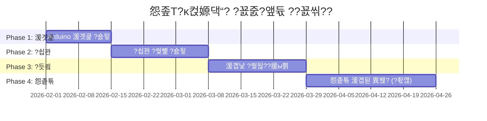

---
tags: [idea]
---

# 怨좊Т?κ컩嫄댁“?€ ?꾨몢?대끂 ?꾨줈?앺듃 - 珥덇툒???숈뒿 怨꾪쉷

?꾨몢?대끂 珥덇툒 媛쒕컻?먭? ?④퀎?곸쑝濡??숈뒿?섎ʼn ?꾩꽦?????덈뒗 怨좊Т?κ컩 嫄댁“?€ ?꾨줈?앺듃 怨꾪쉷?낅땲??

## ?꾨줈?앺듃 媛쒖슂

### 紐⑺몴
- 怨좊Т?κ컩???⑥쑉?곸쑝濡?嫄댁“?쒗궎???먮룞???쒖뒪??援ъ텞
- ?꾨몢?대끂 湲곗큹遺€???④퀎?곸쑝濡??숈뒿?섎ʼn ?꾨줈?앺듃 ?꾩꽦
- ?ㅼ깮?쒖뿉 ?좎슜??IoT 湲곌린 ?쒖옉 寃쏀뿕

### ?듭떖 湲곕뒫
1. **?먮룞 嫄댁“**: ?ъ쓣 ?댁슜??怨듦린 ?쒗솚
2. **?⑤룄 ?쒖뼱**: ?덊꽣瑜??댁슜???⑦뭾 嫄댁“ (?좏깮?ы빆)
3. **?듬룄 媛먯?**: 嫄댁“ ?꾨즺 ?먮룞 媛먯?
4. **?€?대㉧ 湲곕뒫**: ?ㅼ젙 ?쒓컙 ???먮룞 醫낅즺
5. **LED ?쒖떆**: ?숈옉 ?곹깭 ?쒓컖??

---

## ?숈뒿 ?④퀎蹂?援ы쁽 怨꾪쉷

### ?뱴 Phase 1: ?꾨몢?대끂 湲곗큹 ?숈뒿 (1-2二?

#### 1.1 媛쒕컻 ?섍꼍 ?ㅼ젙
- [ ] Arduino IDE ?ㅼ튂 諛??ㅼ젙
- [ ] ?꾨몢?대끂 蹂대뱶 ?곌껐 諛??뚯뒪??
- [ ] ?쒕━??紐⑤땲???ъ슜踰??듯엳湲?

#### 1.2 湲곕낯 ?덉젣 ?ㅼ뒿
```
?숈뒿 ?쒖꽌:
1. Blink (LED 源쒕묀?닿린) - ?붿???異쒕젰
2. Button (踰꾪듉 ?낅젰) - ?붿????낅젰
3. AnalogReadSerial (?꾨궇濡쒓렇 ?낅젰)
4. Fade (PWM 異쒕젰)
```

**?ㅼ뒿 紐⑺몴**: 
- ?붿????꾨궇濡쒓렇 ?낆텧???댄빐
- ?쒕━???듭떊 湲곗큹
- 湲곕낯 臾몃쾿 (蹂€?? 議곌굔臾? 諛섎났臾?

---

### ?뵩 Phase 2: ?쇱꽌 諛??≪텛?먯씠???쒖뼱 (2-3二?

#### 2.1 DHT22 ?⑥뒿???쇱꽌
**?숈뒿 ?댁슜**:
- I2C/?붿????듭떊 ?댄빐
- ?쇱씠釉뚮윭由??ㅼ튂 諛??ъ슜踰?
- ?쇱꽌 ?곗씠???쎄린 諛??쒕━??異쒕젰

**?ㅼ뒿 肄붾뱶**:
```cpp
#include <DHT.h>

#define DHTPIN 2
#define DHTTYPE DHT22

DHT dht(DHTPIN, DHTTYPE);

void setup() {
  Serial.begin(9600);
  dht.begin();
}

void loop() {
  float humidity = dht.readHumidity();
  float temperature = dht.readTemperature();
  
  Serial.print("?듬룄: ");
  Serial.print(humidity);
  Serial.print("% ?⑤룄: ");
  Serial.print(temperature);
  Serial.println("째C");
  
  delay(2000);
}
```

#### 2.2 ??紐⑦꽣 ?쒖뼱
**?숈뒿 ?댁슜**:
- 由대젅??紐⑤뱢 ?ъ슜踰?
- ?먮뒗 MOSFET???댁슜??PWM ?쒖뼱
- ?덉쟾???꾩썝 遺꾨━

**?ㅼ뒿 肄붾뱶**:
```cpp
#define FAN_PIN 3

void setup() {
  pinMode(FAN_PIN, OUTPUT);
}

void loop() {
  // ??耳쒓린
  digitalWrite(FAN_PIN, HIGH);
  delay(5000);
  
  // ???꾧린
  digitalWrite(FAN_PIN, LOW);
  delay(5000);
}
```

#### 2.3 LED ?곹깭 ?쒖떆
**?숈뒿 ?댁슜**:
- RGB LED ?먮뒗 媛쒕퀎 LED ?쒖뼱
- ?곹깭蹂??됱긽/?⑦꽩 ?쒖떆

---

### ?렞 Phase 3: 湲곕뒫 ?듯빀 (2-3二?

#### 3.1 湲곕낯 ?먮룞 嫄댁“ ?쒖뒪??
**援ы쁽 湲곕뒫**:
- ?듬룄 湲곕컲 ???먮룞 ?쒖뼱
- 嫄댁“ ?꾨즺 媛먯?
- LED ?곹깭 ?쒖떆

**?듭떖 濡쒖쭅**:
```cpp
const float DRY_THRESHOLD = 40.0;  // 嫄댁“ ?꾨즺 ?듬룄 (%)

void loop() {
  float humidity = dht.readHumidity();
  
  if (humidity > DRY_THRESHOLD) {
    // 嫄댁“ 以?
    digitalWrite(FAN_PIN, HIGH);
    setLED(BLUE);  // ?뚮???LED
  } else {
    // 嫄댁“ ?꾨즺
    digitalWrite(FAN_PIN, LOW);
    setLED(GREEN);  // 珥덈줉??LED
  }
}
```

#### 3.2 ?€?대㉧ 湲곕뒫 異붽?
**?숈뒿 ?댁슜**:
- millis() ?⑥닔瑜??댁슜??鍮꾩감???€?대㉧
- 踰꾪듉???댁슜???쒓컙 ?ㅼ젙

#### 3.3 LCD ?붿뒪?뚮젅??(?좏깮?ы빆)
**?숈뒿 ?댁슜**:
- I2C LCD 紐⑤뱢 ?ъ슜
- ?ㅼ떆媛??뺣낫 ?쒖떆 (?⑤룄, ?듬룄, ?⑥? ?쒓컙)

---

### ?? Phase 4: 怨좉툒 湲곕뒫 (?좏깮?ы빆, 3-4二?

#### 4.1 ?⑤룄 ?쒖뼱 (?덊꽣 異붽?)
> [!WARNING]
> ?덊꽣 ?ъ슜 ???덉쟾??媛곷퀎??二쇱쓽?댁빞 ?⑸땲?? 怨쇱뿴 諛⑹? ?뚮줈 ?꾩닔!

**?숈뒿 ?댁슜**:
- PID ?쒖뼱 湲곗큹
- ?⑤룄 ?쇱꽌 (DS18B20 ?먮뒗 DHT22)
- 由대젅?대? ?댁슜???덊꽣 ?쒖뼱

#### 4.2 ?ㅻ쭏?명룿 ?곕룞 (IoT)
**?숈뒿 ?댁슜**:
- ESP8266/ESP32 WiFi 紐⑤뱢
- Blynk ?먮뒗 MQTT ?꾨줈?좎퐳
- ?먭꺽 紐⑤땲?곕쭅 諛??쒖뼱

#### 4.3 ?곗씠??濡쒓퉭
**?숈뒿 ?댁슜**:
- SD 移대뱶 紐⑤뱢
- 嫄댁“ ?대젰 ?€??
- ?곗씠??遺꾩꽍

---

## ?꾩슂???섎뱶?⑥뼱

### 湲곕낯 援ъ꽦 (Phase 1-3)
| 遺€?덈챸 | ?섎웾 | ?덉긽 媛€寃?| ?⑸룄 |
|--------|------|-----------|------|
| Arduino Uno/Nano | 1 | 15,000??| 硫붿씤 而⑦듃濡ㅻ윭 |
| DHT22 ?⑥뒿???쇱꽌 | 1 | 5,000??| ?듬룄 痢≪젙 |
| 5V DC ??| 1-2 | 3,000??| 怨듦린 ?쒗솚 |
| 由대젅??紐⑤뱢 (5V) | 1 | 2,000??| ???쒖뼱 |
| RGB LED | 1 | 500??| ?곹깭 ?쒖떆 |
| ?앺듃 ?ㅼ쐞移?| 2-3 | 1,000??| ?낅젰 踰꾪듉 |
| ?€??(220廓, 10k廓) | 媛?5媛?| 1,000??| ?뚮줈 援ъ꽦 |
| 釉뚮젅?쒕낫??| 1 | 3,000??| ?꾨줈?좏??댄븨 |
| ?먰띁 ?€?댁뼱 | 1?명듃 | 3,000??| ?곌껐 |
| 5V ?꾩썝 ?대뙌??| 1 | 5,000??| ?꾩썝 怨듦툒 |

**湲곕낯 援ъ꽦 珥앹븸**: ??38,500??

### 怨좉툒 援ъ꽦 異붽? 遺€??(Phase 4)
| 遺€?덈챸 | ?섎웾 | ?덉긽 媛€寃?| ?⑸룄 |
|--------|------|-----------|------|
| I2C LCD (16x2) | 1 | 8,000??| ?뺣낫 ?쒖떆 |
| DS18B20 ?⑤룄?쇱꽌 | 1 | 3,000??| ?뺣? ?⑤룄 痢≪젙 |
| ESP8266 WiFi 紐⑤뱢 | 1 | 8,000??| IoT ?곕룞 |
| ?몃씪誘??덊꽣 (12V) | 1 | 15,000??| ?⑦뭾 嫄댁“ |
| SD 移대뱶 紐⑤뱢 | 1 | 3,000??| ?곗씠??濡쒓퉭 |

---

## ?꾩슂???뚰봽?몄썾??諛??쇱씠釉뚮윭由?

### 媛쒕컻 ?꾧뎄
- Arduino IDE (理쒖떊 踰꾩쟾)
- USB ?쒕씪?대쾭 (CH340/CP2102)

### ?꾩닔 ?쇱씠釉뚮윭由?
```
1. DHT sensor library (by Adafruit)
2. Adafruit Unified Sensor
```

### ?좏깮 ?쇱씠釉뚮윭由?(怨좉툒 湲곕뒫)
```
3. LiquidCrystal_I2C (LCD ?ъ슜 ??
4. OneWire + DallasTemperature (DS18B20 ?ъ슜 ??
5. ESP8266WiFi (WiFi ?곕룞 ??
6. Blynk (IoT ?곕룞 ??
7. SD (?곗씠??濡쒓퉭 ??
```

---

## ?숈뒿 ?먮즺 諛?李멸퀬 臾몄꽌

### 怨듭떇 臾몄꽌
- [Arduino 怨듭떇 ?쒗넗由ъ뼹](https://www.arduino.cc/en/Tutorial/HomePage)
- [Arduino ?몄뼱 ?덊띁?곗뒪](https://www.arduino.cc/reference/ko/)

### 異붿쿇 ?숈뒿 ?쒖꽌
1. **1二쇱감**: Arduino IDE ?ㅼ튂 諛?湲곕낯 ?덉젣 (Blink, Button)
2. **2二쇱감**: ?쇱꽌 ?낅젰 諛??쒕━???듭떊
3. **3二쇱감**: DHT22 ?쇱꽌 ?ъ슜踰?
4. **4二쇱감**: 由대젅??紐⑦꽣 ?쒖뼱
5. **5二쇱감**: 湲곕낯 ?먮룞??濡쒖쭅 援ы쁽
6. **6二쇱감**: ?€?대㉧ 諛??곹깭 愿€由?
7. **7二쇱감 ?댄썑**: 怨좉툒 湲곕뒫 異붽?

### ?좎슜??而ㅻ??덊떚
- ?꾨몢?대끂 怨듭떇 ?щ읆
- ?ㅼ씠踰??꾨몢?대끂 移댄럹
- Stack Overflow (arduino ?쒓렇)

---

## ?덉쟾 二쇱쓽?ы빆

> [!CAUTION]
> ?꾧린 ?덉쟾??媛곷퀎??二쇱쓽?섏꽭??

### ?꾩닔 ?덉쟾 ?섏튃
1. **?꾩썝 遺꾨━**: ?꾨몢?대끂?€ 怨좎쟾??遺€???? ?덊꽣)???꾩썝 遺꾨━
2. **由대젅???ъ슜**: 怨좎쟾??遺€?덉? 諛섎뱶??由대젅?대? ?듯빐 ?쒖뼱
3. **怨쇱뿴 諛⑹?**: ?덊꽣 ?ъ슜 ???⑤룄 ?쇱꽌?€ ?먮룞 李⑤떒 ?뚮줈 ?꾩닔
4. **?섍린**: 諛€?먮맂 怨듦컙?먯꽌 ?ъ슜 湲덉?
5. **?덉뿰**: 紐⑤뱺 ?꾧린 ?곌껐遺€ ?덉뿰 泥섎━
6. **?뚯뒪??*: ?ㅼ젣 ?ъ슜 ??異⑸텇???뚯뒪??

---

## ?꾨줈?앺듃 ?쇱젙 (?덉긽)



**珥??덉긽 湲곌컙**: 8-12二?(怨좉툒 湲곕뒫 ?ы븿 ??

---

## ?ㅼ쓬 ?④퀎

### 利됱떆 ?쒖옉 媛€?ν븳 ?묒뾽
1. ??Arduino IDE ?ㅼ튂
2. ???꾨몢?대끂 蹂대뱶 援щℓ (Uno ?먮뒗 Nano 異붿쿇)
3. ??湲곕낯 遺€??援щℓ (DHT22, ?? 由대젅?? LED)
4. ??Blink ?덉젣濡?蹂대뱶 ?뚯뒪??

### ?숈뒿 濡쒕뱶留?
- **Week 1-2**: Arduino 湲곗큹 (?붿????꾨궇濡쒓렇 I/O)
- **Week 3-4**: ?쇱꽌 ?ъ슜踰?(DHT22)
- **Week 5-6**: ?≪텛?먯씠???쒖뼱 (?? LED)
- **Week 7-8**: ?듯빀 諛??먮룞??濡쒖쭅
- **Week 9+**: 怨좉툒 湲곕뒫 諛?理쒖쟻??

---

## 臾몄젣 ?닿껐 媛€?대뱶

### ?먯＜ 諛쒖깮?섎뒗 臾몄젣

#### 1. ?쇱꽌 媛믪씠 NaN?쇰줈 異쒕젰??
```cpp
// ?닿껐: ?쇱꽌 珥덇린???쒓컙 異붽?
void setup() {
  Serial.begin(9600);
  dht.begin();
  delay(2000);  // ?쇱꽌 ?덉젙???€湲?
}
```

#### 2. ?ъ씠 ?묐룞?섏? ?딆쓬
- ?꾩썝 ?뺤씤 (5V 異⑸텇?쒖?)
- 由대젅???곌껐 ?뺤씤
- 肄붾뱶?먯꽌 pinMode ?ㅼ젙 ?뺤씤

#### 3. ?꾨몢?대끂媛€ ?щ??낅맖
- ?꾩썝 遺€議????몃? ?꾩썝 ?대뙌???ъ슜
- ?ш낵 ?꾨몢?대끂 ?꾩썝 遺꾨━

---

## 李멸퀬 ?먮즺

### ?뚮줈???덉떆
```
[異뷀썑 Fritzing?쇰줈 ?묒꽦 ?덉젙]
- 湲곕낯 ?뚮줈??
- 怨좉툒 ?뚮줈??(?덊꽣 ?ы븿)
```

### 肄붾뱶 ?€?μ냼 援ъ“
```
怨좊Т?κ컩嫄댁“?€/
?쒋??€ README.md (??臾몄꽌)
?쒋??€ docs/
??  ?쒋??€ circuit_diagrams/
??  ?쒋??€ learning_materials/
??  ?붴??€ troubleshooting.md
?쒋??€ src/
??  ?쒋??€ phase1_basics/
??  ?쒋??€ phase2_sensors/
??  ?쒋??€ phase3_integration/
??  ?붴??€ phase4_advanced/
?붴??€ hardware/
    ?붴??€ parts_list.md
```

---

## 湲곕? ?④낵

### ?숈뒿 ?깃낵
- ???꾨몢?대끂 湲곗큹遺€??以묎툒源뚯? ?④퀎???숈뒿
- ???쇱꽌, ?≪텛?먯씠???쒖뼱 寃쏀뿕
- ???ㅼ깮??臾몄젣 ?닿껐 ?꾨줈?앺듃 ?꾩꽦
- ??IoT 湲곗큹 媛쒕뀗 ?댄빐 (?좏깮?ы빆)

### ?ㅼ슜??媛€移?
- ?뮕 怨좊Т?κ컩 ?꾩깮 愿€由?媛쒖꽑
- ?뮕 ?먮꼫吏€ ?⑥쑉??嫄댁“
- ?뮕 ?먮룞?붾줈 ?몄쓽???μ긽
- ?뮕 DIY ?쒖옉?쇰줈 鍮꾩슜 ?덇컧

---

## ?쇱씠?좎뒪 諛?湲곗뿬

???꾨줈?앺듃???숈뒿 紐⑹쟻?쇰줈 ?먯쑀濡?쾶 ?ъ슜 媛€?ν빀?덈떎.
媛쒖꽑 ?ы빆?대굹 ?꾩씠?붿뼱媛€ ?덈떎硫??몄젣??怨듭쑀?댁＜?몄슂!

**Happy Making! ??**

