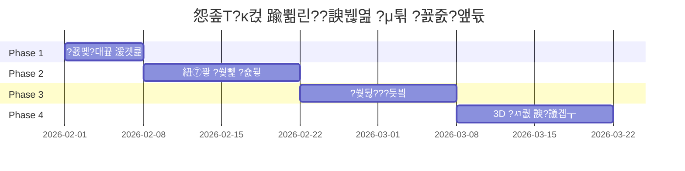

---
tags: [idea]
---

# 怨좊Т?κ컩 踰쀪린??諛붾엺 ?μ튂 - ?꾨몢?대끂 ?꾨줈?앺듃 怨꾪쉷

?꾨몢?대끂 珥덇툒 媛쒕컻?먭? ?④퀎?곸쑝濡??숈뒿?섎ʼn ?꾩꽦?섎뒗 怨좊Т?κ컩 ?덉갑 蹂댁“ ?μ튂 ?꾨줈?앺듃?낅땲??

## ?꾨줈?앺듃 媛쒖슂

### 臾몄젣 ?뺤쓽
?덉뿉 硫댁씠 ?녿뒗 怨좊Т?κ컩??踰쀬쓣 ???먯뿉 ?€??李⑥꽌 ??踰쀪꺼吏€吏€ ?딅뒗 臾몄젣瑜??닿껐?⑸땲??

### ?닿껐 諛⑹븞
怨좊Т?κ컩 ?대???怨듦린瑜?遺덉뼱?ｌ뼱 ?먭낵 ?κ컩 ?ъ씠??怨듦컙??留뚮뱾???쎄쾶 踰쀬쓣 ???덈룄濡??⑸땲??

### ?듭떖 湲곕뒫
1. **踰꾪듉 ?쒖꽦??*: 踰꾪듉???꾨Ⅴ硫?釉붾줈?????묐룞
2. **怨듦린 二쇱엯**: 怨좊Т?κ컩 ?먮ぉ 遺€遺꾩뿉 怨듦린 二쇱엯
3. **?먮룞 ?뺤?**: ?쇱젙 ?쒓컙 ???먮룞 醫낅즺
4. **?€?뚯쓬 ?ㅺ퀎**: 議곗슜?????ъ슜 諛??뚯쓬 理쒖냼??

---

## ?숈뒿 ?④퀎蹂?援ы쁽 怨꾪쉷

### ?뱴 Phase 1: ?꾨몢?대끂 湲곗큹 ?숈뒿 (1二?

#### 1.1 媛쒕컻 ?섍꼍 ?ㅼ젙
- [ ] Arduino IDE ?ㅼ튂
- [ ] ?꾨몢?대끂 蹂대뱶 ?곌껐 ?뚯뒪??
- [ ] ?쒕━??紐⑤땲???ъ슜踰?

#### 1.2 湲곕낯 ?덉젣 ?ㅼ뒿
```
?숈뒿 ?쒖꽌:
1. Blink - LED ?쒖뼱
2. Button - 踰꾪듉 ?낅젰 泥섎━
3. DigitalReadSerial - ?낅젰 ?곹깭 ?뺤씤
```

**?듭떖 媛쒕뀗**:
- ?붿????낆텧??
- ?€???€?ㅼ슫 ?€??
- ?붾컮?댁떛

---

### ?뵩 Phase 2: 紐⑦꽣 ?쒖뼱 ?숈뒿 (1-2二?

#### 2.1 DC 紐⑦꽣 湲곗큹
**?숈뒿 ?댁슜**:
- DC 紐⑦꽣 ?숈옉 ?먮━
- ?꾩썝 遺꾨━??以묒슂??
- ??린?꾨젰 蹂댄샇 (?ㅼ씠?ㅻ뱶)

#### 2.2 紐⑦꽣 ?쒕씪?대쾭 ?ъ슜
**異붿쿇 紐⑤뱢**: L298N ?먮뒗 L9110S

**?ㅼ뒿 肄붾뱶**:
```cpp
// 湲곕낯 紐⑦꽣 ?쒖뼱
#define MOTOR_PIN1 3
#define MOTOR_PIN2 4
#define ENABLE_PIN 5

void setup() {
  pinMode(MOTOR_PIN1, OUTPUT);
  pinMode(MOTOR_PIN2, OUTPUT);
  pinMode(ENABLE_PIN, OUTPUT);
}

void loop() {
  // 紐⑦꽣 ?뺣갑???뚯쟾
  digitalWrite(MOTOR_PIN1, HIGH);
  digitalWrite(MOTOR_PIN2, LOW);
  analogWrite(ENABLE_PIN, 200);  // ?띾룄 議곗젅 (0-255)
  
  delay(3000);
  
  // 紐⑦꽣 ?뺤?
  digitalWrite(MOTOR_PIN1, LOW);
  digitalWrite(MOTOR_PIN2, LOW);
  
  delay(2000);
}
```

#### 2.3 PWM???댁슜???띾룄 ?쒖뼱
**?숈뒿 ?댁슜**:
- PWM ?먮━ ?댄빐
- analogWrite() ?⑥닔
- ?띾룄 議곗젅 ?ㅼ뒿

---

### ?렞 Phase 3: 湲곕낯 ?쒖뒪??援ы쁽 (1-2二?

#### 3.1 踰꾪듉 ?쒖뼱 釉붾줈???쒖뒪??
**援ы쁽 湲곕뒫**:
- 踰꾪듉 ?꾨Ⅴ硫????묐룞
- 3珥????먮룞 ?뺤?
- LED濡??숈옉 ?곹깭 ?쒖떆

**?듭떖 肄붾뱶**:
```cpp
#define BUTTON_PIN 2
#define MOTOR_PIN1 3
#define MOTOR_PIN2 4
#define ENABLE_PIN 5
#define LED_PIN 13

const unsigned long RUN_TIME = 3000;  // 3珥?
unsigned long startTime = 0;
bool isRunning = false;

void setup() {
  pinMode(BUTTON_PIN, INPUT_PULLUP);
  pinMode(MOTOR_PIN1, OUTPUT);
  pinMode(MOTOR_PIN2, OUTPUT);
  pinMode(ENABLE_PIN, OUTPUT);
  pinMode(LED_PIN, OUTPUT);
  
  Serial.begin(9600);
}

void loop() {
  // 踰꾪듉 媛먯? (?붾컮?댁떛 ?ы븿)
  static unsigned long lastDebounceTime = 0;
  static int lastButtonState = HIGH;
  int buttonState = digitalRead(BUTTON_PIN);
  
  if (buttonState != lastButtonState) {
    lastDebounceTime = millis();
  }
  
  if ((millis() - lastDebounceTime) > 50) {
    if (buttonState == LOW && !isRunning) {
      // 踰꾪듉 ?뚮┝ - ???쒖옉
      startMotor();
      isRunning = true;
      startTime = millis();
      Serial.println("???묐룞 ?쒖옉");
    }
  }
  
  lastButtonState = buttonState;
  
  // ?먮룞 ?뺤? 泥댄겕
  if (isRunning && (millis() - startTime >= RUN_TIME)) {
    stopMotor();
    isRunning = false;
    Serial.println("???뺤?");
  }
}

void startMotor() {
  digitalWrite(MOTOR_PIN1, HIGH);
  digitalWrite(MOTOR_PIN2, LOW);
  analogWrite(ENABLE_PIN, 180);  // ?띾룄 議곗젅
  digitalWrite(LED_PIN, HIGH);
}

void stopMotor() {
  digitalWrite(MOTOR_PIN1, LOW);
  digitalWrite(MOTOR_PIN2, LOW);
  digitalWrite(LED_PIN, LOW);
}
```

#### 3.2 ?띾룄 議곗젅 湲곕뒫
**?숈뒿 ?댁슜**:
- 媛€蹂€?€???ы뀗?붾??? ?ъ슜
- analogRead()濡?媛??쎄린
- map() ?⑥닔濡?媛?蹂€??

---

### ?? Phase 4: 怨좉툒 湲곕뒫 (?좏깮?ы빆, 1-2二?

#### 4.1 ?ㅻ떒怨??띾룄 ?쒖뼱
**援ы쁽**:
- 踰꾪듉???щ윭 踰??꾨Ⅴ硫??띾룄 蹂€寃?
- ?쏀뭾 ??以묓뭾 ??媛뺥뭾 ?쒗솚

```cpp
int speedLevel = 0;
const int speeds[] = {0, 150, 200, 255};

void loop() {
  if (buttonPressed) {
    speedLevel = (speedLevel + 1) % 4;
    analogWrite(ENABLE_PIN, speeds[speedLevel]);
  }
}
```

#### 4.2 LCD ?붿뒪?뚮젅??
**?쒖떆 ?뺣낫**:
- ?꾩옱 ?띾룄 ?덈꺼
- ?⑥? ?묐룞 ?쒓컙
- ?곹깭 硫붿떆吏€

#### 4.3 ?먮룞 媛먯? (怨좉툒)
**?쇱꽌 ?쒖슜**:
- ?곸쇅???쇱꽌濡???媛먯?
- ?먮룞?쇰줈 ???묐룞
- ?먯쓣 鍮쇰㈃ ?먮룞 ?뺤?

---

## 3D ?꾨┛???ㅺ퀎 媛€?대뱶

### ?꾩슂??遺€??

#### 1. 怨듦린 二쇱엯 ?몄쫹
**?ㅺ퀎 ?붽뎄?ы빆**:
- 怨좊Т?κ컩 ?먮ぉ 遺€遺꾩뿉 留욌뒗 ?ш린
- 怨듦린 ?꾩텧 理쒖냼??
- 遺€?쒕윭???쒕㈃ (?κ컩 ?먯긽 諛⑹?)

**沅뚯옣 移섏닔**:
- ?닿꼍: 40-50mm (?먮ぉ ?ш린??留욎땄)
- ?몄쫹 湲몄씠: 30-40mm
- 怨듦린 ?낃뎄: 釉붾줈????異쒓뎄?€ ?곌껐

#### 2. ???섏슦吏?
**?ㅺ퀎 ?붽뎄?ы빆**:
- 釉붾줈????怨좎젙
- ?뚯쓬 媛먯냼 援ъ“
- 怨듦린 ?먮쫫 理쒖쟻??

#### 3. 蹂몄껜 耳€?댁뒪
**?ы븿 ?붿냼**:
- ?꾨몢?대끂 蹂대뱶 怨좎젙遺€
- 紐⑦꽣 ?쒕씪?대쾭 ?μ갑 怨듦컙
- 踰꾪듉 諛?LED ?€
- ?꾩썝 耳€?대툝 異쒓뎄
- ?섍린援?

### 3D 紐⑤뜽留??꾧뎄
**珥덈낫??異붿쿇**:
- Tinkercad (??湲곕컲, 臾대즺, ?ъ?)
- Fusion 360 (?숈깮/痍⑤???臾대즺)

**?숈뒿 ?먮즺**:
- Tinkercad 怨듭떇 ?쒗넗由ъ뼹
- YouTube 3D ?꾨┛??梨꾨꼸

---

## ?꾩슂???섎뱶?⑥뼱

### ?꾩옄 遺€??(湲곕낯 援ъ꽦)

| 遺€?덈챸 | ?섎웾 | ?덉긽 媛€寃?| ?ъ뼇 |
|--------|------|-----------|------|
| Arduino Uno/Nano | 1 | 15,000??| 5V |
| DC 釉붾줈????| 1 | 8,000??| 5V/12V, ?€?뚯쓬 |
| 紐⑦꽣 ?쒕씪?대쾭 | 1 | 3,000??| L298N ?먮뒗 L9110S |
| ?앺듃 ?ㅼ쐞移?| 1 | 500??| ?쒓컙 ?묒큺 |
| LED | 1 | 200??| 5mm, ?뚮???|
| ?€??220廓 | 1 | 100??| LED??|
| ?ㅼ씠?ㅻ뱶 1N4007 | 1 | 100??| ??린?꾨젰 蹂댄샇 |
| 釉뚮젅?쒕낫??| 1 | 3,000??| ?꾨줈?좏??댄븨 |
| ?먰띁 ?€?댁뼱 | 1?명듃 | 3,000??| M-M, M-F |
| ?꾩썝 ?대뙌??| 1 | 5,000??| 12V 1A ?먮뒗 5V 2A |
| DC ??| 1 | 1,000??| ?꾩썝 ?곌껐 |

**湲곕낯 援ъ꽦 珥앹븸**: ??38,900??

### 怨좉툒 援ъ꽦 異붽? 遺€??

| 遺€?덈챸 | ?섎웾 | ?덉긽 媛€寃?| ?⑸룄 |
|--------|------|-----------|------|
| 媛€蹂€?€??10k廓 | 1 | 500??| ?띾룄 議곗젅 |
| I2C LCD 16x2 | 1 | 8,000??| ?뺣낫 ?쒖떆 |
| ?곸쇅???쇱꽌 | 1 | 2,000??| ?먮룞 媛먯? |

### 3D ?꾨┛???щ즺
- PLA ?꾨씪硫섑듃: ??5,000??(100g ?ъ슜 ?덉긽)
- ?먮뒗 3D ?꾨┛???쒕퉬???댁슜: 10,000-20,000??

---

## 釉붾줈?????좏깮 媛€?대뱶

### ?€?뚯쓬 ??異붿쿇

#### 1. 5V USB ??
**?μ젏**:
- 議곗슜??(30-40dB)
- ?꾨몢?대끂 ?꾩썝?쇰줈 吏곸젒 援щ룞 媛€??
- ?€?댄븿

**?⑥젏**:
- ?띾웾???쏀븷 ???덉쓬

#### 2. 12V 釉붾줈????
**?μ젏**:
- 媛뺥븳 ?띾웾
- ?ㅼ뼇???ш린 ?좏깮 媛€??

**?⑥젏**:
- 蹂꾨룄 12V ?꾩썝 ?꾩슂
- ?뚯쓬???????덉쓬

#### 3. ?먯떖 釉붾줈????(異붿쿇)
**?뱀쭠**:
- 吏묒쨷??怨듦린 ?먮쫫
- 以묎컙 ?뚯쓬 (40-50dB)
- ?⑥쑉?곸씤 怨듦린 二쇱엯

**異붿쿇 紐⑤뜽**:
- 5015 釉붾줈????(50x50x15mm)
- 12V ?먮뒗 5V 踰꾩쟾

### ?뚯쓬 媛먯냼 ??
1. **???띾룄 議곗젅**: PWM?쇰줈 ?꾩슂??留뚰겮留??뚯쟾
2. **吏꾨룞 ?≪닔**: 怨좊Т ?⑤뱶 ?ъ슜
3. **?섏슦吏??ㅺ퀎**: ?뚯쓬 媛먯뇿 援ъ“
4. **???덉쭏**: 踰좎뼱留??€???좏깮 (蹂?踰좎뼱留?> ?щ━釉?

---

## ?뚮줈 ?ㅺ퀎

### 湲곕낯 ?뚮줈??(?띿뒪??

```
Arduino Uno
?쒋? D2 ?€?€?€?€ ?앺듃 ?ㅼ쐞移??€?€?€?€ GND
?쒋? D3 ?€?€?€?€ 紐⑦꽣?쒕씪?대쾭 IN1
?쒋? D4 ?€?€?€?€ 紐⑦꽣?쒕씪?대쾭 IN2
?쒋? D5 ?€?€?€?€ 紐⑦꽣?쒕씪?대쾭 ENA (PWM)
?쒋? D13 ?€?€?€ LED (+) ?€?€?€?€ 220廓 ?€?€?€?€ GND
?쒋? 5V ?€?€?€?€ 紐⑦꽣?쒕씪?대쾭 VCC
?붴? GND ?€?€?€ 紐⑦꽣?쒕씪?대쾭 GND

紐⑦꽣 ?쒕씪?대쾭 (L298N)
?쒋? OUT1 ?€?€?€?€ 釉붾줈????(+)
?쒋? OUT2 ?€?€?€?€ 釉붾줈????(-)
?쒋? 12V ?€?€?€?€ ?몃? ?꾩썝 (+)
?붴? GND ?€?€?€?€ ?몃? ?꾩썝 (-)
```

### ?꾩썝 援ъ꽦

**?듭뀡 1: 5V ???ъ슜**
- USB ?꾩썝 ?먮뒗 5V ?대뙌??
- ?꾨몢?대끂?€ ??怨듯넻 ?꾩썝

**?듭뀡 2: 12V ???ъ슜 (異붿쿇)**
- 12V ?대뙌??
- ?꾨몢?대끂??USB ?먮뒗 紐⑦꽣?쒕씪?대쾭??5V 異쒕젰 ?ъ슜
- ??媛뺥븳 ?띾웾

---

## ?뚰봽?몄썾??援ъ“

### ?곹깭 癒몄떊 ?ㅺ퀎

```cpp
enum State {
  IDLE,      // ?€湲??곹깭
  RUNNING,   // ???묐룞 以?
  STOPPING   // ?뺤? 以?
};

State currentState = IDLE;

void loop() {
  switch(currentState) {
    case IDLE:
      if (buttonPressed) {
        currentState = RUNNING;
        startMotor();
      }
      break;
      
    case RUNNING:
      if (millis() - startTime >= RUN_TIME) {
        currentState = STOPPING;
      }
      break;
      
    case STOPPING:
      stopMotor();
      currentState = IDLE;
      break;
  }
}
```

### ?꾩닔 ?쇱씠釉뚮윭由?
**湲곕낯 援ъ꽦**:
- ?댁옣 ?쇱씠釉뚮윭由щ쭔 ?ъ슜 (異붽? ?ㅼ튂 遺덊븘??

**怨좉툒 湲곕뒫**:
- LiquidCrystal_I2C (LCD ?ъ슜 ??

---

## ?숈뒿 濡쒕뱶留?

### Week 1: ?꾨몢?대끂 湲곗큹
- [ ] Arduino IDE ?ㅼ튂
- [ ] Blink ?덉젣
- [ ] Button ?덉젣
- [ ] ?쒕━??紐⑤땲???ъ슜

### Week 2: 紐⑦꽣 ?쒖뼱
- [ ] 紐⑦꽣 ?쒕씪?대쾭 ?곌껐
- [ ] 湲곕낯 紐⑦꽣 ?쒖뼱
- [ ] PWM ?띾룄 議곗젅
- [ ] ??린?꾨젰 蹂댄샇 ?댄빐

### Week 3: ?듯빀 ?쒖뒪??
- [ ] 踰꾪듉 + 紐⑦꽣 ?듯빀
- [ ] ?€?대㉧ 湲곕뒫 援ы쁽
- [ ] LED ?곹깭 ?쒖떆
- [ ] ?붾쾭源?諛??뚯뒪??

### Week 4: 3D ?꾨┛??(?좏깮)
- [ ] Tinkercad ?숈뒿
- [ ] ?몄쫹 ?ㅺ퀎
- [ ] 耳€?댁뒪 ?ㅺ퀎
- [ ] ?꾨┛??諛?議곕┰

### Week 5: 怨좉툒 湲곕뒫 (?좏깮)
- [ ] ?띾룄 議곗젅 異붽?
- [ ] LCD ?붿뒪?뚮젅??
- [ ] 理쒖쥌 議곕┰ 諛??뚯뒪??

**珥??덉긽 湲곌컙**: 3-5二?

---

## ?덉쟾 二쇱쓽?ы빆

> [!CAUTION]
> ?꾧린 諛?湲곌퀎 ?덉쟾??二쇱쓽?섏꽭??

### ?꾧린 ?덉쟾
- ???꾨몢?대끂?€ 紐⑦꽣 ?꾩썝 遺꾨━
- ??紐⑦꽣?먮뒗 諛섎뱶????린?꾨젰 蹂댄샇 ?ㅼ씠?ㅻ뱶 ?ъ슜
- ???꾩썝 洹뱀꽦 ?뺤씤 (+ / -)
- ???⑤씫 諛⑹? (?덉뿰 ?뚯씠???ъ슜)

### 湲곌퀎 ?덉쟾
- ?뵩 ???좉컻???먭????묒큺 湲덉?
- ?뵩 ?뚯쟾 遺€??蹂댄샇 而ㅻ쾭 ?ㅼ튂
- ?뵩 怨좎젙 遺€???뺤떎??泥닿껐

### ?ъ슜 ?덉쟾
- ?뫀 ?대┛???ъ슜 ??蹂댄샇??媛먮룆
- ?뫀 ?μ떆媛??곗냽 ?ъ슜 湲덉? (怨쇱뿴 諛⑹?)
- ?뫀 ?댁긽 ?뚯쓬 諛쒖깮 ??利됱떆 以묐떒

---

## ?꾨줈?앺듃 ?€?꾨씪??



---

## 臾몄젣 ?닿껐 媛€?대뱶

### ?먯＜ 諛쒖깮?섎뒗 臾몄젣

#### 1. 紐⑦꽣媛€ ?묐룞?섏? ?딆쓬
**泥댄겕由ъ뒪??*:
- [ ] ?꾩썝 ?곌껐 ?뺤씤 (12V ?먮뒗 5V)
- [ ] 紐⑦꽣 ?쒕씪?대쾭 ?곌껐 ?뺤씤
- [ ] 肄붾뱶?먯꽌 pinMode ?ㅼ젙 ?뺤씤
- [ ] 紐⑦꽣 ?쒕씪?대쾭 ?먰띁 ?ㅼ젙 (ENA ?쒖꽦??

#### 2. ?꾨몢?대끂媛€ ?щ??낅맖
**?먯씤**: ?꾩썝 遺€議?
**?닿껐**:
- 紐⑦꽣?€ ?꾨몢?대끂 ?꾩썝 遺꾨━
- ?????⑸웾???대뙌???ъ슜 (2A ?댁긽)

#### 3. 踰꾪듉???ㅼ옉?숉븿
**?먯씤**: ?붾컮?댁떛 臾몄젣
**?닿껐**:
```cpp
// ?붾컮?댁떛 肄붾뱶 異붽?
unsigned long lastDebounceTime = 0;
const unsigned long debounceDelay = 50;
```

#### 4. ???뚯쓬????
**?닿껐**:
- PWM ?띾룄 ??텛湲?
- ?€?뚯쓬 ?ъ쑝濡?援먯껜
- 吏꾨룞 ?≪닔 ?⑤뱶 異붽?
- ?섏슦吏?媛쒖꽑

---

## 媛쒖꽑 ?꾩씠?붿뼱

### ?④퀎蹂??낃렇?덉씠??

#### Level 1: 湲곕낯 (?꾩꽦 ??
- ??踰꾪듉 ?꾨Ⅴ硫?3珥??묐룞
- ??LED ?곹깭 ?쒖떆

#### Level 2: ?몄쓽??
- ?뵩 ?띾룄 議곗젅 (媛€蹂€?€??
- ?뵩 ?묐룞 ?쒓컙 議곗젅
- ?뵩 LCD ?뺣낫 ?쒖떆

#### Level 3: ?먮룞??
- ?? ??媛먯? ?먮룞 ?묐룞
- ?? ?묒넀 ?숈떆 ?ъ슜 (??2媛?
- ?? 諛고꽣由?援щ룞 (?대???

#### Level 4: ?ㅻ쭏??
- ?뮕 釉붾（?ъ뒪 ?쒖뼱
- ?뮕 ?ъ슜 ?잛닔 移댁슫??
- ?뮕 ?먮룞 ?덉쟾 紐⑤뱶

---

## ?덉긽 鍮꾩슜 諛??쒓컙

### 鍮꾩슜 遺꾩꽍

| ??ぉ | 鍮꾩슜 |
|------|------|
| ?꾩옄 遺€??(湲곕낯) | 38,900??|
| 3D ?꾨┛??| 10,000??|
| ?덈퉬 遺€??| 5,000??|
| **珥앷퀎** | **??54,000??* |

### ?쒓컙 ?ъ옄

| ?④퀎 | ?쒓컙 |
|------|------|
| ?숈뒿 (?꾨몢?대끂 湲곗큹) | 10?쒓컙 |
| ?뚮줈 援ъ꽦 諛?肄붾뵫 | 15?쒓컙 |
| 3D ?ㅺ퀎 諛??꾨┛??| 20?쒓컙 |
| 議곕┰ 諛??뚯뒪??| 10?쒓컙 |
| **珥앷퀎** | **??55?쒓컙** |

**1??2?쒓컙 ?묒뾽 ??*: ??4二??뚯슂

---

## ?ㅼ쓬 ?④퀎

### 利됱떆 ?쒖옉 媛€??

1. ??**Arduino IDE ?ㅼ튂**
2. ??**?꾨몢?대끂 蹂대뱶 援щℓ** (Uno 異붿쿇)
3. ??**湲곕낯 遺€??援щℓ**:
   - 釉붾줈????(5015 ?먮뒗 ?좎궗)
   - L298N 紐⑦꽣 ?쒕씪?대쾭
   - 踰꾪듉, LED, ?€??
4. ??**Blink ?덉젣濡??뚯뒪??*

### ?숈뒿 ?쒖꽌

```
1二쇱감: Arduino 湲곗큹 ?듯엳湲?
  ??
2二쇱감: 紐⑦꽣 ?쒕씪?대쾭 ?ъ슜踰?
  ??
3二쇱감: 踰꾪듉 + 紐⑦꽣 ?듯빀
  ??
4二쇱감: 3D ?ㅺ퀎 (?좏깮)
  ??
5二쇱감: 理쒖쥌 議곕┰
```

---

## 李멸퀬 ?먮즺

### 怨듭떇 臾몄꽌
- [Arduino 怨듭떇 ?ъ씠??(https://www.arduino.cc)
- [Arduino ?몄뼱 ?덊띁?곗뒪](https://www.arduino.cc/reference/ko/)

### 紐⑦꽣 ?쒖뼱 ?쒗넗由ъ뼹
- Arduino DC Motor Control Tutorial
- L298N Motor Driver Guide

### 3D ?꾨┛??
- [Tinkercad](https://www.tinkercad.com)
- Thingiverse (3D 紐⑤뜽 怨듭쑀 ?ъ씠??

### 而ㅻ??덊떚
- ?꾨몢?대끂 怨듭떇 ?щ읆
- ?ㅼ씠踰??꾨몢?대끂 移댄럹
- 3D ?꾨┛??而ㅻ??덊떚

---

## 湲곕? ?④낵

### ?숈뒿 ?깃낵
- ???꾨몢?대끂 湲곗큹 ??以묎툒 ?④퀎 ?숈뒿
- ??紐⑦꽣 ?쒖뼱 ?ㅼ쟾 寃쏀뿕
- ??3D ?꾨┛??湲곗큹 ?듬뱷
- ??臾몄젣 ?닿껐 ?λ젰 ?μ긽

### ?ㅼ슜??媛€移?
- ?뮕 怨좊Т?κ컩 ?덉갑 ?몄쓽???€???μ긽
- ?뮕 ???쇰? 蹂댄샇 (臾대━????遺덊븘??
- ?뮕 ?쒓컙 ?덉빟
- ?뮕 DIY ?쒖옉???깆랬媛?

---

## ?꾨줈?앺듃 ?€?μ냼 援ъ“ (?덉젙)

```
怨좊Т?κ컩踰쀪린?붾컮??
?쒋??€ README.md
?쒋??€ implementation_plan.md (??臾몄꽌)
?쒋??€ docs/
??  ?쒋??€ circuit_diagram.png
??  ?쒋??€ wiring_guide.md
??  ?붴??€ troubleshooting.md
?쒋??€ src/
??  ?쒋??€ basic_version/
??  ??  ?붴??€ glove_remover_v1.ino
??  ?쒋??€ advanced_version/
??  ??  ?붴??€ glove_remover_v2.ino
??  ?붴??€ final_version/
??      ?붴??€ glove_remover_final.ino
?쒋??€ 3d_models/
??  ?쒋??€ air_nozzle.stl
??  ?쒋??€ fan_housing.stl
??  ?붴??€ main_case.stl
?붴??€ hardware/
    ?쒋??€ parts_list.md
    ?붴??€ assembly_guide.md
```

---

## ?쇱씠?좎뒪

???꾨줈?앺듃???숈뒿 諛?媛쒖씤 ?ъ슜 紐⑹쟻?쇰줈 ?먯쑀濡?쾶 ?ъ슜 媛€?ν빀?덈떎.

**Happy Making! ??**

---

*Last Updated: 2026-02-01*

