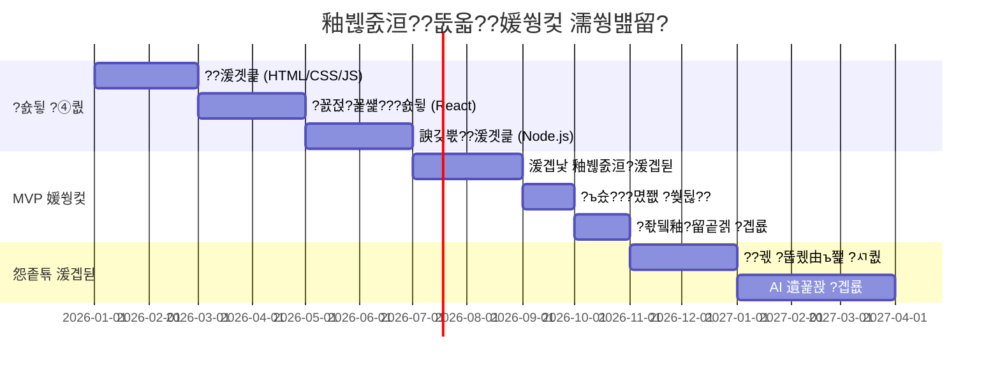

---
tags: [idea]
---

# ?덈줈???묎렐??釉붾줈洹??뚮옯??- 援ы쁽 ?쒖씠??遺꾩꽍

> **?€??*: ??媛쒕컻 寃쏀뿕???녿뒗 珥덈낫?? 
> **湲곗???*: 2026-01-09

---

## ?뱤 醫낇빀 ?쒖씠???됯?

| ??ぉ | ?쒖씠??(1-10) | ?ㅻ챸 |
|:---|:---:|:---|
| **?꾩껜 ?꾨줈?앺듃** | 狩먥춴狩먥춴狩먥춴狩먥춴 (8/10) | ?€?ㅽ깮 ??媛쒕컻 + AI/ML ?뚭퀬由ъ쬁 ?꾩슂 |
| **?꾨줎?몄뿏??* | 狩먥춴狩먥춴狩먥춴 (6/10) | 源붾걫??UI 援ы쁽 ?먯껜??以묎컙 ?쒖씠??|
| **諛깆뿏??* | 狩먥춴狩먥춴狩먥춴狩먥춴 (8/10) | ?ъ슜?? 肄섑뀗痢? ??궧 ?쒖뒪????蹂듭옟 |
| **AI/?뚭퀬由ъ쬁** | 狩먥춴狩먥춴狩먥춴狩먥춴狩?(9/10) | "紐낆꽍??湲€" ?먮퀎?€ 怨좊궃?대룄 |
| **?명봽???댁쁺** | 狩먥춴狩먥춴狩먥춴狩?(7/10) | ?쒕쾭, DB, 蹂댁븞, ?뺤옣??怨좊젮 ?꾩슂 |

---

## ?렞 ?듭떖 湲곕뒫蹂?援ы쁽 ?쒖씠??

### 1. 湲곕낯 釉붾줈洹?湲곕뒫 (寃뚯떆湲€ CRUD)
| ?몃? 湲곕뒫 | ?쒖씠??| 珥덈낫???덉긽 ?숈뒿 湲곌컙 | 鍮꾧퀬 |
|:---|:---:|:---|:---|
| 湲€ ?묒꽦/?섏젙/??젣 | ?윞 4/10 | 2-4二?| 湲곕낯 ??媛쒕컻 ?숈뒿?쇰줈 媛€??|
| 留덊겕?ㅼ슫 ?먮뵒??| ?윞 5/10 | 1-2二?| ?ㅽ뵂?뚯뒪 ?쇱씠釉뚮윭由??쒖슜 媛€??|
| ?대?吏€ ?낅줈??| ?윞 5/10 | 1-2二?| ?대씪?곕뱶 ?ㅽ넗由ъ? ?곕룞 ?꾩슂 |
| ?ъ슜???몄쬆 (濡쒓렇???뚯썝媛€?? | ?윝 6/10 | 2-3二?| 蹂댁븞 怨좊젮?ы빆 留롮쓬 |

### 2. ?덇킅怨??섍꼍 (源붾걫??UI)
| ?몃? 湲곕뒫 | ?쒖씠??| 珥덈낫???덉긽 ?숈뒿 湲곌컙 | 鍮꾧퀬 |
|:---|:---:|:---|:---|
| 諛섏쓳???붿옄??| ?윞 5/10 | 2-3二?| CSS/?꾨젅?꾩썙???숈뒿 ?꾩슂 |
| ?ㅽ겕紐⑤뱶 吏€??| ?윟 3/10 | 3-5??| 鍮꾧탳??媛꾨떒 |
| ?€?댄룷洹몃옒??理쒖쟻??| ?윞 4/10 | 1-2二?| ?붿옄??媛먭컖 ?꾩슂 |

### 3. 媛€移?湲곕컲 ??궧 ?쒖뒪???좑툘 ?듭떖 ?쒖젣
| ?몃? 湲곕뒫 | ?쒖씠??| 珥덈낫???덉긽 ?숈뒿 湲곌컙 | 鍮꾧퀬 |
|:---|:---:|:---|:---|
| ?⑥닚 ?듦퀎 (議고쉶?? 醫뗭븘?? | ?윞 4/10 | 1-2二?| 湲곕낯?곸씤 DB 荑쇰━ |
| 泥대쪟?쒓컙 ?몃옒??| ?윝 6/10 | 2-3二?| JavaScript ?대깽??泥섎━ |
| "紐낆꽍??湲€" ?먮퀎 ?뚭퀬由ъ쬁 | ?뵶 9/10 | 6媛쒖썡+ | **NLP/ML ?꾨Ц吏€???꾩슂** |
| ?볤? 源딆씠/?덉쭏 遺꾩꽍 | ?뵶 8/10 | 3媛쒖썡+ | ?먯뿰??泥섎━ ?꾩슂 |
| ?꾨Ц媛€ ?됱젏 ?쒖뒪??| ?윝 6/10 | 3-4二?| ?ㅺ퀎??媛€?? ?꾨Ц媛€ ?뺣낫媛€ 愿€嫄?|

> [!CAUTION]
> **"?좎슜?섍퀬 紐낆꽍??湲€"???먮룞?쇰줈 ?먮퀎?섎뒗 寃껋? ???꾨줈?앺듃??媛€???대젮??遺€遺꾩엯?덈떎.**  
> ChatGPT/Claude ?섏???LLM???쒖슜?섎뜑?쇰룄 ?꾨꼍???먮퀎?€ ?대졄?듬땲??

### 4. ?몃? ?곌껐 ?쒖뒪??(Bridge ??븷)
| ?몃? 湲곕뒫 | ?쒖씠??| 珥덈낫???덉긽 ?숈뒿 湲곌컙 | 鍮꾧퀬 |
|:---|:---:|:---|:---|
| ?좏뒠釉??꾨쿋??| ?윟 2/10 | 2-3??| YouTube API ?쒖슜, 留ㅼ슦 ?ъ? |
| ?곹뭹 留곹겕 ?곕룞 | ?윟 3/10 | 1二?| ?꾨쭏議? 荑좏뙜 ???쒗쑕 留곹겕 |
| 媛뺤쓽 ?뚮옯???곌껐 | ?윟 3/10 | 1二?| 留곹겕 諛?移대뱶 UI 援ы쁽 |
| Native UI ?붿옄??| ?윞 5/10 | 2-3二?| 愿묎퀬泥섎읆 蹂댁씠吏€ ?딅뒗 ?붿옄??|

### 5. ?명봽??諛??댁쁺
| ?몃? 湲곕뒫 | ?쒖씠??| 珥덈낫???덉긽 ?숈뒿 湲곌컙 | 鍮꾧퀬 |
|:---|:---:|:---|:---|
| ?쒕쾭 諛고룷 (AWS/Vercel) | ?윝 6/10 | 2-3二?| ?대씪?곕뱶 ?쒕퉬???숈뒿 ?꾩슂 |
| ?곗씠?곕쿋?댁뒪 ?ㅺ퀎 | ?윝 6/10 | 3-4二?| 愿€怨꾪삎/NoSQL ?댄빐 ?꾩슂 |
| 寃€??湲곕뒫 (Elasticsearch) | ?뵶 7/10 | 4-6二?| 蹂꾨룄 湲곗닠 ?ㅽ깮 |
| 蹂댁븞 (XSS, CSRF, SQL Injection) | ?뵶 7/10 | 吏€?띿쟻 | 蹂댁븞 痍⑥빟???댄빐 ?꾩닔 |

---

## ?뱟 珥덈낫??湲곗? ?덉긽 媛쒕컻 湲곌컙

### ?쒕굹由ъ삤 1: MVP (理쒖냼 湲곕뒫 ?쒗뭹)
**湲곕뒫**: 湲€ ?묒꽦, ?⑥닚 ??궧(議고쉶??, ?좏뒠釉??꾨쿋??

| ?④퀎 | 湲곌컙 | ?쒕룞 |
|:---|:---:|:---|
| ??湲곗큹 ?숈뒿 | 2-3媛쒖썡 | HTML, CSS, JavaScript |
| ?꾨젅?꾩썙???숈뒿 | 1-2媛쒖썡 | React ?먮뒗 Vue.js |
| 諛깆뿏???숈뒿 | 2-3媛쒖썡 | Node.js ?먮뒗 Python(Django) |
| MVP 媛쒕컻 | 2-3媛쒖썡 | ?ㅼ젣 援ы쁽 |
| **珥??덉긽 湲곌컙** | **7-11媛쒖썡** | |

### ?쒕굹由ъ삤 2: ?꾩쟾 湲곕뒫 (媛€移?湲곕컲 ??궧 ?ы븿)
**湲곕뒫**: 紐⑤뱺 ?듭떖 湲곕뒫 + AI 湲곕컲 肄섑뀗痢?遺꾩꽍

| ?④퀎 | 湲곌컙 | ?쒕룞 |
|:---|:---:|:---|
| MVP ?꾩꽦 | 7-11媛쒖썡 | ???쒕굹由ъ삤 1 李몄“ |
| AI/ML 湲곗큹 ?숈뒿 | 4-6媛쒖썡 | Python, TensorFlow/PyTorch |
| NLP 諛???궧 ?뚭퀬由ъ쬁 媛쒕컻 | 6-12媛쒖썡 | 肄섑뀗痢??덉쭏 遺꾩꽍 紐⑤뜽 |
| ?쒖뒪???듯빀 諛?理쒖쟻??| 2-3媛쒖썡 | ?깅뒫 ?쒕떇 |
| **珥??덉긽 湲곌컙** | **19-32媛쒖썡 (??2-3??** | |

> [!WARNING]
> **?쇱옄 媛쒕컻 ???꾩떎?곸쑝濡??€?€??2-3?꾩씠 ?뚯슂?????덉뒿?덈떎.**  
> ?€(?꾨줎?몄뿏?? 諛깆뿏?? ML ?붿??덉뼱)?쇰줈 援ъ꽦?섎㈃ 6媛쒖썡-1?꾩쑝濡??⑥텞 媛€?ν빀?덈떎.

---

## ?썱截??꾩슂??湲곗닠 ?ㅽ깮

### ?꾨줎?몄뿏??
- HTML/CSS/JavaScript (?꾩닔)
- React.js ?먮뒗 Vue.js (沅뚯옣)
- Tailwind CSS ?먮뒗 Styled Components

### 諛깆뿏??
- Node.js + Express ?먮뒗 Python + Django/FastAPI
- PostgreSQL ?먮뒗 MongoDB (?곗씠?곕쿋?댁뒪)
- Redis (罹먯떛, ?몄뀡 愿€由?

### AI/ML (媛€移?湲곕컲 ??궧)
- Python (?꾩닔)
- OpenAI API ?먮뒗 Hugging Face Transformers
- ?띿뒪???꾨쿋??諛?遺꾨쪟 紐⑤뜽

### ?명봽??
- AWS, GCP, ?먮뒗 Vercel/Netlify
- Docker (而⑦뀒?대꼫??
- GitHub Actions (CI/CD)

---

## ?뮕 珥덈낫?먮? ?꾪븳 ?꾩떎??議곗뼵

### ??異붿쿇 ?묎렐踰?

1. **?④퀎蹂??묎렐**: 泥섏쓬遺€??紐⑤뱺 湲곕뒫??援ы쁽?섎젮 ?섏? 留덉꽭??
   - 1?④퀎: ?뺤쟻 釉붾줈洹?(HTML/CSS留뚯쑝濡??쒖옉)
   - 2?④퀎: CMS ?꾩엯 (Ghost, Contentful ??
   - 3?④퀎: 而ㅼ뒪?€ 湲곕뒫 異붽?

2. **湲곗〈 ?뚮옯???쒖슜**: 
   - **Ghost**: ?ㅽ뵂?뚯뒪 釉붾줈洹??뚮옯?? 而ㅼ뒪?곕쭏?댁쭠 媛€??
   - **Notion + Super.so**: 鍮좊Ⅸ 釉붾줈洹?援ъ텞 媛€??
   - **WordPress**: ?뚮윭洹몄씤?쇰줈 ?뺤옣 媛€??

3. **No-Code/Low-Code ?꾧뎄**:
   - **Webflow**: 肄붾뵫 ?놁씠 ?뱀궗?댄듃 ?쒖옉
   - **Bubble**: ?€?ㅽ깮 ??媛쒕컻 媛€??
   - **Airtable + Softr**: ?곗씠?곕쿋?댁뒪 湲곕컲 ??

4. **AI 湲곕뒫?€ ?몃? API濡??€泥?*:
   - OpenAI GPT API濡?湲€ ?덉쭏 珥덈쾶 遺꾩꽍
   - 珥덇린?먮뒗 ?섎룞 ?먮젅?댁뀡 + AI 蹂댁“ 諛⑹떇 異붿쿇

### ???쇳빐?????⑥젙

1. **?꾨꼍二쇱쓽**: MVP ?놁씠 ?꾩쟾???쒗뭹??紐⑺몴濡??섎㈃ ?꾩꽦 遺덇?
2. **湲곗닠 ?ㅽ깮 怨쇱슃**: 泥섏쓬遺€??蹂듭옟???꾪궎?띿쿂 ?ㅺ퀎 湲덉?
3. **?쇱옄 紐⑤뱺 寃??섎젮???쒕룄**: ?€???먮뒗 ?몄＜ 怨좊젮
4. **?ъ슜??寃€利??놁씠 媛쒕컻**: 鍮좊Ⅴ寃?異쒖떆?섍퀬 ?쇰뱶諛?諛쏄린

---

## ?뱢 ?④퀎蹂?濡쒕뱶留??쒖븞

---

## ?렡 寃곕줎 諛?沅뚯옣?ы빆

| ?꾩옱 ?섏? | 沅뚯옣 ?묎렐踰?|
|:---|:---|
| ??媛쒕컻 寃쏀뿕 0 | Ghost/WordPress濡?MVP 異쒖떆 ???먯쭊???뺤옣 |
| ?꾨줎?몄뿏?쒕쭔 媛€??| Supabase/Firebase ?쒖슜 BaaS 諛⑹떇 異붿쿇 |
| ?꾨줈洹몃옒諛?媛€??(鍮꾩쎒) | React + Node.js ?€?ㅽ깮 吏곸젒 媛쒕컻 ?꾩쟾 |
| ?€ 援ъ꽦 媛€??| 遺꾩뾽?섏뿬 6媛쒖썡 ??異쒖떆 紐⑺몴 |

> [!IMPORTANT]
> **?듭떖 泥좏븰?€ 吏€?ㅻ릺, 湲곗닠??援ы쁽?€ ?좎뿰?섍쾶!**  
> "媛€移?湲곕컲 ??궧"???듭떖 ?꾩씠?붿뼱??珥덇린??**?섎룞 ?먮젅?댁뀡(?꾨Ц媛€ ?좎젙)**?쇰줈 ?쒖옉?섍퀬,  
> ?곗씠?곌? ?볦씠硫?AI 遺꾩꽍?쇰줈 ?꾪솚?섎뒗 寃껋씠 ?꾩떎?곸엯?덈떎.

---

## ?뱴 ?숈뒿 由ъ냼??異붿쿇

### 臾대즺 媛뺤쥖
- [freeCodeCamp](https://www.freecodecamp.org/) - ??媛쒕컻 ?꾨컲
- [The Odin Project](https://www.theodinproject.com/) - ?€?ㅽ깮 而ㅻ━?섎읆
- [?앺솢肄붾뵫](https://opentutorials.org/) - ?쒓뎅????媛쒕컻 媛뺤쥖

### ?좊즺 媛뺤쥖
- Udemy: "The Complete Web Developer Bootcamp"
- Nomad Coders: ?쒓뎅????媛쒕컻 媛뺤쥖
- Fast Campus: ?€?ㅽ깮 媛쒕컻 肄붿뒪

### ?꾩꽌
- "?쇱옄 怨듬??섎뒗 HTML + CSS + ?먮컮?ㅽ겕由쏀듃" (?쒕튆誘몃뵒??
- "由ъ븸?몃? ?ㅻ（??湲곗닠" (湲몃쿁)
- "Node.js 援먭낵?? (湲몃쿁)

