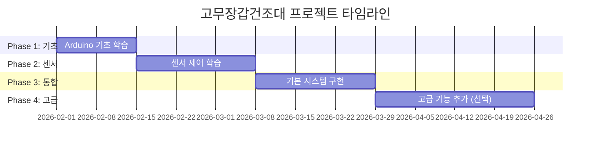

# 고무장갑건조대 아두이노 프로젝트 - 초급자 학습 계획

아두이노 초급 개발자가 단계적으로 학습하며 완성할 수 있는 고무장갑 건조대 프로젝트 계획입니다.

## 프로젝트 개요

### 목표
- 고무장갑을 효율적으로 건조시키는 자동화 시스템 구축
- 아두이노 기초부터 단계적으로 학습하며 프로젝트 완성
- 실생활에 유용한 IoT 기기 제작 경험

### 핵심 기능
1. **자동 건조**: 팬을 이용한 공기 순환
2. **온도 제어**: 히터를 이용한 온풍 건조 (선택사항)
3. **습도 감지**: 건조 완료 자동 감지
4. **타이머 기능**: 설정 시간 후 자동 종료
5. **LED 표시**: 동작 상태 시각화

---

## 학습 단계별 구현 계획

### 📚 Phase 1: 아두이노 기초 학습 (1-2주)

#### 1.1 개발 환경 설정
- [ ] Arduino IDE 설치 및 설정
- [ ] 아두이노 보드 연결 및 테스트
- [ ] 시리얼 모니터 사용법 익히기

#### 1.2 기본 예제 실습
```
학습 순서:
1. Blink (LED 깜빡이기) - 디지털 출력
2. Button (버튼 입력) - 디지털 입력
3. AnalogReadSerial (아날로그 입력)
4. Fade (PWM 출력)
```

**실습 목표**: 
- 디지털/아날로그 입출력 이해
- 시리얼 통신 기초
- 기본 문법 (변수, 조건문, 반복문)

---

### 🔧 Phase 2: 센서 및 액추에이터 제어 (2-3주)

#### 2.1 DHT22 온습도 센서
**학습 내용**:
- I2C/디지털 통신 이해
- 라이브러리 설치 및 사용법
- 센서 데이터 읽기 및 시리얼 출력

**실습 코드**:
```cpp
#include <DHT.h>

#define DHTPIN 2
#define DHTTYPE DHT22

DHT dht(DHTPIN, DHTTYPE);

void setup() {
  Serial.begin(9600);
  dht.begin();
}

void loop() {
  float humidity = dht.readHumidity();
  float temperature = dht.readTemperature();
  
  Serial.print("습도: ");
  Serial.print(humidity);
  Serial.print("% 온도: ");
  Serial.print(temperature);
  Serial.println("°C");
  
  delay(2000);
}
```

#### 2.2 팬 모터 제어
**학습 내용**:
- 릴레이 모듈 사용법
- 또는 MOSFET을 이용한 PWM 제어
- 안전한 전원 분리

**실습 코드**:
```cpp
#define FAN_PIN 3

void setup() {
  pinMode(FAN_PIN, OUTPUT);
}

void loop() {
  // 팬 켜기
  digitalWrite(FAN_PIN, HIGH);
  delay(5000);
  
  // 팬 끄기
  digitalWrite(FAN_PIN, LOW);
  delay(5000);
}
```

#### 2.3 LED 상태 표시
**학습 내용**:
- RGB LED 또는 개별 LED 제어
- 상태별 색상/패턴 표시

---

### 🎯 Phase 3: 기능 통합 (2-3주)

#### 3.1 기본 자동 건조 시스템
**구현 기능**:
- 습도 기반 팬 자동 제어
- 건조 완료 감지
- LED 상태 표시

**핵심 로직**:
```cpp
const float DRY_THRESHOLD = 40.0;  // 건조 완료 습도 (%)

void loop() {
  float humidity = dht.readHumidity();
  
  if (humidity > DRY_THRESHOLD) {
    // 건조 중
    digitalWrite(FAN_PIN, HIGH);
    setLED(BLUE);  // 파란색 LED
  } else {
    // 건조 완료
    digitalWrite(FAN_PIN, LOW);
    setLED(GREEN);  // 초록색 LED
  }
}
```

#### 3.2 타이머 기능 추가
**학습 내용**:
- millis() 함수를 이용한 비차단 타이머
- 버튼을 이용한 시간 설정

#### 3.3 LCD 디스플레이 (선택사항)
**학습 내용**:
- I2C LCD 모듈 사용
- 실시간 정보 표시 (온도, 습도, 남은 시간)

---

### 🚀 Phase 4: 고급 기능 (선택사항, 3-4주)

#### 4.1 온도 제어 (히터 추가)
> [!WARNING]
> 히터 사용 시 안전에 각별히 주의해야 합니다. 과열 방지 회로 필수!

**학습 내용**:
- PID 제어 기초
- 온도 센서 (DS18B20 또는 DHT22)
- 릴레이를 이용한 히터 제어

#### 4.2 스마트폰 연동 (IoT)
**학습 내용**:
- ESP8266/ESP32 WiFi 모듈
- Blynk 또는 MQTT 프로토콜
- 원격 모니터링 및 제어

#### 4.3 데이터 로깅
**학습 내용**:
- SD 카드 모듈
- 건조 이력 저장
- 데이터 분석

---

## 필요한 하드웨어

### 기본 구성 (Phase 1-3)
| 부품명 | 수량 | 예상 가격 | 용도 |
|--------|------|-----------|------|
| Arduino Uno/Nano | 1 | 15,000원 | 메인 컨트롤러 |
| DHT22 온습도 센서 | 1 | 5,000원 | 습도 측정 |
| 5V DC 팬 | 1-2 | 3,000원 | 공기 순환 |
| 릴레이 모듈 (5V) | 1 | 2,000원 | 팬 제어 |
| RGB LED | 1 | 500원 | 상태 표시 |
| 택트 스위치 | 2-3 | 1,000원 | 입력 버튼 |
| 저항 (220Ω, 10kΩ) | 각 5개 | 1,000원 | 회로 구성 |
| 브레드보드 | 1 | 3,000원 | 프로토타이핑 |
| 점퍼 와이어 | 1세트 | 3,000원 | 연결 |
| 5V 전원 어댑터 | 1 | 5,000원 | 전원 공급 |

**기본 구성 총액**: 약 38,500원

### 고급 구성 추가 부품 (Phase 4)
| 부품명 | 수량 | 예상 가격 | 용도 |
|--------|------|-----------|------|
| I2C LCD (16x2) | 1 | 8,000원 | 정보 표시 |
| DS18B20 온도센서 | 1 | 3,000원 | 정밀 온도 측정 |
| ESP8266 WiFi 모듈 | 1 | 8,000원 | IoT 연동 |
| 세라믹 히터 (12V) | 1 | 15,000원 | 온풍 건조 |
| SD 카드 모듈 | 1 | 3,000원 | 데이터 로깅 |

---

## 필요한 소프트웨어 및 라이브러리

### 개발 도구
- Arduino IDE (최신 버전)
- USB 드라이버 (CH340/CP2102)

### 필수 라이브러리
```
1. DHT sensor library (by Adafruit)
2. Adafruit Unified Sensor
```

### 선택 라이브러리 (고급 기능)
```
3. LiquidCrystal_I2C (LCD 사용 시)
4. OneWire + DallasTemperature (DS18B20 사용 시)
5. ESP8266WiFi (WiFi 연동 시)
6. Blynk (IoT 연동 시)
7. SD (데이터 로깅 시)
```

---

## 학습 자료 및 참고 문서

### 공식 문서
- [Arduino 공식 튜토리얼](https://www.arduino.cc/en/Tutorial/HomePage)
- [Arduino 언어 레퍼런스](https://www.arduino.cc/reference/ko/)

### 추천 학습 순서
1. **1주차**: Arduino IDE 설치 및 기본 예제 (Blink, Button)
2. **2주차**: 센서 입력 및 시리얼 통신
3. **3주차**: DHT22 센서 사용법
4. **4주차**: 릴레이/모터 제어
5. **5주차**: 기본 자동화 로직 구현
6. **6주차**: 타이머 및 상태 관리
7. **7주차 이후**: 고급 기능 추가

### 유용한 커뮤니티
- 아두이노 공식 포럼
- 네이버 아두이노 카페
- Stack Overflow (arduino 태그)

---

## 안전 주의사항

> [!CAUTION]
> 전기 안전에 각별히 주의하세요!

### 필수 안전 수칙
1. **전원 분리**: 아두이노와 고전력 부품(팬, 히터)의 전원 분리
2. **릴레이 사용**: 고전력 부품은 반드시 릴레이를 통해 제어
3. **과열 방지**: 히터 사용 시 온도 센서와 자동 차단 회로 필수
4. **환기**: 밀폐된 공간에서 사용 금지
5. **절연**: 모든 전기 연결부 절연 처리
6. **테스트**: 실제 사용 전 충분한 테스트

---

## 프로젝트 일정 (예상)



**총 예상 기간**: 8-12주 (고급 기능 포함 시)

---

## 다음 단계

### 즉시 시작 가능한 작업
1. ✅ Arduino IDE 설치
2. ✅ 아두이노 보드 구매 (Uno 또는 Nano 추천)
3. ✅ 기본 부품 구매 (DHT22, 팬, 릴레이, LED)
4. ✅ Blink 예제로 보드 테스트

### 학습 로드맵
- **Week 1-2**: Arduino 기초 (디지털/아날로그 I/O)
- **Week 3-4**: 센서 사용법 (DHT22)
- **Week 5-6**: 액추에이터 제어 (팬, LED)
- **Week 7-8**: 통합 및 자동화 로직
- **Week 9+**: 고급 기능 및 최적화

---

## 문제 해결 가이드

### 자주 발생하는 문제

#### 1. 센서 값이 NaN으로 출력됨
```cpp
// 해결: 센서 초기화 시간 추가
void setup() {
  Serial.begin(9600);
  dht.begin();
  delay(2000);  // 센서 안정화 대기
}
```

#### 2. 팬이 작동하지 않음
- 전원 확인 (5V 충분한지)
- 릴레이 연결 확인
- 코드에서 pinMode 설정 확인

#### 3. 아두이노가 재부팅됨
- 전원 부족 → 외부 전원 어댑터 사용
- 팬과 아두이노 전원 분리

---

## 참고 자료

### 회로도 예시
```
[추후 Fritzing으로 작성 예정]
- 기본 회로도
- 고급 회로도 (히터 포함)
```

### 코드 저장소 구조
```
고무장갑건조대/
├── README.md (이 문서)
├── docs/
│   ├── circuit_diagrams/
│   ├── learning_materials/
│   └── troubleshooting.md
├── src/
│   ├── phase1_basics/
│   ├── phase2_sensors/
│   ├── phase3_integration/
│   └── phase4_advanced/
└── hardware/
    └── parts_list.md
```

---

## 기대 효과

### 학습 성과
- ✅ 아두이노 기초부터 중급까지 단계적 학습
- ✅ 센서, 액추에이터 제어 경험
- ✅ 실생활 문제 해결 프로젝트 완성
- ✅ IoT 기초 개념 이해 (선택사항)

### 실용적 가치
- 💡 고무장갑 위생 관리 개선
- 💡 에너지 효율적 건조
- 💡 자동화로 편의성 향상
- 💡 DIY 제작으로 비용 절감

---

## 라이선스 및 기여

이 프로젝트는 학습 목적으로 자유롭게 사용 가능합니다.
개선 사항이나 아이디어가 있다면 언제든 공유해주세요!

**Happy Making! 🚀**
