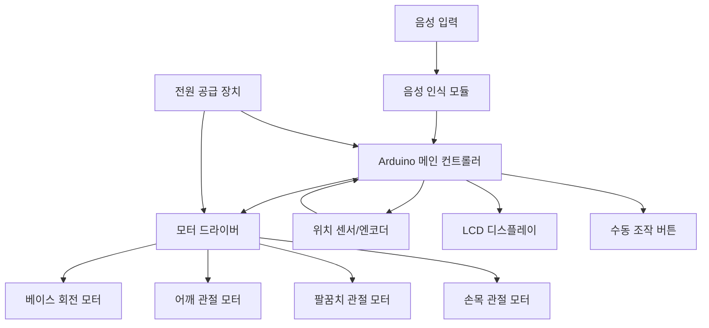

# 음성 제어 로봇팔 수전 시스템 - Arduino 개발 계획서

## 프로젝트 개요

주방 씽크대 위에 설치된 수전(faucet)을 음성 명령으로 제어하여 좌우 이동 및 각도 조절이 가능한 로봇팔 시스템을 개발합니다. 이를 통해 수전을 수동으로 조작하는 불편함을 해소하고, 음성 명령만으로 원하는 위치에 물을 공급할 수 있습니다.

### 핵심 기능
- 음성 명령을 통한 수전 위치 제어 (좌/우 이동)
- 음성 명령을 통한 수전 각도 조절 (상/하, 앞/뒤)
- 안전한 동작 범위 제한
- 수동 조작 모드 지원 (비상시)
- 위치 기억 기능 (프리셋 포지션)

## User Review Required

> [!IMPORTANT]
> **하드웨어 선택 결정 필요**
> 
> 이 프로젝트는 두 가지 주요 접근 방식이 있습니다:
> 1. **완제품 로봇팔 사용**: uArm Swift Pro, Dobot Magician 등 (비용: 50-100만원)
> 2. **DIY 로봇팔 제작**: 3D 프린팅 + 서보모터 (비용: 10-30만원, 제작 난이도 높음)
> 
> 예산과 제작 능력에 따라 선택이 필요합니다.

> [!WARNING]
> **방수 처리 필수**
> 
> 주방 환경 특성상 물 튀김이 빈번하므로:
> - 전자 부품은 방수 케이스 내 설치 필수
> - 모터 부분은 최소 IP54 등급 이상 방수 처리 권장
> - 배선은 방수 커넥터 사용

> [!CAUTION]
> **전기 안전 고려사항**
> 
> - 물과 전기가 함께 있는 환경이므로 누전차단기 설치 필수
> - 저전압(12V 이하) 시스템 권장
> - 접지 처리 필수

## Proposed Changes

### 1. 시스템 아키텍처



---

### 2. 하드웨어 컴포넌트

#### 2.1 메인 컨트롤러

**[선택 1] Arduino Mega 2560** (권장)
- **이유**: 
  - PWM 핀 15개 (서보모터 다수 제어 가능)
  - 메모리: 256KB Flash, 8KB SRAM (음성 명령 처리 충분)
  - 시리얼 포트 4개 (음성 모듈, 디버깅 동시 사용)
  - 54개 디지털 I/O 핀
- **가격**: 약 15,000원

**[선택 2] ESP32** (고급 옵션)
- **이유**:
  - WiFi/Bluetooth 내장 (스마트폰 앱 연동 가능)
  - 듀얼 코어 240MHz (더 복잡한 제어 알고리즘 가능)
  - 음성 인식을 클라우드 API로 처리 가능
- **가격**: 약 8,000원
- **단점**: Arduino IDE 호환성 확인 필요

#### 2.2 음성 인식 모듈

**[선택 1] DFRobot Voice Recognition Module V3** (권장 - 초보자용)
- **특징**:
  - 오프라인 음성 인식 (인터넷 불필요)
  - 80개 명령어 저장 가능
  - 한국어 지원 (발음 학습 필요)
  - UART 통신 (Arduino 연결 간단)
- **가격**: 약 25,000원
- **명령어 예시**: "왼쪽", "오른쪽", "위", "아래", "정지", "초기화"

**[선택 2] Google Assistant + ESP32** (고급 옵션)
- **특징**:
  - 자연어 처리 가능
  - 높은 인식률
  - WiFi 필요
- **가격**: ESP32 포함 약 10,000원
- **단점**: 인터넷 연결 필수, 구현 복잡도 높음

**[선택 3] Elechouse Voice Recognition Module V3.1**
- **특징**:
  - 저렴한 가격
  - 15개 명령어 동시 인식
  - 간단한 UART 인터페이스
- **가격**: 약 15,000원
- **단점**: 명령어 수 제한적

#### 2.3 로봇팔 구성

**옵션 A: DIY 3D 프린팅 로봇팔** (권장 - 맞춤 제작)

**기구부:**
- 3D 프린팅 파츠 (STL 파일 오픈소스 활용)
  - 추천 모델: "BCN3D Moveo" 또는 "EEZYbotARM MK2"
  - 재료: PLA 또는 PETG (약 500g 필요)
  - 프린팅 시간: 약 40-60시간
- 알루미늄 프로파일 (보강용, 선택사항)

**모터 시스템:**
- **MG996R 서보모터 x 4개** (메탈기어)
  - 토크: 11kg·cm @ 6V
  - 회전 각도: 180도
  - 가격: 개당 약 7,000원
  - 용도: 베이스 회전, 어깨, 팔꿈치, 손목
- **대체 옵션**: DS3218 서보모터 (20kg·cm 토크, 개당 12,000원)

**베어링 및 기계 부품:**
- 608 베어링 x 4개 (회전 부위 마찰 감소)
- M3/M4 볼트, 너트 세트
- 케이블 타이, 열수축 튜브

**옵션 B: 완제품 로봇팔 개조**
- uArm Swift Pro (약 80만원) - 정밀도 높음
- Dobot Magician (약 100만원) - 교육용, 안정적
- **장점**: 즉시 사용 가능, 높은 정밀도
- **단점**: 높은 비용, 방수 처리 추가 필요

#### 2.4 모터 드라이버

**PCA9685 16채널 PWM 서보 드라이버**
- **특징**:
  - I2C 통신 (Arduino 핀 절약)
  - 16개 서보모터 동시 제어 가능
  - 외부 전원 입력 (모터 전원 분리)
  - 정밀한 PWM 제어 (12-bit 해상도)
- **가격**: 약 5,000원

#### 2.5 센서 및 피드백

**위치 피드백:**
- **홀 효과 센서** (선택사항)
  - 각 관절의 정확한 위치 측정
  - 모델: AS5600 (자기 엔코더)
  - 가격: 개당 약 3,000원

**안전 센서:**
- **리미트 스위치 x 4개**
  - 동작 범위 제한 (과도한 회전 방지)
  - 가격: 개당 약 500원

**물 감지 센서** (안전용)
- 전자 부품 케이스 내부 누수 감지
- 가격: 약 2,000원

#### 2.6 전원 시스템

**12V 5A 스위칭 어댑터**
- 서보모터 4개 동시 구동 (최대 소비 전류: 약 4A)
- 가격: 약 10,000원

**DC-DC 벅 컨버터** (LM2596)
- 12V → 5V 변환 (Arduino 전원)
- 가격: 약 2,000원

**전원 분배:**
```
12V 어댑터
├─→ PCA9685 (서보모터 전원)
└─→ LM2596 → 5V (Arduino, 음성 모듈)
```

#### 2.7 사용자 인터페이스

**LCD 디스플레이** (선택사항)
- 16x2 I2C LCD
- 현재 위치, 모드 표시
- 가격: 약 5,000원

**수동 조작 버튼**
- 4방향 조이스틱 모듈
- 비상 정지 버튼
- 가격: 약 3,000원

#### 2.8 방수 및 보호

**방수 케이스**
- ABS 플라스틱 정션 박스 (150x100x70mm)
- IP65 등급
- 가격: 약 8,000원

**케이블 글랜드**
- 방수 케이블 관통구 (PG7 사이즈)
- 가격: 개당 약 1,000원

---

### 3. 소프트웨어 아키텍처

#### 3.1 계층 구조

```
┌─────────────────────────────────────┐
│   Application Layer                 │
│   - 음성 명령 해석                   │
│   - 사용자 인터페이스                │
└─────────────────────────────────────┘
           ↓
┌─────────────────────────────────────┐
│   Control Layer                     │
│   - 역기구학 계산                    │
│   - 경로 계획                        │
│   - 안전 범위 검증                   │
└─────────────────────────────────────┘
           ↓
┌─────────────────────────────────────┐
│   Hardware Abstraction Layer        │
│   - 서보모터 제어                    │
│   - 센서 데이터 읽기                 │
│   - I2C/UART 통신                   │
└─────────────────────────────────────┘
```

#### 3.2 주요 라이브러리

**필수 라이브러리:**
```cpp
#include <Wire.h>              // I2C 통신
#include <Adafruit_PWMServoDriver.h>  // PCA9685 제어
#include <SoftwareSerial.h>    // 음성 모듈 통신
#include <EEPROM.h>            // 위치 저장
```

**추가 라이브러리 (선택):**
```cpp
#include <LiquidCrystal_I2C.h> // LCD 디스플레이
#include <Servo.h>             // 서보모터 (PCA9685 미사용시)
```

#### 3.3 핵심 클래스 설계

**RobotArm 클래스**
```cpp
class RobotArm {
private:
    Adafruit_PWMServoDriver pwm;
    struct JointAngles {
        int base;      // 베이스 회전 (0-180도)
        int shoulder;  // 어깨 (0-180도)
        int elbow;     // 팔꿈치 (0-180도)
        int wrist;     // 손목 (0-180도)
    } currentPos, targetPos;
    
    // 안전 범위
    const int MIN_ANGLE = 0;
    const int MAX_ANGLE = 180;
    
public:
    void init();
    void moveToPosition(JointAngles target);
    void moveSmooth(JointAngles target, int speed);
    bool isPositionSafe(JointAngles pos);
    void emergencyStop();
    void savePosition(int slot);
    void loadPosition(int slot);
};
```

**VoiceController 클래스**
```cpp
class VoiceController {
private:
    SoftwareSerial voiceSerial;
    
public:
    void init();
    int getCommand();  // 음성 명령 ID 반환
    void trainCommand(int id, String phrase);
};
```

**SafetyManager 클래스**
```cpp
class SafetyManager {
private:
    bool limitSwitchStates[4];
    bool waterDetected;
    
public:
    void checkLimits();
    bool isMovementSafe(int joint, int direction);
    void handleEmergency();
};
```

#### 3.4 음성 명령 매핑

```cpp
enum VoiceCommand {
    CMD_LEFT = 1,      // "왼쪽"
    CMD_RIGHT = 2,     // "오른쪽"
    CMD_UP = 3,        // "위"
    CMD_DOWN = 4,      // "아래"
    CMD_FORWARD = 5,   // "앞으로"
    CMD_BACKWARD = 6,  // "뒤로"
    CMD_STOP = 7,      // "정지"
    CMD_RESET = 8,     // "초기화"
    CMD_PRESET1 = 9,   // "위치 1"
    CMD_PRESET2 = 10,  // "위치 2"
    CMD_PRESET3 = 11,  // "위치 3"
    CMD_SAVE = 12      // "저장"
};
```

#### 3.5 제어 알고리즘

**부드러운 이동 (Smooth Motion)**
```cpp
void RobotArm::moveSmooth(JointAngles target, int speed) {
    // 각 관절의 현재 각도와 목표 각도 차이 계산
    int deltaBase = target.base - currentPos.base;
    int deltaShoulder = target.shoulder - currentPos.shoulder;
    int deltaElbow = target.elbow - currentPos.elbow;
    int deltaWrist = target.wrist - currentPos.wrist;
    
    // 가장 큰 이동 거리 찾기
    int maxDelta = max(abs(deltaBase), 
                       max(abs(deltaShoulder), 
                           max(abs(deltaElbow), abs(deltaWrist))));
    
    // 단계별 이동
    for (int step = 0; step <= maxDelta; step++) {
        currentPos.base += deltaBase / maxDelta;
        currentPos.shoulder += deltaShoulder / maxDelta;
        currentPos.elbow += deltaElbow / maxDelta;
        currentPos.wrist += deltaWrist / maxDelta;
        
        updateServos();
        delay(speed);  // 속도 조절 (ms)
    }
}
```

**역기구학 (Inverse Kinematics) - 간단한 2D 버전**
```cpp
// 목표 위치(x, y)를 관절 각도로 변환
JointAngles calculateIK(float x, float y) {
    JointAngles result;
    
    // 팔 길이 정의
    const float L1 = 15.0;  // 어깨-팔꿈치 (cm)
    const float L2 = 12.0;  // 팔꿈치-손목 (cm)
    
    // 역기구학 계산 (2-link planar arm)
    float distance = sqrt(x*x + y*y);
    float cosElbow = (distance*distance - L1*L1 - L2*L2) / (2*L1*L2);
    result.elbow = acos(cosElbow) * 180 / PI;
    
    float alpha = atan2(y, x);
    float beta = atan2(L2*sin(result.elbow*PI/180), 
                       L1 + L2*cos(result.elbow*PI/180));
    result.shoulder = (alpha - beta) * 180 / PI;
    
    return result;
}
```

---

### 4. 기계 설계 및 3D 모델링

#### 4.1 로봇팔 구조

**자유도(DOF) 설계:**
- **4-DOF 구성** (권장):
  1. 베이스 회전 (Yaw): 좌우 180도
  2. 어깨 관절 (Pitch): 상하 120도
  3. 팔꿈치 관절 (Pitch): 상하 135도
  4. 손목 관절 (Pitch): 상하 90도

**치수 설계:**
```
베이스 높이: 10cm
어깨-팔꿈치: 15cm
팔꿈치-손목: 12cm
손목-수전 고정부: 5cm
총 도달 거리: 약 32cm (수평)
```

#### 4.2 3D 프린팅 파일

**추천 오픈소스 모델:**
1. **BCN3D Moveo** (Thingiverse)
   - 링크: thingiverse.com/thing:1693444
   - 특징: 5-DOF, 강력한 구조
   - 수정 필요: 수전 고정 어댑터 추가

2. **EEZYbotARM MK2**
   - 링크: thingiverse.com/thing:1454048
   - 특징: 간단한 조립, 교육용
   - 수정 필요: 모터 업그레이드, 방수 처리

**커스텀 파트:**
- `faucet_adapter.stl` - 수전 고정 어댑터
- `waterproof_motor_cover.stl` - 모터 방수 커버
- `base_mount.stl` - 씽크대 고정 베이스

#### 4.3 조립 가이드


---

### 5. 전기 배선도

```
┌─────────────────────────────────────────────────────────┐
│                    12V Power Supply                      │
└────┬──────────────────────────────────────────┬─────────┘
     │                                           │
     │                                           │
┌────▼─────────────┐                   ┌────────▼─────────┐
│   LM2596 Buck    │                   │   PCA9685 PWM    │
│   Converter      │                   │   Driver         │
│   12V → 5V       │                   │                  │
└────┬─────────────┘                   └────┬─────────────┘
     │                                       │
     │ 5V                                    │ PWM Signals
     │                                       │
┌────▼─────────────────────────────┐        │
│   Arduino Mega 2560              │        │
│                                  │        │
│   Pin Connections:               │        │
│   - D2, D3: Voice Module (RX,TX) │        │
│   - D20, D21: I2C (SDA, SCL) ────┼────────┘
│   - D4-D7: Limit Switches        │
│   - D8: Emergency Stop Button    │
│   - D9: Water Sensor             │
│   - A0: Joystick X               │
│   - A1: Joystick Y               │
└──────────────────────────────────┘

PCA9685 Servo Connections:
- Channel 0: Base Servo (MG996R)
- Channel 1: Shoulder Servo (MG996R)
- Channel 2: Elbow Servo (MG996R)
- Channel 3: Wrist Servo (MG996R)
```

**핀 할당 상세:**

| Arduino Pin | 연결 대상 | 용도 |
|------------|----------|------|
| 5V | 음성 모듈, LCD | 전원 공급 |
| GND | 모든 모듈 공통 | 접지 |
| D2 (RX) | 음성 모듈 TX | UART 수신 |
| D3 (TX) | 음성 모듈 RX | UART 송신 |
| D20 (SDA) | PCA9685, LCD | I2C 데이터 |
| D21 (SCL) | PCA9685, LCD | I2C 클럭 |
| D4 | 리미트 스위치 1 | 베이스 좌측 한계 |
| D5 | 리미트 스위치 2 | 베이스 우측 한계 |
| D6 | 리미트 스위치 3 | 어깨 상단 한계 |
| D7 | 리미트 스위치 4 | 어깨 하단 한계 |
| D8 | 비상 정지 버튼 | 긴급 정지 |
| D9 | 물 감지 센서 | 누수 감지 |
| A0 | 조이스틱 X축 | 수동 제어 |
| A1 | 조이스틱 Y축 | 수동 제어 |

---

### 6. 펌웨어 구현

#### 6.1 메인 프로그램 구조

**[NEW] [main.ino](file:///e:/project/00_Management/Ideas_Backlog/아이디어/주방쪽/씽크대위로봇팔에있는수전/firmware/main.ino)**

```cpp
// 전역 객체
RobotArm arm;
VoiceController voice;
SafetyManager safety;
LiquidCrystal_I2C lcd(0x27, 16, 2);

// 프리셋 위치 (EEPROM 주소)
const int PRESET_ADDR_1 = 0;
const int PRESET_ADDR_2 = 20;
const int PRESET_ADDR_3 = 40;

void setup() {
    Serial.begin(9600);
    
    // 초기화
    arm.init();
    voice.init();
    safety.init();
    lcd.init();
    lcd.backlight();
    
    // 초기 위치로 이동
    arm.moveToHome();
    
    lcd.print("Ready!");
}

void loop() {
    // 안전 체크
    safety.checkLimits();
    if (safety.isEmergency()) {
        arm.emergencyStop();
        lcd.clear();
        lcd.print("EMERGENCY STOP!");
        return;
    }
    
    // 음성 명령 처리
    int cmd = voice.getCommand();
    if (cmd > 0) {
        handleVoiceCommand(cmd);
    }
    
    // 수동 조작 처리
    handleManualControl();
    
    // 상태 표시 업데이트
    updateDisplay();
    
    delay(50);  // 20Hz 루프
}
```

#### 6.2 음성 명령 핸들러

**[NEW] [voice_handler.ino](file:///e:/project/00_Management/Ideas_Backlog/아이디어/주방쪽/씽크대위로봇팔에있는수전/firmware/voice_handler.ino)**

```cpp
void handleVoiceCommand(int cmd) {
    JointAngles target = arm.getCurrentPosition();
    
    switch(cmd) {
        case CMD_LEFT:
            target.base += 15;  // 15도 왼쪽 회전
            lcd.print("Left");
            break;
            
        case CMD_RIGHT:
            target.base -= 15;  // 15도 오른쪽 회전
            lcd.print("Right");
            break;
            
        case CMD_UP:
            target.shoulder += 10;  // 10도 위로
            lcd.print("Up");
            break;
            
        case CMD_DOWN:
            target.shoulder -= 10;  // 10도 아래로
            lcd.print("Down");
            break;
            
        case CMD_FORWARD:
            target.elbow -= 10;  // 앞으로 뻗기
            lcd.print("Forward");
            break;
            
        case CMD_BACKWARD:
            target.elbow += 10;  // 뒤로 당기기
            lcd.print("Backward");
            break;
            
        case CMD_STOP:
            arm.emergencyStop();
            lcd.print("Stop");
            return;
            
        case CMD_RESET:
            arm.moveToHome();
            lcd.print("Reset");
            return;
            
        case CMD_PRESET1:
            arm.loadPosition(PRESET_ADDR_1);
            lcd.print("Preset 1");
            return;
            
        case CMD_PRESET2:
            arm.loadPosition(PRESET_ADDR_2);
            lcd.print("Preset 2");
            return;
            
        case CMD_PRESET3:
            arm.loadPosition(PRESET_ADDR_3);
            lcd.print("Preset 3");
            return;
    }
    
    // 안전 범위 체크 후 이동
    if (arm.isPositionSafe(target)) {
        arm.moveSmooth(target, 20);  // 20ms 딜레이로 부드럽게 이동
    } else {
        lcd.clear();
        lcd.print("Out of Range!");
        delay(1000);
    }
}
```

#### 6.3 라이브러리 구현

**[NEW] [RobotArm.h](file:///e:/project/00_Management/Ideas_Backlog/아이디어/주방쪽/씽크대위로봇팔에있는수전/firmware/libraries/RobotArm/RobotArm.h)**

**[NEW] [RobotArm.cpp](file:///e:/project/00_Management/Ideas_Backlog/아이디어/주방쪽/씽크대위로봇팔에있는수전/firmware/libraries/RobotArm/RobotArm.cpp)**

**[NEW] [VoiceController.h](file:///e:/project/00_Management/Ideas_Backlog/아이디어/주방쪽/씽크대위로봇팔에있는수전/firmware/libraries/VoiceController/VoiceController.h)**

**[NEW] [VoiceController.cpp](file:///e:/project/00_Management/Ideas_Backlog/아이디어/주방쪽/씽크대위로봇팔에있는수전/firmware/libraries/VoiceController/VoiceController.cpp)**

---

### 7. 설치 및 조립

#### 7.1 씽크대 마운팅

**고정 방법 옵션:**

1. **클램프 방식** (권장 - 비파괴)
   - 씽크대 상판 두께에 맞는 C-클램프 사용
   - 고무 패드로 상판 보호
   - 장점: 설치/제거 용이, 임대 주택 가능
   - 단점: 진동에 약할 수 있음

2. **볼트 고정 방식**
   - 상판에 구멍 뚫어 볼트 체결
   - 가장 안정적
   - 단점: 상판 손상, 영구적

3. **접착 방식**
   - 강력 양면테이프 또는 에폭시
   - 중간 정도 안정성
   - 단점: 제거 시 흔적

**설치 위치 고려사항:**
- 수전 작동 반경 내 모든 씽크대 영역 커버
- 벽면과 최소 10cm 이상 거리 확보
- 전원 콘센트 접근 가능한 위치

#### 7.2 배선 정리

```
씽크대 상판
├─ 로봇팔 베이스 (방수 처리)
├─ 방수 케이블 글랜드 → 하부로 배선
└─ 씽크대 하부 수납공간
   ├─ 방수 케이스 (Arduino + 드라이버)
   ├─ 전원 어댑터
   └─ 케이블 타이로 정리
```

#### 7.3 조립 순서

1. **기계 조립** (3-4시간)
   - 3D 프린팅 파트 조립
   - 서보모터 장착
   - 베어링 및 볼트 체결

2. **전자 부품 조립** (2-3시간)
   - Arduino, PCA9685 보드 케이스 내 고정
   - 배선 연결 (배선도 참조)
   - 방수 처리

3. **펌웨어 업로드** (30분)
   - Arduino IDE에서 라이브러리 설치
   - 코드 컴파일 및 업로드
   - 시리얼 모니터로 초기 테스트

4. **음성 명령 학습** (1시간)
   - 음성 모듈에 명령어 등록
   - 각 명령어 5회 이상 반복 학습
   - 인식률 테스트

5. **캘리브레이션** (1-2시간)
   - 서보모터 중립 위치 조정
   - 동작 범위 설정
   - 리미트 스위치 위치 조정

6. **최종 설치** (1시간)
   - 씽크대에 마운팅
   - 케이블 정리
   - 방수 테스트 (물 뿌리기)

---

### 8. 테스트 및 검증

#### 8.1 단위 테스트

**서보모터 테스트**
```cpp
// 각 서보모터 개별 동작 확인
void testServo(int channel) {
    pwm.setPWM(channel, 0, angleToPulse(0));
    delay(1000);
    pwm.setPWM(channel, 0, angleToPulse(90));
    delay(1000);
    pwm.setPWM(channel, 0, angleToPulse(180));
    delay(1000);
}
```

**음성 인식 테스트**
```cpp
// 시리얼 모니터로 인식된 명령어 출력
void testVoiceRecognition() {
    int cmd = voice.getCommand();
    if (cmd > 0) {
        Serial.print("Command detected: ");
        Serial.println(cmd);
    }
}
```

#### 8.2 통합 테스트

**테스트 시나리오:**

1. **기본 동작 테스트**
   - [ ] "왼쪽" 명령 → 베이스 15도 좌회전
   - [ ] "오른쪽" 명령 → 베이스 15도 우회전
   - [ ] "위" 명령 → 어깨 10도 상승
   - [ ] "아래" 명령 → 어깨 10도 하강
   - [ ] "정지" 명령 → 즉시 정지

2. **프리셋 위치 테스트**
   - [ ] "위치 1" → 왼쪽 씽크대 중앙
   - [ ] "위치 2" → 오른쪽 씽크대 중앙
   - [ ] "위치 3" → 배수구 위치

3. **안전 기능 테스트**
   - [ ] 리미트 스위치 작동 시 정지
   - [ ] 비상 정지 버튼 작동
   - [ ] 범위 초과 명령 거부

4. **내구성 테스트**
   - [ ] 연속 100회 동작 (과열 체크)
   - [ ] 물 튀김 환경에서 24시간 대기
   - [ ] 전원 차단 후 재시작

#### 8.3 성능 지표

| 항목 | 목표 | 측정 방법 |
|------|------|-----------|
| 음성 인식률 | >90% | 100회 명령 중 성공 횟수 |
| 반응 시간 | <1초 | 명령 후 동작 시작까지 |
| 위치 정확도 | ±2cm | 목표 위치와 실제 위치 차이 |
| 동작 소음 | <50dB | 소음계 측정 (1m 거리) |
| 연속 작동 시간 | >8시간 | 과열 없이 작동 가능 시간 |

---

### 9. 사용자 매뉴얼

#### 9.1 초기 설정

**음성 명령 등록 (최초 1회)**
1. Arduino 전원 켜기
2. LCD에 "Training Mode" 표시될 때까지 대기
3. 각 명령어를 3회씩 명확하게 발음
   - "왼쪽" (3회)
   - "오른쪽" (3회)
   - "위" (3회)
   - "아래" (3회)
   - "정지" (3회)
   - "초기화" (3회)
4. 완료 후 자동으로 정상 모드 전환

**프리셋 위치 저장**
1. 수동 조작으로 원하는 위치로 이동
2. "저장" 명령 후 "위치 1/2/3" 명령
3. LCD에 "Saved!" 표시 확인

#### 9.2 일상 사용

**기본 사용법:**
```
1. 전원 켜기 → "Ready!" 표시 대기
2. 음성 명령으로 위치 조절
   - "왼쪽" / "오른쪽" : 좌우 이동
   - "위" / "아래" : 높이 조절
   - "앞으로" / "뒤로" : 전후 이동
3. 원하는 위치에서 "정지"
4. 사용 완료 후 "초기화" (선택사항)
```

**프리셋 사용:**
```
"위치 1" → 왼쪽 씽크대 (채소 세척용)
"위치 2" → 오른쪽 씽크대 (그릇 세척용)
"위치 3" → 배수구 (음식물 처리용)
```

#### 9.3 문제 해결

| 증상 | 원인 | 해결 방법 |
|------|------|-----------|
| 음성 인식 안 됨 | 주변 소음 과다 | 조용한 환경에서 재학습 |
| 모터 떨림 | 전원 부족 | 어댑터 용량 확인 (5A 이상) |
| LCD "Out of Range!" | 범위 초과 명령 | "초기화" 후 재시도 |
| 동작 중 정지 | 리미트 스위치 작동 | 수동으로 반대 방향 이동 |
| 물 감지 경고 | 케이스 내 누수 | 즉시 전원 차단, 건조 후 재가동 |

---

### 10. 예산 및 일정

#### 10.1 부품 비용 (DIY 옵션)

| 항목 | 수량 | 단가 | 합계 |
|------|------|------|------|
| **전자 부품** | | | |
| Arduino Mega 2560 | 1 | 15,000원 | 15,000원 |
| DFRobot Voice Module V3 | 1 | 25,000원 | 25,000원 |
| PCA9685 PWM Driver | 1 | 5,000원 | 5,000원 |
| MG996R 서보모터 | 4 | 7,000원 | 28,000원 |
| 12V 5A 어댑터 | 1 | 10,000원 | 10,000원 |
| LM2596 벅 컨버터 | 1 | 2,000원 | 2,000원 |
| 16x2 I2C LCD | 1 | 5,000원 | 5,000원 |
| 리미트 스위치 | 4 | 500원 | 2,000원 |
| 조이스틱 모듈 | 1 | 3,000원 | 3,000원 |
| 물 감지 센서 | 1 | 2,000원 | 2,000원 |
| **기계 부품** | | | |
| 3D 프린팅 필라멘트 (PLA 500g) | 1 | 15,000원 | 15,000원 |
| 608 베어링 | 4 | 500원 | 2,000원 |
| M3/M4 볼트 너트 세트 | 1 | 5,000원 | 5,000원 |
| **보호 및 기타** | | | |
| 방수 케이스 (IP65) | 1 | 8,000원 | 8,000원 |
| 케이블 글랜드 | 4 | 1,000원 | 4,000원 |
| 배선 재료 (전선, 커넥터 등) | 1 | 10,000원 | 10,000원 |
| **합계** | | | **141,000원** |

**추가 옵션:**
- ESP32 사용 시: -7,000원 (Arduino Mega 대신)
- DS3218 고토크 서보 사용 시: +20,000원
- 완제품 로봇팔 사용 시: +600,000~900,000원

#### 10.2 제작 일정

**총 예상 기간: 2-3주**

| 주차 | 작업 내용 | 소요 시간 |
|------|-----------|-----------|
| **1주차** | 부품 구매 및 3D 프린팅 | |
| Day 1-2 | 부품 주문 (배송 대기) | - |
| Day 3-7 | 3D 프린팅 (40-60시간) | 연속 작업 |
| **2주차** | 조립 및 프로그래밍 | |
| Day 8-9 | 기계 조립 | 6시간 |
| Day 10-11 | 전자 부품 조립 및 배선 | 5시간 |
| Day 12 | 펌웨어 개발 및 업로드 | 4시간 |
| Day 13 | 음성 명령 학습 | 2시간 |
| Day 14 | 캘리브레이션 | 3시간 |
| **3주차** | 테스트 및 설치 | |
| Day 15-16 | 단위 테스트 및 디버깅 | 6시간 |
| Day 17 | 통합 테스트 | 4시간 |
| Day 18 | 씽크대 설치 | 2시간 |
| Day 19-20 | 최종 테스트 및 조정 | 4시간 |
| Day 21 | 예비일 (문제 해결) | - |

---

### 11. 확장 가능성

#### 11.1 단기 개선 사항

**스마트폰 앱 연동** (ESP32 사용 시)
- WiFi를 통한 원격 제어
- 앱에서 프리셋 위치 관리
- 사용 통계 확인

**수압 센서 추가**
- 물 사용량 모니터링
- 자동 물 절약 모드

**LED 상태 표시**
- 동작 상태 시각적 피드백
- RGB LED로 모드 구분

#### 11.2 장기 확장 계획

**AI 학습 기능**
- 사용 패턴 학습
- 자주 사용하는 위치 자동 추천
- 시간대별 자동 위치 조정

**다른 주방 기기 연동**
- 식기세척기 연동 (자동 위치 이동)
- 정수기 연동
- 스마트 홈 시스템 통합

**그리퍼 추가** (6-DOF로 업그레이드)
- 수전 노즐 교체 자동화
- 간단한 물건 집기 기능

---

## Verification Plan

### Automated Tests

#### 1. 펌웨어 컴파일 테스트
```bash
# Arduino CLI 사용
arduino-cli compile --fqbn arduino:avr:mega firmware/main.ino
```

#### 2. 시리얼 통신 테스트
```cpp
// 시리얼 모니터로 각 모듈 응답 확인
void setup() {
    Serial.begin(9600);
    
    // 음성 모듈 테스트
    if (voice.init()) {
        Serial.println("Voice module OK");
    }
    
    // PCA9685 테스트
    if (pwm.begin()) {
        Serial.println("PWM driver OK");
    }
    
    // 센서 테스트
    Serial.print("Limit switches: ");
    for (int i = 0; i < 4; i++) {
        Serial.print(digitalRead(limitPins[i]));
        Serial.print(" ");
    }
    Serial.println();
}
```

#### 3. 동작 범위 자동 테스트
```cpp
// 모든 관절을 최소~최대 범위로 이동하며 테스트
void testFullRange() {
    for (int joint = 0; joint < 4; joint++) {
        for (int angle = 0; angle <= 180; angle += 10) {
            setJointAngle(joint, angle);
            delay(500);
            Serial.print("Joint ");
            Serial.print(joint);
            Serial.print(" at ");
            Serial.println(angle);
        }
    }
}
```

### Manual Verification

#### 1. 사용자 인수 테스트
- [ ] 음성 명령 10회 연속 성공 (인식률 확인)
- [ ] 프리셋 위치 정확도 측정 (자로 실측)
- [ ] 실제 주방 환경에서 1주일 사용
- [ ] 가족 구성원 모두 음성 인식 테스트

#### 2. 안전성 검증
- [ ] 물 튀김 시뮬레이션 (분무기 사용)
- [ ] 비상 정지 버튼 반응 시간 측정
- [ ] 과부하 상황 테스트 (무거운 물체 부착)
- [ ] 장시간 작동 후 온도 측정

#### 3. 내구성 테스트
- [ ] 500회 반복 동작 후 기계적 마모 확인
- [ ] 습도 높은 환경에서 1개월 작동
- [ ] 전원 차단/재시작 100회 반복

---

## 참고 자료

### 오픈소스 프로젝트
- [BCN3D Moveo Robot Arm](https://github.com/BCN3D/BCN3D-Moveo)
- [EEZYbotARM](https://www.thingiverse.com/thing:1454048)
- [Arduino Servo Library](https://www.arduino.cc/reference/en/libraries/servo/)

### 기술 문서
- [PCA9685 Datasheet](https://www.nxp.com/docs/en/data-sheet/PCA9685.pdf)
- [MG996R Servo Specifications](http://www.towerpro.com.tw/product/mg996r/)
- [DFRobot Voice Recognition Module Guide](https://wiki.dfrobot.com/Voice_Recognition_Module_V3_SKU_DFR0715)

### 학습 자료
- Arduino 로봇팔 제어 튜토리얼: [YouTube - Arduino Robot Arm](https://www.youtube.com/results?search_query=arduino+robot+arm+tutorial)
- 역기구학 기초: [Inverse Kinematics Explained](https://www.alanzucconi.com/2017/04/10/robotic-arms/)
- 음성 인식 Arduino 프로젝트: [Voice Controlled Arduino Projects](https://create.arduino.cc/projecthub/projects/tags/voice-control)

---

## 다음 단계

1. **사용자 검토 및 피드백**
   - 하드웨어 옵션 선택 (DIY vs 완제품)
   - 예산 승인
   - 추가 기능 요구사항 확인

2. **상세 설계**
   - 3D 모델 커스터마이징
   - 배선도 최종 확인
   - 부품 리스트 확정

3. **프로토타입 제작**
   - 부품 구매
   - 조립 및 테스트
   - 문제점 파악 및 개선

4. **최종 제품 완성**
   - 방수 처리 강화
   - 사용자 매뉴얼 작성
   - 설치 및 교육
