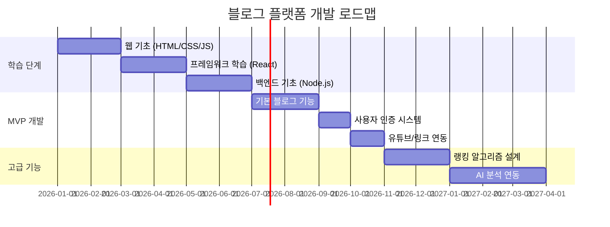

# 새로운 접근의 블로그 플랫폼 - 구현 난이도 분석

> **대상**: 웹 개발 경험이 없는 초보자  
> **기준일**: 2026-01-09

---

## 📊 종합 난이도 평가

| 항목 | 난이도 (1-10) | 설명 |
|:---|:---:|:---|
| **전체 프로젝트** | ⭐⭐⭐⭐⭐⭐⭐⭐ (8/10) | 풀스택 웹 개발 + AI/ML 알고리즘 필요 |
| **프론트엔드** | ⭐⭐⭐⭐⭐⭐ (6/10) | 깔끔한 UI 구현 자체는 중간 난이도 |
| **백엔드** | ⭐⭐⭐⭐⭐⭐⭐⭐ (8/10) | 사용자, 콘텐츠, 랭킹 시스템 등 복잡 |
| **AI/알고리즘** | ⭐⭐⭐⭐⭐⭐⭐⭐⭐ (9/10) | "명석한 글" 판별은 고난이도 |
| **인프라/운영** | ⭐⭐⭐⭐⭐⭐⭐ (7/10) | 서버, DB, 보안, 확장성 고려 필요 |

---

## 🎯 핵심 기능별 구현 난이도

### 1. 기본 블로그 기능 (게시글 CRUD)
| 세부 기능 | 난이도 | 초보자 예상 학습 기간 | 비고 |
|:---|:---:|:---|:---|
| 글 작성/수정/삭제 | 🟡 4/10 | 2-4주 | 기본 웹 개발 학습으로 가능 |
| 마크다운 에디터 | 🟡 5/10 | 1-2주 | 오픈소스 라이브러리 활용 가능 |
| 이미지 업로드 | 🟡 5/10 | 1-2주 | 클라우드 스토리지 연동 필요 |
| 사용자 인증 (로그인/회원가입) | 🟠 6/10 | 2-3주 | 보안 고려사항 많음 |

### 2. 탈광고 환경 (깔끔한 UI)
| 세부 기능 | 난이도 | 초보자 예상 학습 기간 | 비고 |
|:---|:---:|:---|:---|
| 반응형 디자인 | 🟡 5/10 | 2-3주 | CSS/프레임워크 학습 필요 |
| 다크모드 지원 | 🟢 3/10 | 3-5일 | 비교적 간단 |
| 타이포그래피 최적화 | 🟡 4/10 | 1-2주 | 디자인 감각 필요 |

### 3. 가치 기반 랭킹 시스템 ⚠️ 핵심 난제
| 세부 기능 | 난이도 | 초보자 예상 학습 기간 | 비고 |
|:---|:---:|:---|:---|
| 단순 통계 (조회수, 좋아요) | 🟡 4/10 | 1-2주 | 기본적인 DB 쿼리 |
| 체류시간 트래킹 | 🟠 6/10 | 2-3주 | JavaScript 이벤트 처리 |
| "명석한 글" 판별 알고리즘 | 🔴 9/10 | 6개월+ | **NLP/ML 전문지식 필요** |
| 댓글 깊이/품질 분석 | 🔴 8/10 | 3개월+ | 자연어 처리 필요 |
| 전문가 평점 시스템 | 🟠 6/10 | 3-4주 | 설계는 가능, 전문가 확보가 관건 |

> [!CAUTION]
> **"유용하고 명석한 글"을 자동으로 판별하는 것은 이 프로젝트의 가장 어려운 부분입니다.**  
> ChatGPT/Claude 수준의 LLM을 활용하더라도 완벽한 판별은 어렵습니다.

### 4. 외부 연결 시스템 (Bridge 역할)
| 세부 기능 | 난이도 | 초보자 예상 학습 기간 | 비고 |
|:---|:---:|:---|:---|
| 유튜브 임베딩 | 🟢 2/10 | 2-3일 | YouTube API 활용, 매우 쉬움 |
| 상품 링크 연동 | 🟢 3/10 | 1주 | 아마존, 쿠팡 등 제휴 링크 |
| 강의 플랫폼 연결 | 🟢 3/10 | 1주 | 링크 및 카드 UI 구현 |
| Native UI 디자인 | 🟡 5/10 | 2-3주 | 광고처럼 보이지 않는 디자인 |

### 5. 인프라 및 운영
| 세부 기능 | 난이도 | 초보자 예상 학습 기간 | 비고 |
|:---|:---:|:---|:---|
| 서버 배포 (AWS/Vercel) | 🟠 6/10 | 2-3주 | 클라우드 서비스 학습 필요 |
| 데이터베이스 설계 | 🟠 6/10 | 3-4주 | 관계형/NoSQL 이해 필요 |
| 검색 기능 (Elasticsearch) | 🔴 7/10 | 4-6주 | 별도 기술 스택 |
| 보안 (XSS, CSRF, SQL Injection) | 🔴 7/10 | 지속적 | 보안 취약점 이해 필수 |

---

## 📅 초보자 기준 예상 개발 기간

### 시나리오 1: MVP (최소 기능 제품)
**기능**: 글 작성, 단순 랭킹(조회수), 유튜브 임베딩

| 단계 | 기간 | 활동 |
|:---|:---:|:---|
| 웹 기초 학습 | 2-3개월 | HTML, CSS, JavaScript |
| 프레임워크 학습 | 1-2개월 | React 또는 Vue.js |
| 백엔드 학습 | 2-3개월 | Node.js 또는 Python(Django) |
| MVP 개발 | 2-3개월 | 실제 구현 |
| **총 예상 기간** | **7-11개월** | |

### 시나리오 2: 완전 기능 (가치 기반 랭킹 포함)
**기능**: 모든 핵심 기능 + AI 기반 콘텐츠 분석

| 단계 | 기간 | 활동 |
|:---|:---:|:---|
| MVP 완성 | 7-11개월 | 위 시나리오 1 참조 |
| AI/ML 기초 학습 | 4-6개월 | Python, TensorFlow/PyTorch |
| NLP 및 랭킹 알고리즘 개발 | 6-12개월 | 콘텐츠 품질 분석 모델 |
| 시스템 통합 및 최적화 | 2-3개월 | 성능 튜닝 |
| **총 예상 기간** | **19-32개월 (약 2-3년)** | |

> [!WARNING]
> **혼자 개발 시 현실적으로 풀타임 2-3년이 소요될 수 있습니다.**  
> 팀(프론트엔드, 백엔드, ML 엔지니어)으로 구성하면 6개월-1년으로 단축 가능합니다.

---

## 🛠️ 필요한 기술 스택

### 프론트엔드
- HTML/CSS/JavaScript (필수)
- React.js 또는 Vue.js (권장)
- Tailwind CSS 또는 Styled Components

### 백엔드
- Node.js + Express 또는 Python + Django/FastAPI
- PostgreSQL 또는 MongoDB (데이터베이스)
- Redis (캐싱, 세션 관리)

### AI/ML (가치 기반 랭킹)
- Python (필수)
- OpenAI API 또는 Hugging Face Transformers
- 텍스트 임베딩 및 분류 모델

### 인프라
- AWS, GCP, 또는 Vercel/Netlify
- Docker (컨테이너화)
- GitHub Actions (CI/CD)

---

## 💡 초보자를 위한 현실적 조언

### ✅ 추천 접근법

1. **단계별 접근**: 처음부터 모든 기능을 구현하려 하지 마세요.
   - 1단계: 정적 블로그 (HTML/CSS만으로 시작)
   - 2단계: CMS 도입 (Ghost, Contentful 등)
   - 3단계: 커스텀 기능 추가

2. **기존 플랫폼 활용**: 
   - **Ghost**: 오픈소스 블로그 플랫폼, 커스터마이징 가능
   - **Notion + Super.so**: 빠른 블로그 구축 가능
   - **WordPress**: 플러그인으로 확장 가능

3. **No-Code/Low-Code 도구**:
   - **Webflow**: 코딩 없이 웹사이트 제작
   - **Bubble**: 풀스택 앱 개발 가능
   - **Airtable + Softr**: 데이터베이스 기반 앱

4. **AI 기능은 외부 API로 대체**:
   - OpenAI GPT API로 글 품질 초벌 분석
   - 초기에는 수동 큐레이션 + AI 보조 방식 추천

### ❌ 피해야 할 함정

1. **완벽주의**: MVP 없이 완전한 제품을 목표로 하면 완성 불가
2. **기술 스택 과욕**: 처음부터 복잡한 아키텍처 설계 금지
3. **혼자 모든 것 하려는 시도**: 팀원 또는 외주 고려
4. **사용자 검증 없이 개발**: 빠르게 출시하고 피드백 받기

---

## 📈 단계별 로드맵 제안

---

## 🎲 결론 및 권장사항

| 현재 수준 | 권장 접근법 |
|:---|:---|
| 웹 개발 경험 0 | Ghost/WordPress로 MVP 출시 후 점진적 확장 |
| 프론트엔드만 가능 | Supabase/Firebase 활용 BaaS 방식 추천 |
| 프로그래밍 가능 (비웹) | React + Node.js 풀스택 직접 개발 도전 |
| 팀 구성 가능 | 분업하여 6개월 내 출시 목표 |

> [!IMPORTANT]
> **핵심 철학은 지키되, 기술적 구현은 유연하게!**  
> "가치 기반 랭킹"의 핵심 아이디어는 초기에 **수동 큐레이션(전문가 선정)**으로 시작하고,  
> 데이터가 쌓이면 AI 분석으로 전환하는 것이 현실적입니다.

---

## 📚 학습 리소스 추천

### 무료 강좌
- [freeCodeCamp](https://www.freecodecamp.org/) - 웹 개발 전반
- [The Odin Project](https://www.theodinproject.com/) - 풀스택 커리큘럼
- [생활코딩](https://opentutorials.org/) - 한국어 웹 개발 강좌

### 유료 강좌
- Udemy: "The Complete Web Developer Bootcamp"
- Nomad Coders: 한국어 웹 개발 강좌
- Fast Campus: 풀스택 개발 코스

### 도서
- "혼자 공부하는 HTML + CSS + 자바스크립트" (한빛미디어)
- "리액트를 다루는 기술" (길벗)
- "Node.js 교과서" (길벗)
