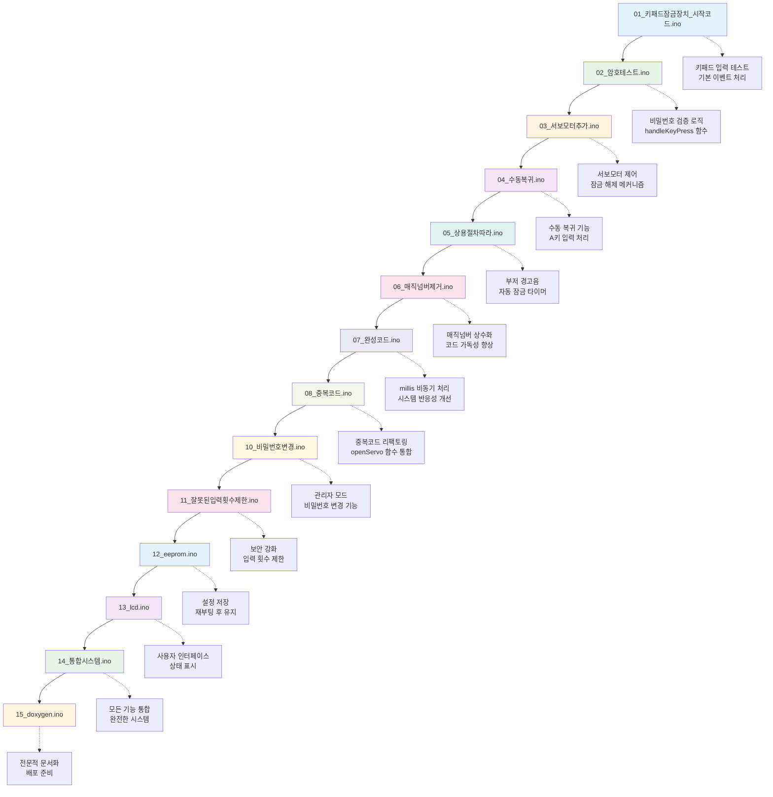
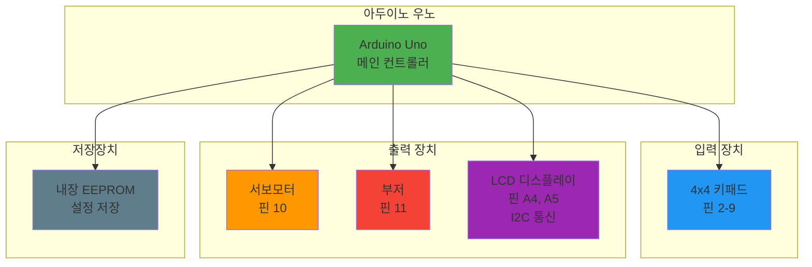
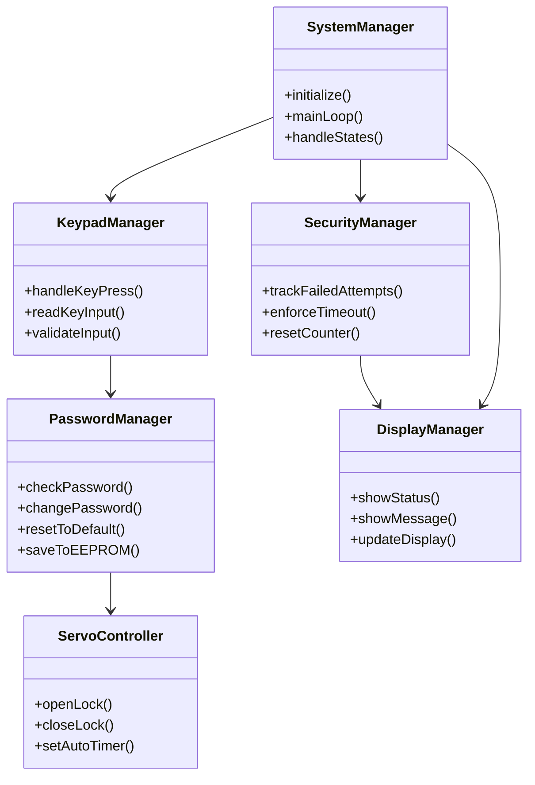
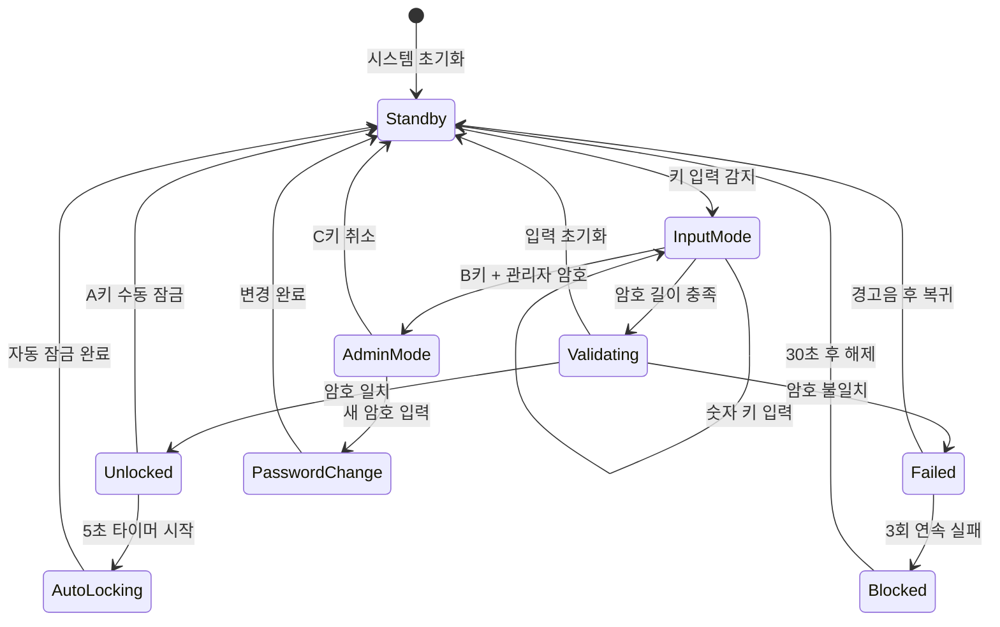
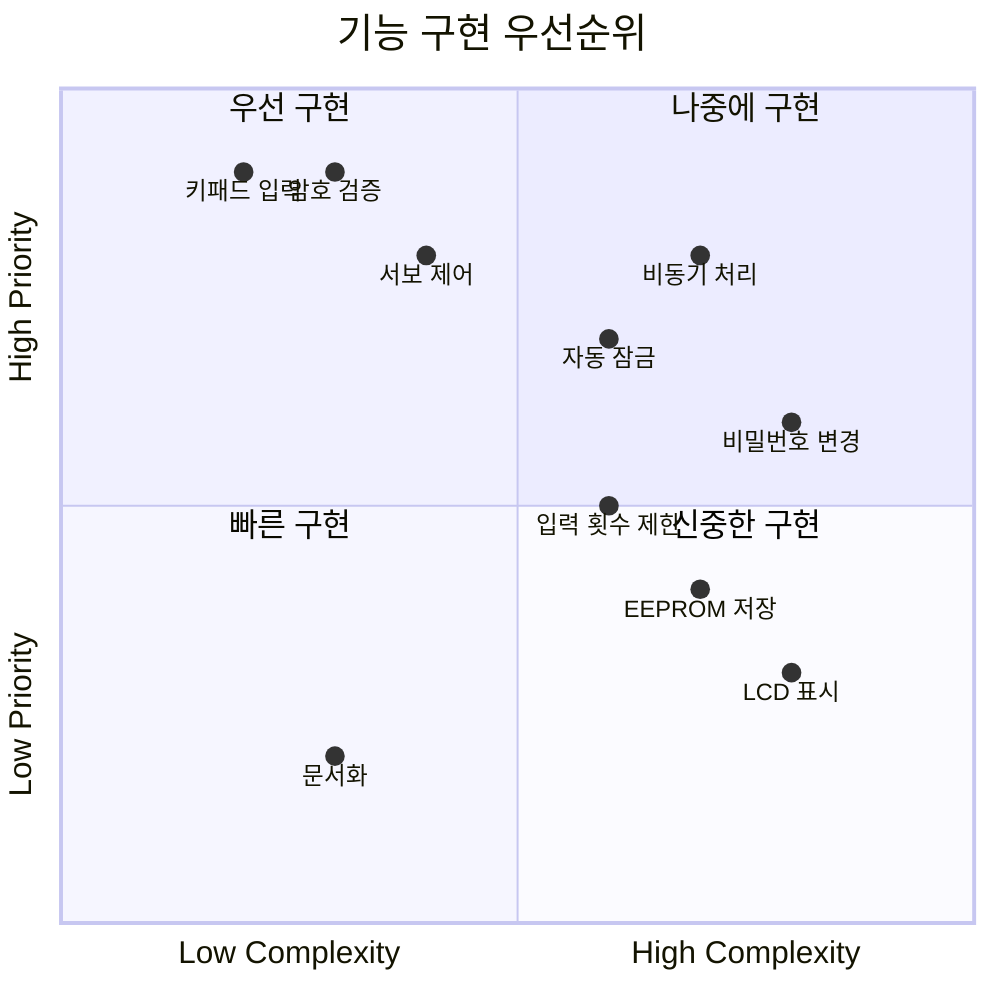
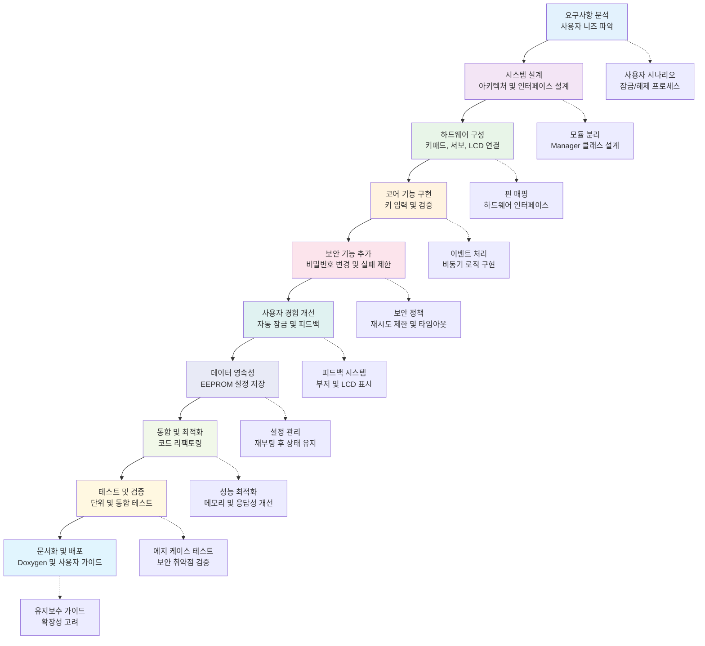

# 키패드 잠금장치 시스템 구현 순서도

## 전체 시스템 구현 플로우차트

## 기능별 구현 상세 플로우

## 하드웨어 연결 다이어그램

## 소프트웨어 아키텍처

## 상태 다이어그램

## 구현 우선순위 매트릭스

## 나만의 시스템 구현 순서도 (grok code fast )

기존의 단계별 파일 기반 접근에서 벗어나, 사용자 중심의 개발 라이프사이클 관점에서 재구성한 순서도입니다.

### 주요 차별점
- **사용자 중심 접근**: 실제 사용자 경험을 우선 고려
- **보안 우선 설계**: 초기 단계부터 보안 메커니즘 통합
- **확장성 고려**: 미래 기능 추가를 위한 모듈화
- **지속적 개선**: 테스트와 피드백 루프 포함