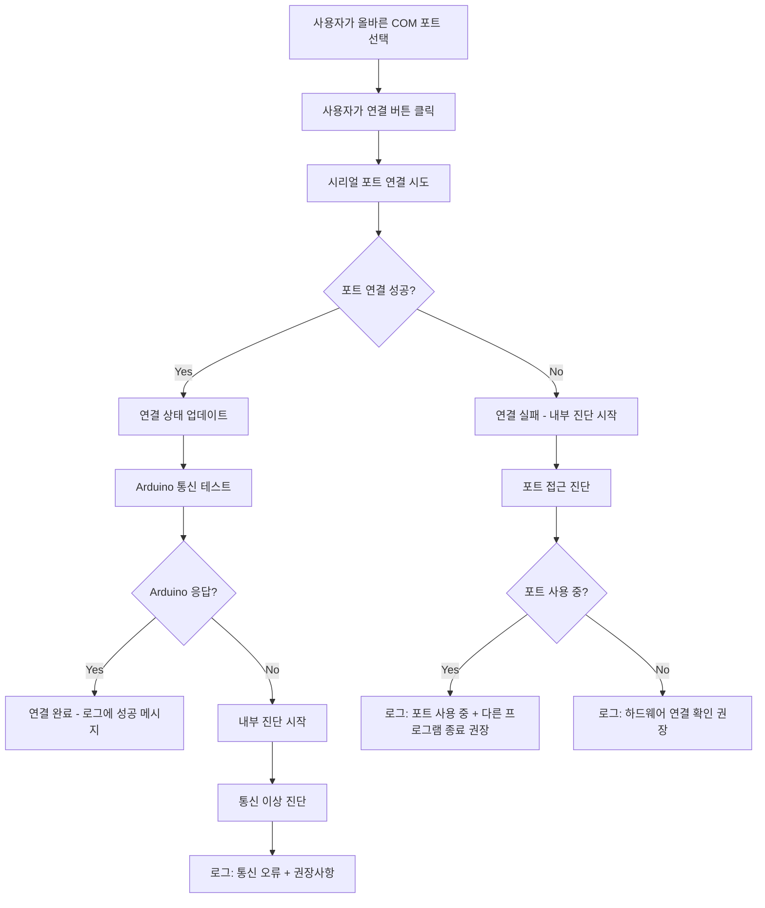
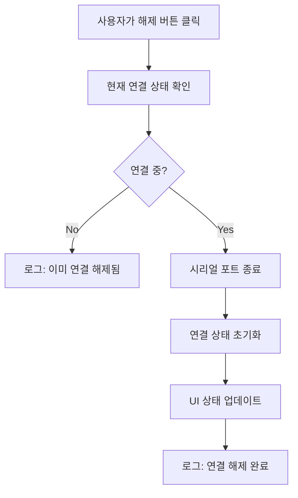
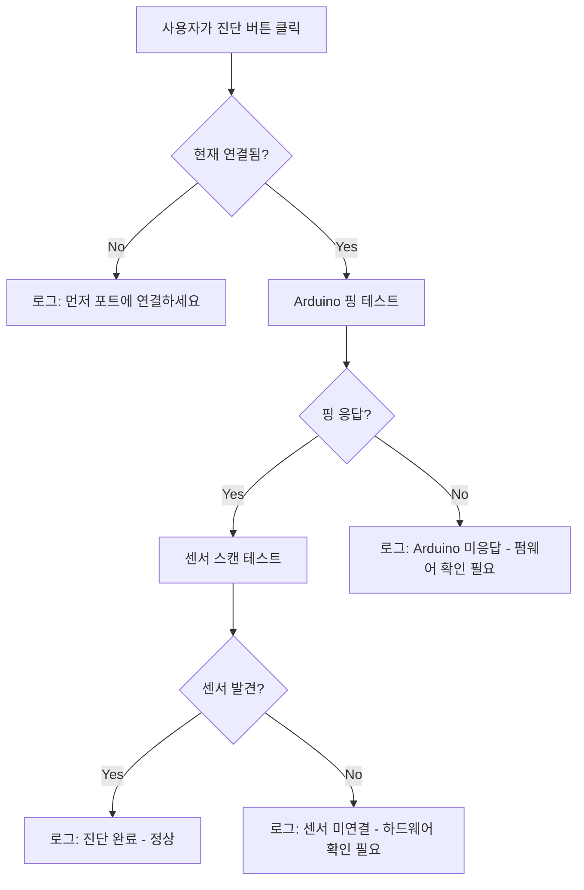

# Arduino 연결 설계 문서

**작성일**: 2025-08-23  
**목적**: DS18B20 온도 센서가 연결된 Arduino와의 시리얼 통신 설계  
**대상**: COM 포트를 통한 Arduino 보드 연결

---

## 🎯 설계 목표

### 주요 기능
1. **COM 포트 자동 검색** - 시스템의 사용 가능한 포트 목록 제공 ( COM 0 , COM 1 은 제외 )
2. **연결 관리** - 연결 과 해제 2가지 기능만 제공
3. **상태 모니터링** - 실시간 연결 상태 표시 (센서 로그창 통해서 )
4. **오류 처리** - 연결 , 해제  , 진단 실패시 센서 로그에 오류 메시지 표시

### 품질 요구사항
- **신뢰성**: 연결 끊김 시 자동 재연결 시도 ( 3회 시도 , 연결 버튼 위에 재시도중 글씨 표시 )
- **사용성**: 직관적인 UI, 명확한 상태 표시
- **성능**: 1초 이내 포트 스캔, 3초 이내 연결 ( 센서 로그에 포트 스캔 , 3초 이내 연결 에러시 표시 )
- **안정성**: 다중 연결 시도 방지, 리소스 정리

---

## 🏗️ 아키텍처 설계

### 1. COM 포트 관리자 (PortManager)
```python
class PortManager:
    """COM 포트 검색, 연결, 상태 관리"""
    
    def scan_ports() -> List[str]:
        """사용 가능한 COM 포트 목록 반환"""
        
    def connect(port: str, baudrate: int = 9600) -> bool:
        """지정된 포트로 연결 시도"""
        
    def disconnect() -> None:
        """현재 연결 해제"""
        
    def get_status() -> ConnectionStatus:
        """현재 연결 상태 반환"""
```

### 2. 연결 상태 관리
```python
@dataclass
class ConnectionStatus:
    is_connected: bool
    port: str | None
    baudrate: int | None
    last_error: str | None
    connected_since: datetime | None
```

### 3. UI 컴포넌트 연동
```python
# 현재 connection_controls.py 확장
def connection_controls() -> html.Div:
    return html.Div([
        # COM 포트 드롭다운 (동적 업데이트)
        dcc.Dropdown(id="com-port-dropdown", options=get_port_options()),
        
        # 연결 제어 버튼
        html.Button("연결", id="connect-btn"),
        html.Button("해제", id="disconnect-btn"), 
        html.Button("진단", id="diagnose-btn"),
        
        # 상태 표시 영역
        html.Div(id="connection-status"),
    ])
```

---

## 🔄 연결 프로세스 설계

### 연결 시나리오


### 해제 시나리오


### 진단 시나리오


---

## 🎨 UI 설계

### 헤더 영역 레이아웃
```
[온도센서 (DS18B20) 대시보드]          [COM3 ▼] [연결] [해제] [진단] [●연결됨]
```

### 상태 표시기
| 상태          | 표시              | 색상   | 설명         |
| ------------- | ----------------- | ------ | ------------ |
| **연결됨**    | `● 연결됨 (COM3)` | 🟢 초록 | 정상 연결 중 |
| **연결 중**   | `⏳ 연결 중...`    | 🟡 노랑 | 연결 시도 중 |
| **연결 실패** | `✗ 연결 실패`     | 🔴 빨강 | 연결 오류    |
| **해제됨**    | `○ 연결 안됨`     | ⚪ 회색 | 기본 상태    |

### 버튼 상태 관리
| 상태          | 연결 버튼 | 해제 버튼 | 진단 버튼 |
| ------------- | --------- | --------- | --------- |
| **연결 안됨** | 활성      | 비활성    | 비활성    |
| **연결 중**   | 비활성    | 비활성    | 비활성    |
| **연결됨**    | 비활성    | 활성      | 활성      |

---

## 📱 콜백 설계

### 1. 포트 스캔 콜백
```python
@app.callback(
    Output("com-port-dropdown", "options"),
    Input("scan-ports-interval", "n_intervals")  # 주기적 업데이트
)
def update_port_list(n_intervals):
    """사용 가능한 COM 포트 목록 업데이트"""
    return get_available_ports()
```

### 2. 연결 콜백 (진단 로직 포함)
```python
@app.callback(
    [Output("connection-status", "children"),
     Output("connect-btn", "disabled"),
     Output("disconnect-btn", "disabled"),
     Output("sensor-log", "children", allow_duplicate=True)],
    Input("connect-btn", "n_clicks"),
    State("com-port-dropdown", "value")
)
def handle_connect(n_clicks, selected_port):
    """연결 버튼 클릭 처리 (진단 포함)"""
    if not n_clicks or not selected_port:
        raise PreventUpdate
    
    # 연결 시도
    success = port_manager.connect(selected_port)
    
    if success:
        # Arduino 통신 테스트
        comm_result = test_arduino_communication(selected_port)
        if comm_result:
            log_messages = [
                create_log_entry("✅ COM{} 연결 성공 - Arduino 응답 확인됨".format(selected_port)),
            ]
            return f"● 연결됨 ({selected_port})", True, False, log_messages
        else:
            # 통신 실패 시 진단
            diagnostic = diagnose_sensor_communication(selected_port)
            log_messages = [
                create_log_entry(f"❌ {diagnostic.message}"),
                create_log_entry(f"💡 {diagnostic.recommendation}")
            ]
            port_manager.disconnect()  # 연결 해제
            return "✗ 통신 실패", False, True, log_messages
    
    else:
        # 연결 실패 시 진단
        diagnostic = diagnose_connection_failure(selected_port)
        log_messages = [
            create_log_entry(f"❌ {diagnostic.message}"),
            create_log_entry(f"💡 {diagnostic.recommendation}")
        ]
        return "✗ 연결 실패", False, True, log_messages
```

### 3. 해제 콜백
```python
@app.callback(
    [Output("connection-status", "children"),
     Output("connect-btn", "disabled"),
     Output("disconnect-btn", "disabled"),
     Output("sensor-log", "children", allow_duplicate=True)],
    Input("disconnect-btn", "n_clicks")
)
def handle_disconnect(n_clicks):
    """해제 버튼 클릭 처리"""
    if not n_clicks:
        raise PreventUpdate
        
    if port_manager.is_connected():
        port_manager.disconnect()
        log_messages = [create_log_entry("🔌 연결 해제 완료")]
        return "○ 연결 안됨", False, True, log_messages
    else:
        log_messages = [create_log_entry("ℹ️ 이미 연결 해제됨")]
        return "○ 연결 안됨", False, True, log_messages
```

### 4. 진단 콜백
```python
@app.callback(
    Output("sensor-log", "children", allow_duplicate=True),
    Input("diagnose-btn", "n_clicks"),
    State("com-port-dropdown", "value")
)
def handle_diagnose(n_clicks, selected_port):
    """진단 버튼 클릭 처리"""
    if not n_clicks:
        raise PreventUpdate
    
    if not port_manager.is_connected():
        return [create_log_entry("⚠️ 먼저 Arduino에 연결하세요")]
    
    # 진단 실행
    diagnostic = diagnose_sensor_communication(selected_port)
    
    if diagnostic.success:
        return [create_log_entry(f"✅ {diagnostic.message}")]
    else:
        return [
            create_log_entry(f"❌ {diagnostic.message}"),
            create_log_entry(f"💡 {diagnostic.recommendation}")
        ]
```

---

## 🛠️ 기술 스택

### 필요한 라이브러리
```python
# requirements.txt 추가
pyserial>=3.5      # 시리얼 통신
psutil>=5.9.0      # 시스템 포트 정보 (선택적)
```

### 파일 구조
```
src/python/
├── services/
│   ├── port_manager.py      # COM 포트 관리
│   └── arduino_client.py    # Arduino 통신 클라이언트
├── components/
│   └── connection_controls.py  # 기존 파일 확장
└── callbacks/
    └── connection_callbacks.py  # 연결 관련 콜백
```

---

## 🔒 오류 처리 및 진단 전략

### 진단 로직 설계
```python
class DiagnosticResult:
    """진단 결과"""
    success: bool
    issue_type: str  # 'port_busy', 'hardware_disconnected', 'communication_error', 'sensor_missing'
    message: str
    recommendation: str

def diagnose_connection_failure(port: str) -> DiagnosticResult:
    """연결 실패 원인 진단"""
    
    # 1. 포트 접근성 테스트
    if not is_port_accessible(port):
        return DiagnosticResult(
            success=False,
            issue_type='port_busy',
            message=f'COM 포트 {port} 접근 실패',
            recommendation='다른 프로그램에서 사용 중일 수 있습니다. Arduino IDE, 시리얼 모니터를 종료 후 다시 시도하세요.'
        )
    
    # 2. 하드웨어 연결 테스트  
    if not test_port_response(port):
        return DiagnosticResult(
            success=False,
            issue_type='hardware_disconnected', 
            message=f'COM 포트 {port}에서 응답 없음',
            recommendation='USB 케이블 연결 상태를 확인하고, Arduino 보드의 전원 LED가 켜져 있는지 확인하세요.'
        )
    
    # 3. Arduino 통신 테스트
    if not test_arduino_communication(port):
        return DiagnosticResult(
            success=False,
            issue_type='communication_error',
            message='Arduino는 연결되었으나 통신 프로토콜 오류',
            recommendation='Arduino에 올바른 펌웨어가 업로드되어 있는지 확인하세요. 보드 타입과 통신 속도(9600 bps)를 확인하세요.'
        )
    
    return DiagnosticResult(success=True, message='진단 완료', recommendation='')

def diagnose_sensor_communication(port: str) -> DiagnosticResult:
    """센서 통신 진단"""
    
    # Arduino 핑 테스트
    if not send_ping_command(port):
        return DiagnosticResult(
            success=False,
            issue_type='communication_error',
            message='Arduino 핑 테스트 실패',
            recommendation='펌웨어가 올바르게 동작하지 않습니다. Arduino 코드를 다시 업로드하세요.'
        )
    
    # 센서 스캔 테스트
    sensors = scan_sensors(port)
    if not sensors:
        return DiagnosticResult(
            success=False, 
            issue_type='sensor_missing',
            message='DS18B20 센서를 찾을 수 없음',
            recommendation='센서 배선을 확인하세요. 데이터 핀이 올바른 디지털 핀에 연결되고 풀업 저항(4.7kΩ)이 연결되어 있는지 확인하세요.'
        )
    
    return DiagnosticResult(
        success=True, 
        message=f'진단 완료 - {len(sensors)}개 센서 발견', 
        recommendation=''
    )
```

### 로그 메시지 예시
```python
# 연결 성공
log_message("✅ COM3 연결 성공 - Arduino 응답 확인됨")

# 연결 실패 - 포트 사용 중
log_error("❌ COM3 연결 실패 - 포트가 사용 중입니다")
log_recommendation("💡 Arduino IDE나 다른 시리얼 모니터 프로그램을 종료 후 다시 시도하세요")

# 연결 실패 - 하드웨어 미연결  
log_error("❌ COM3 연결 실패 - 하드웨어 응답 없음")
log_recommendation("💡 USB 케이블과 Arduino 전원 상태를 확인하세요")

# 통신 오류
log_error("❌ Arduino 통신 오류 - 프로토콜 불일치")
log_recommendation("💡 Arduino 펌웨어를 다시 업로드하고 통신 속도(9600 bps)를 확인하세요")

# 센서 미발견
log_warning("⚠️ DS18B20 센서를 찾을 수 없습니다")
log_recommendation("💡 센서 배선과 풀업 저항(4.7kΩ) 연결을 확인하세요")

# 진단 완료
log_message("✅ 진단 완료 - 2개 센서 정상 동작 중")
```

### 자동 재연결 설계
```python
@app.callback(
    [Output("connection-status", "children"),
     Output("connect-btn", "children"),
     Output("connect-btn", "disabled"),
     Output("reconnect-interval", "disabled")],
    Input("reconnect-interval", "n_intervals"),
    State("com-port-dropdown", "value")
)
def handle_auto_reconnect(n_intervals, selected_port):
    """자동 재연결 처리 (3회 시도)"""
    
    if not should_attempt_reconnect():
        raise PreventUpdate
    
    retry_count = get_retry_count()
    
    if retry_count >= 3:
        # 3회 시도 실패
        reset_retry_count()
        return "✗ 재연결 실패", "연결", False, True
    
    # 재연결 시도
    increment_retry_count()
    reconnect_text = f"재시도 중... ({retry_count + 1}/3)"
    
    success = port_manager.connect(selected_port)
    
    if success:
        reset_retry_count()
        log_message(f"✅ 자동 재연결 성공 ({retry_count + 1}회 시도)")
        return f"● 연결됨 ({selected_port})", "연결", True, True
    else:
        return f"⏳ 재연결 시도 중", reconnect_text, True, False

# 재연결 상태 표시 컴포넌트
html.Div([
    html.Button("연결", id="connect-btn"),
    html.Div(id="reconnect-status", style={"fontSize": "12px", "color": "#666"})
], style={"textAlign": "center"})
```

---

## 📋 구현 우선순위

### Phase 1: 기본 연결 (1-2일)
- [ ] PortManager 클래스 구현
- [ ] 기본 연결/해제 기능
- [ ] UI 상태 업데이트

### Phase 2: 고급 기능 (2-3일)  
- [ ] 자동 포트 스캔
- [ ] 연결 상태 모니터링
- [ ] 오류 처리 강화

### Phase 3: 사용성 개선 (1일)
- [ ] 자동 재연결 (3회 시도, 연결 버튼 상단에 재시도 상태 표시)
- [ ] 고급 진단 기능 (센서별 상태 검사)
- [ ] 로그 메시지 아이콘 및 색상 구분

---

**다음 단계**: 02_SERIAL_PROTOCOL.md에서 Arduino와의 통신 프로토콜 정의