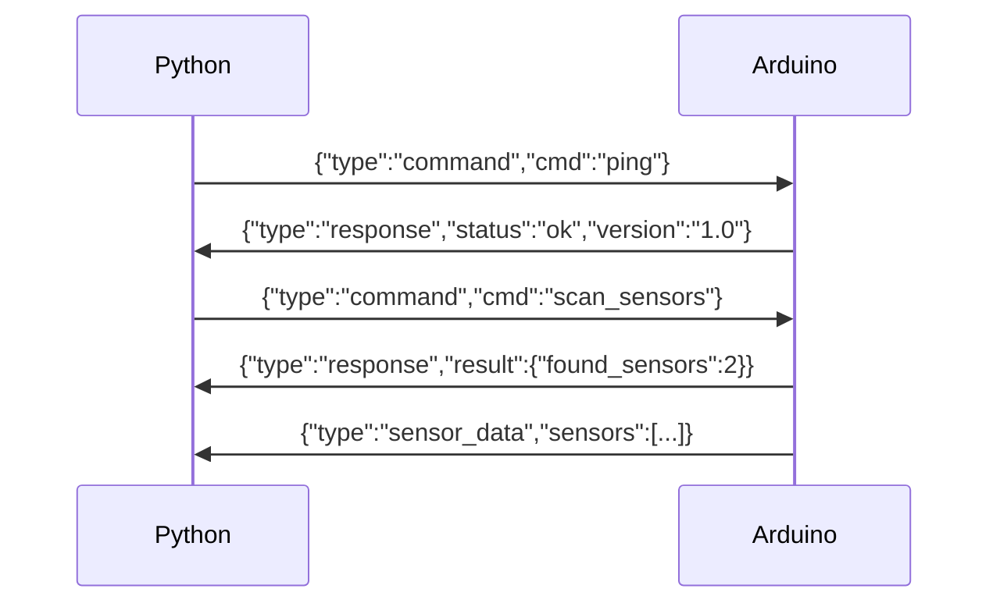
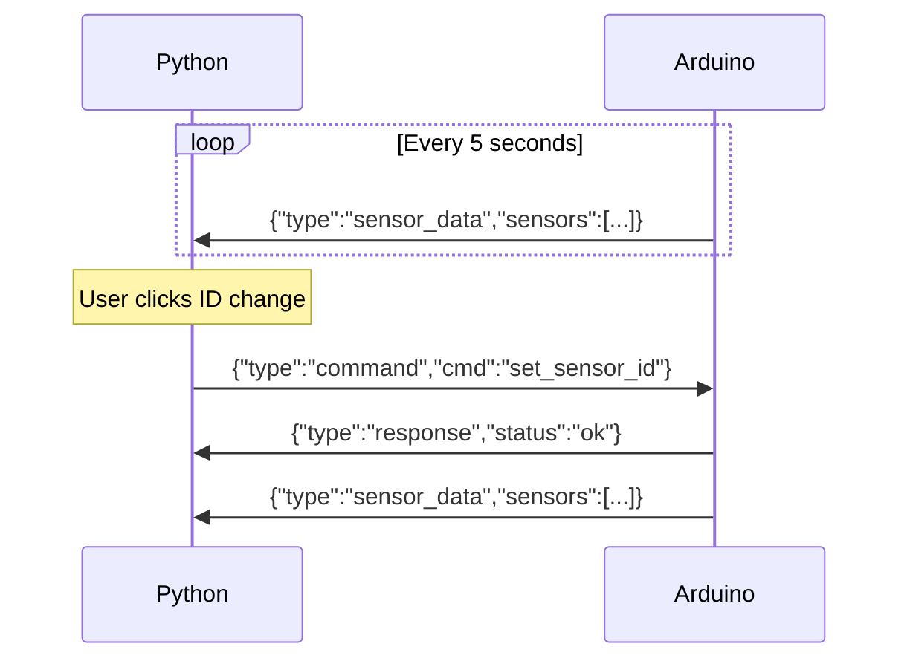

# Arduino 시리얼 통신 프로토콜

**작성일**: 2025-01-28  
**목적**: DS18B20 센서 데이터 수집을 위한 Arduino ↔ Python 통신 규약  
**프로토콜 버전**: v1.0

---

## 🎯 프로토콜 설계 원칙

### 설계 목표
- **단순성**: JSON 기반의 읽기 쉬운 메시지 형태
- **신뢰성**: 체크섬 및 오류 검증 포함
- **확장성**: 향후 센서 추가 가능한 구조
- **디버깅**: 사람이 읽을 수 있는 텍스트 형태

### 통신 설정
```
- Baud Rate: 115200 bps  # 8센서 지원을 위한 고속 통신
- Data Bits: 8
- Parity: None  
- Stop Bits: 1
- Flow Control: None
- Line Ending: \r\n (CRLF)
- Buffer Size: 128 bytes  # 다중 센서 데이터 처리용
```

---

## 📡 메시지 포맷

### 기본 구조
```json
{
  "type": "message_type",
  "timestamp": 1706400000,
  "data": { ... },
  "checksum": "abc123"
}
```

### 필드 설명
| 필드 | 타입 | 설명 |
|------|------|------|
| `type` | string | 메시지 유형 (`sensor_data`, `command`, `response`, `error`) |
| `timestamp` | integer | Unix 타임스탬프 (Arduino millis() 기준) |
| `data` | object | 메시지별 데이터 페이로드 |
| `checksum` | string | 데이터 무결성 검증용 CRC16 체크섬 |

---

## 🌡️ 센서 데이터 메시지

### Arduino → Python (센서 읽기)
```json
{
  "type": "sensor_data",
  "timestamp": 1706400123,
  "data": {
    "sensors": [
      {
        "id": "00",
        "address": "28AA1B2C3D4E5F60", 
        "temperature": 25.3,
        "humidity": 65.2,
        "status": "ok"
      },
      {
        "id": "01", 
        "address": "28BB2C3D4E5F6071",
        "temperature": -127.0,
        "humidity": 0.0,
        "status": "error"
      }
    ],
    "measurement_interval": 2000,
    "batch_size": 2
  },
  "checksum": "4F2A"
}
```

### 센서 객체 스키마
| 필드 | 타입 | 설명 | 예시 |
|------|------|------|------|
| `id` | string | 센서 식별자 (00-08) | `"00"` |
| `address` | string | DS18B20 64비트 주소 (16진수) | `"28AA1B2C3D4E5F60"` |
| `temperature` | float | 온도 값 (°C) | `25.3` |
| `status` | string | 센서 상태 | `"ok"`, `"error"`, `"disconnected"` |

### 특수 온도 값
| 값 | 의미 |
|----|------|
| `-127.0` | 센서 읽기 오류 |
| `-999.0` | 센서 연결되지 않음 |
| `85.0` | 센서 초기화 중 (무시) |

---

## 🎛️ 명령어 메시지

### Python → Arduino (명령 전송)

#### 1. 센서 스캔 요청
```json
{
  "type": "command",
  "timestamp": 1706400123,
  "data": {
    "cmd": "scan_sensors"
  },
  "checksum": "1A2B"
}
```

#### 2. 센서 ID 변경
```json
{
  "type": "command", 
  "timestamp": 1706400123,
  "data": {
    "cmd": "set_sensor_id",
    "sensor_address": "28AA1B2C3D4E5F60",
    "new_id": "02"
  },
  "checksum": "3C4D"
}
```

#### 3. 측정 주기 설정
```json
{
  "type": "command",
  "timestamp": 1706400123, 
  "data": {
    "cmd": "set_interval",
    "interval_ms": 5000
  },
  "checksum": "5E6F"
}
```

#### 4. 임계값 설정 (TH/TL)
```json
{
  "type": "command",
  "timestamp": 1706400123,
  "data": {
    "cmd": "set_threshold",
    "sensor_id": "00",
    "high_temp": 30.0,
    "low_temp": 10.0
  },
  "checksum": "7890"
}
```

---

## ✅ 응답 메시지

### Arduino → Python (명령 응답)

#### 성공 응답
```json
{
  "type": "response",
  "timestamp": 1706400124,
  "data": {
    "cmd": "scan_sensors",
    "status": "ok",
    "result": {
      "found_sensors": 3,
      "addresses": [
        "28AA1B2C3D4E5F60",
        "28BB2C3D4E5F6071", 
        "28CC3D4E5F607182"
      ]
    }
  },
  "checksum": "ABCD"
}
```

#### 오류 응답
```json
{
  "type": "response",
  "timestamp": 1706400124,
  "data": {
    "cmd": "set_sensor_id",
    "status": "error", 
    "error_code": "SENSOR_NOT_FOUND",
    "message": "Sensor with address 28XX... not found"
  },
  "checksum": "EFGH"
}
```

---

## ❌ 오류 메시지

### Arduino → Python (시스템 오류)

#### 하드웨어 오류
```json
{
  "type": "error",
  "timestamp": 1706400124,
  "data": {
    "error_code": "ONEWIRE_BUS_ERROR",
    "message": "OneWire bus communication failed",
    "severity": "high"
  },
  "checksum": "1234"
}
```

#### 전원 오류
```json
{
  "type": "error", 
  "timestamp": 1706400124,
  "data": {
    "error_code": "POWER_INSUFFICIENT", 
    "message": "Parasitic power mode detected, external power required",
    "severity": "medium"
  },
  "checksum": "5678"
}
```

### 오류 코드 정의
| 코드 | 심각도 | 설명 |
|------|--------|------|
| `SENSOR_NOT_FOUND` | low | 지정된 주소의 센서를 찾을 수 없음 |
| `ONEWIRE_BUS_ERROR` | high | OneWire 통신 버스 오류 |
| `POWER_INSUFFICIENT` | medium | 전원 공급 부족 |
| `MEMORY_ERROR` | high | Arduino 메모리 부족 |
| `INVALID_COMMAND` | low | 알 수 없는 명령어 |

---

## 🔄 통신 플로우

### 1. 초기 연결 시퀀스


### 2. 정상 운영 중


---

## 🛡️ 체크섬 계산

### CRC16 구현 (Arduino)
```cpp
uint16_t calculateCRC16(const char* data) {
    uint16_t crc = 0xFFFF;
    for (int i = 0; data[i] != '\0'; i++) {
        crc ^= data[i];
        for (int j = 0; j < 8; j++) {
            if (crc & 1) {
                crc = (crc >> 1) ^ 0xA001;
            } else {
                crc >>= 1;
            }
        }
    }
    return crc;
}
```

### 체크섬 검증 (Python)
```python
def verify_checksum(message: dict) -> bool:
    """메시지 체크섬 검증"""
    received_checksum = message.pop('checksum')
    calculated = calculate_crc16(json.dumps(message, sort_keys=True))
    return received_checksum == f"{calculated:04X}"
```

---

## 📋 구현 가이드라인

### Arduino 측 구현 요구사항
1. **JSON 라이브러리**: ArduinoJson 사용 (✅ 구현 완료)
2. **버퍼 크기**: 128바이트 시리얼 버퍼 (✅ 구현 완료)
3. **타임아웃**: 명령 처리는 3초 이내 완료 (✅ 구현 완료)
4. **메모리 관리**: JSON 객체 생성/해제 최적화 (✅ 구현 완료)
5. **배치 처리**: 2개 센서씩 배치 처리 (✅ 구현 완료)
6. **EEPROM 보호**: 5초 디바운스 적용 (✅ 구현 완료)

### Python 측 구현 요구사항  
1. **JSON 파싱**: 표준 json 모듈 사용 (✅ 구현 완료)
2. **타임아웃**: 응답 대기는 5초 이내 (✅ 구현 완료)
3. **재시도**: 체크섬 오류 시 3회까지 재요청 (✅ 구현 완료)
4. **로깅**: 모든 통신 메시지 로그 기록 (✅ 구현 완료)
5. **센서 로거**: 실시간 통계 수집 시스템 (✅ 구현 완료)
6. **스트리밍 UI**: 10초 간격 로그 카드 업데이트 (✅ 구현 완료)

---

## 🧪 테스트 시나리오

### 1. 정상 통신 테스트
```python
# Python 테스트 코드 예시
def test_sensor_data_parsing():
    message = '{"type":"sensor_data","timestamp":123,"data":{"sensors":[{"id":"00","temperature":25.3}]},"checksum":"1234"}\r\n'
    parsed = parse_message(message)
    assert parsed['type'] == 'sensor_data'
    assert len(parsed['data']['sensors']) == 1
```

### 2. 오류 처리 테스트
- 체크섬 불일치
- JSON 파싱 오류  
- 타임아웃 발생
- 잘못된 명령어

### 3. 성능 테스트
- 센서 9개 동시 읽기
- 1초 간격 연속 데이터 수신
- 명령어 응답 시간 측정

---

## 📈 프로토콜 버전 관리

### 버전 협상
```json
# Python → Arduino (연결 시)
{"type":"command","cmd":"get_version"}

# Arduino → Python  
{"type":"response","version":"1.0","features":["temp_sensor","threshold"]}
```

### 향후 확장 계획
- **v1.1**: 습도 센서 (DHT22) 추가
- **v1.2**: 알람 임계값 기능  
- **v1.3**: 설정 저장/복원 기능

---

**다음 단계**: 03_IMPLEMENTATION_GUIDE.md에서 실제 코드 구현 방법 정의