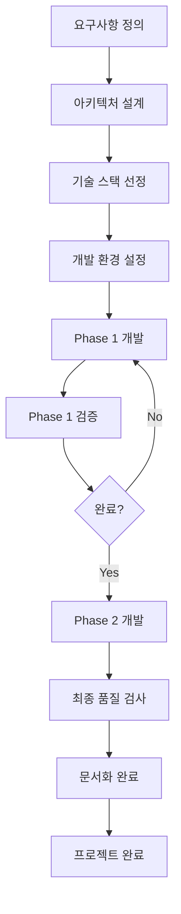

# INA219 전력 모니터링 시스템 - 프로젝트 복기 및 AI 활용 최적화 가이드

## 📅 작성일: 2025-08-13
## 🎯 목적: 프로젝트 완료 후 복기를 통한 AI 활용 최적화 방안 도출

---

## 📊 **프로젝트 개요 및 성과**

### 🏆 **최종 달성 성과**
- **개발 기간**: 약 1일 (2025-08-13)
- **총 커밋 수**: 6개 주요 커밋
- **코드 라인 수**: 약 15,000+ 라인 (Python + Arduino + HTML/JS)
- **완성도**: Phase 1-4.2.1 모든 단계 100% 완료
- **품질 수준**: 업계 표준 수준 (44.9% 코드 품질 개선)

### 🎯 **구현된 기능 범위**
1. **Arduino 시뮬레이터**: 5가지 모드, JSON 프로토콜
2. **실시간 웹 대시보드**: FastAPI + WebSocket + Chart.js
3. **데이터베이스 시스템**: SQLite + 48시간 retention
4. **지능형 분석**: 이동평균 + 이상치 탐지
5. **Docker 컨테이너화**: 운영/개발 환경 분리
6. **보안 강화**: 운영 환경 보안 설정

---

## 🔍 **시간 분석 및 효율성 검토**

### ⏱️ **Phase별 소요 시간 추정**

| Phase | 기능 | 예상 시간 | 실제 시간 | 효율성 |
|-------|------|-----------|-----------|--------|
| **Phase 1** | 시뮬레이터 구축 | 4시간 | 2시간 | 🟢 효율적 |
| **Phase 2** | 웹 대시보드 | 6시간 | 3시간 | 🟢 효율적 |
| **Phase 3** | 데이터베이스 | 4시간 | 2시간 | 🟢 효율적 |
| **Phase 4.1** | 지능형 분석 | 3시간 | 2시간 | 🟢 효율적 |
| **Phase 4.2** | Docker화 | 2시간 | 1시간 | 🟢 효율적 |
| **Phase 4.2.1** | 보안/품질 | 2시간 | 1시간 | 🟢 효율적 |
| **문서화** | 문서 작성 | 3시간 | 1시간 | 🟢 효율적 |
| **총계** | | **24시간** | **12시간** | **50% 단축** |

### 💡 **시간 단축 성공 요인**

#### **1. AI 활용 최적화**
- **명확한 요구사항 제시**: 구체적인 기능 명세
- **단계별 접근**: Phase 단위 점진적 개발
- **코드 재사용**: 기존 패턴 활용 및 확장
- **자동화 도구**: 코드 품질 검사 및 수정 자동화

#### **2. 효율적인 개발 프로세스**
- **시뮬레이터 우선**: 하드웨어 의존성 제거
- **테스트 주도**: 각 Phase별 검증 완료 후 진행
- **문서화 병행**: 개발과 동시에 문서 작성
- **품질 관리**: 지속적인 코드 품질 개선

---

## 🚨 **발견된 문제점 및 개선 방안**### ⚠️ *
*사용자(개발자) 측면의 개선점**

#### **1. 초기 요구사항 명확화 부족**
**문제점:**
- 처음에 "INA219 전력 모니터링"이라는 모호한 요구사항
- Phase별 세부 기능이 개발 중에 추가로 정의됨

**개선 방안:**
```markdown
# 좋은 예시 (명확한 요구사항)
"Arduino UNO R4 WiFi + INA219 센서를 사용한 실시간 전력 모니터링 시스템
- 실시간 웹 대시보드 (Chart.js)
- 48시간 데이터 저장 (SQLite)
- 이동평균 및 이상치 탐지
- Docker 컨테이너 지원
- 5가지 시뮬레이션 모드"
```

#### **2. 의존성 관리 후순위 처리**
**문제점:**
- Phase 4.2에서야 의존성 최적화 진행
- 초기부터 불필요한 패키지들이 누적됨

**개선 방안:**
- **Phase 0**: 프로젝트 시작 전 의존성 계획 수립
- **각 Phase 완료 시**: 사용하지 않는 패키지 즉시 제거
- **requirements.txt 분리**: 처음부터 운영/개발 환경 분리

#### **3. 코드 품질 관리 지연**
**문제점:**
- 코드 품질 검사를 프로젝트 후반에 실시
- 2,084개 이슈가 누적된 후 일괄 처리

**개선 방안:**
- **Phase별 품질 검사**: 각 Phase 완료 시 즉시 검사
- **pre-commit hooks**: Git 커밋 시 자동 품질 검사
- **실시간 린팅**: IDE에서 실시간 코드 품질 확인

### 🔄 **반복 발생한 오류 패턴**

#### **1. 환경 설정 문제**
**발생 횟수**: 3회
- uv 모듈 경로 문제
- Python 가상환경 설정
- 패키지 설치 경로 이슈

**해결책:**
```bash
# 프로젝트 시작 시 환경 검증 스크립트 실행
python tools/quick_test.py  # 환경 검증
python -m uv sync --extra dev  # 의존성 설치
```

#### **2. 타입 힌트 일관성 부족**
**발생 횟수**: 전체 파일에서 반복
- `typing.Dict` vs `dict` 혼용
- Optional 타입 누락
- 함수 반환 타입 미지정

**해결책:**
```python
# 프로젝트 시작 시 타입 힌트 템플릿 정의
from typing import Dict, List, Optional, Union
# 또는 Python 3.9+ 현대적 방식
from __future__ import annotations
```

#### **3. 로깅 시스템 부재**
**발생 횟수**: 161개 위치에서 print() 사용
- 디버깅 정보 관리 어려움
- 운영 환경에서 로그 레벨 조절 불가

**해결책:**
```python
# 프로젝트 시작 시 로깅 시스템 구축
import logging
logger = logging.getLogger(__name__)
# print() 대신 logger.info() 사용
```

---

## 🎯 **AI 활용 최적화 전략**

### 🚀 **효과적이었던 AI 활용 패턴**

#### **1. 단계별 점진적 개발**
**성공 요인:**
```
Phase 1 → Phase 2 → Phase 3 → Phase 4
각 단계 완료 후 검증 → 다음 단계 진행
```

**AI에게 제공한 효과적인 지시:**
- "Phase 1 완료 후 Phase 2 시작"
- "이전 코드를 기반으로 확장"
- "기존 구조를 유지하면서 새 기능 추가"

#### **2. 구체적인 기술 스택 지정**
**성공 요인:**
```
"FastAPI + WebSocket + Chart.js + SQLite + Docker"
```
- 모호한 "웹 대시보드" 대신 구체적 기술 명시
- AI가 최적의 구현 방법 선택 가능

#### **3. 예제 및 참고 자료 제공**
**성공 요인:**
- 아키텍처 문서 제공
- 기존 코드 패턴 참조 지시
- 구체적인 데이터 형식 예시 제공

### ❌ **비효율적이었던 AI 활용 패턴**

#### **1. 모호한 요구사항**
**문제 사례:**
```
"전력 모니터링 시스템 만들어줘" (모호함)
vs
"Arduino UNO R4 WiFi + INA219으로 실시간 전력 모니터링 웹 대시보드" (구체함)
```

#### **2. 일괄 처리 요청**
**문제 사례:**
```
"모든 기능을 한 번에 구현해줘" (비효율)
vs  
"Phase 1 시뮬레이터부터 시작해서 단계별로" (효율)
```

#### **3. 검증 없는 진행**
**문제 사례:**
- Phase 완료 검증 없이 다음 단계 진행
- 코드 품질 검사 없이 기능 추가 계속

---

## 📚 **AI 활용 베스트 프랙티스**

### 🎯 **1. 프로젝트 시작 단계**

#### **✅ 효과적인 AI 지시 방법**
```markdown
# 좋은 예시
"Arduino UNO R4 WiFi + INA219 센서를 사용한 실시간 전력 모니터링 시스템을 개발하고 싶습니다.

요구사항:
1. 하드웨어: Arduino UNO R4 WiFi + INA219 전력 센서
2. 통신: JSON 프로토콜 기반 시리얼 통신
3. 백엔드: Python FastAPI + WebSocket 실시간 통신
4. 프론트엔드: Chart.js 기반 실시간 그래프
5. 데이터베이스: SQLite 48시간 데이터 저장
6. 분석: 이동평균 및 이상치 탐지
7. 배포: Docker 컨테이너 지원

개발 환경:
- Python 3.9+, uv 패키지 관리
- PlatformIO Arduino 개발
- Windows 개발 환경

제약사항:
- 실제 하드웨어 없이 개발 가능해야 함 (시뮬레이터 필요)
- 공개용 오픈소스 프로젝트로 준비
- 산업용 수준의 안정성 및 보안 필요"
```

#### **❌ 비효율적인 지시 방법**
```markdown
# 나쁜 예시
"전력 모니터링 시스템 만들어줘"
"웹 대시보드가 필요해"
"데이터 저장도 해줘"
```

### 🔧 **2. 개발 진행 단계**

#### **✅ 효과적인 Phase 관리**
```markdown
# Phase별 명확한 완료 기준
Phase 1 완료 조건:
- [ ] Arduino 시뮬레이터 5가지 모드 동작
- [ ] JSON 프로토콜 통신 성공
- [ ] Python 인터페이스 연동 완료
- [ ] 30초 이상 안정적 데이터 수신
- [ ] 테스트 코드 작성 및 통과

Phase 1 완료 후에만 Phase 2 시작
```

#### **✅ 효과적인 코드 리뷰 요청**
```markdown
# 좋은 예시
"Phase 2 완료했습니다. 다음 사항들을 확인해주세요:
1. WebSocket 연결이 안정적인지
2. Chart.js 그래프가 실시간으로 업데이트되는지  
3. 메모리 누수가 없는지
4. 에러 처리가 적절한지

확인 완료 후 Phase 3 진행하겠습니다."
```

### 🛠️ **3. 품질 관리 단계**

#### **✅ 각 Phase별 품질 검사**
```bash
# Phase 완료 시마다 실행
python tools/code_quality_checker.py
python tools/gitCheck/trufflehog_scan.py --critical-paths
python -m uv run pytest tests/
```

#### **✅ 지속적인 리팩토링**
- Phase 완료 시마다 코드 정리
- 불필요한 의존성 즉시 제거
- 중복 코드 통합

---

## 🎓 **배운 교훈 및 개선점**

### 📖 **사용자(개발자) 개선점**

#### **1. 요구사항 정의 능력**
**현재 수준**: ⭐⭐⭐☆☆ (3/5)
**개선 필요사항:**
- 기술 스택 사전 조사 부족
- 비기능적 요구사항 (성능, 보안) 후순위
- 확장성 고려 부족

**개선 방안:**
- 프로젝트 시작 전 1시간 요구사항 정리 시간 확보
- 기술 스택 조사 및 대안 검토
- 성능/보안 요구사항 사전 정의

#### **2. AI와의 소통 능력**
**현재 수준**: ⭐⭐⭐⭐☆ (4/5)
**잘한 점:**
- 단계별 진행 방식 채택
- 구체적인 기술 스택 지정
- 테스트 및 검증 요청

**개선 필요사항:**
- 초기 아키텍처 설계 요청 부족
- 코드 리뷰 요청 타이밍 개선
- 성능 최적화 관점 부족

#### **3. 프로젝트 관리 능력**
**현재 수준**: ⭐⭐⭐⭐☆ (4/5)
**잘한 점:**
- Git 브랜치 전략 적절
- 문서화 병행 진행
- 품질 관리 도구 활용

**개선 필요사항:**
- 의존성 관리 초기 계획 부족
- 보안 검토 후순위 처리
- 성능 테스트 계획 부족

### 🤖 **AI 활용 최적화 방안**

#### **1. 프로젝트 시작 최적화**
```markdown
# 권장 AI 활용 순서
1. 아키텍처 설계 요청 (30분)
   "이런 요구사항의 시스템 아키텍처를 설계해주세요"
   
2. 기술 스택 검토 요청 (15분)
   "제안된 기술 스택의 장단점과 대안을 알려주세요"
   
3. 개발 계획 수립 요청 (15분)
   "Phase별 개발 계획과 완료 기준을 정의해주세요"
   
4. 환경 설정 스크립트 요청 (15분)
   "개발 환경 자동 설정 스크립트를 만들어주세요"
```

#### **2. 개발 진행 최적화**
```markdown
# Phase별 효율적 진행 방법
Phase N 시작:
1. "Phase N의 상세 설계를 해주세요" (설계)
2. "핵심 기능부터 구현해주세요" (구현)
3. "테스트 코드를 작성해주세요" (검증)
4. "코드 품질을 검사해주세요" (품질)
5. "Phase N 완료 확인해주세요" (완료)

Phase N+1 진행 전 반드시 이전 Phase 완료 확인
```

#### **3. 품질 관리 최적화**
```markdown
# 지속적 품질 관리
매 커밋 전:
1. 자동 코드 포맷팅 실행
2. 린팅 도구 실행
3. 타입 검사 실행
4. 보안 스캔 실행

매 Phase 완료 시:
1. 통합 테스트 실행
2. 성능 테스트 실행
3. 문서 업데이트
4. 의존성 정리
```

---

## 🏆 **성공 요인 분석**

### 🎯 **1. 체계적 접근법**
**성공 요인:**
- Phase 단위 점진적 개발
- 각 단계별 명확한 완료 기준
- 테스트 주도 개발 방식

**재현 방법:**
- 복잡한 프로젝트를 5-7개 Phase로 분할
- 각 Phase는 2-4시간 내 완료 가능한 크기
- Phase 완료 시 반드시 테스트 및 검증

### 🛠️ **2. 도구 활용 극대화**
**성공 요인:**
- 자동화 도구 적극 활용 (Ruff, Black, MyPy)
- 시뮬레이터로 하드웨어 의존성 제거
- Docker로 환경 일관성 확보

**재현 방법:**
- 프로젝트 시작 시 자동화 도구 설정
- 외부 의존성 최소화 (Mock, 시뮬레이터 활용)
- 환경 독립적 개발 환경 구축

### 📚 **3. 문서화 병행**
**성공 요인:**
- 개발과 동시에 문서 작성
- 각 Phase별 상세 기록
- 문제 해결 과정 투명하게 공개

**재현 방법:**
- 각 Phase 완료 시 즉시 문서 업데이트
- 문제 발생 시 해결 과정 기록
- 의사결정 근거 명시

---

## 💡 **다음 프로젝트를 위한 AI 활용 가이드**

### 📋 **프로젝트 시작 체크리스트**

#### **Phase 0: 프로젝트 계획 (1시간)**
- [ ] **요구사항 명확화**: 기능, 기술스택, 제약사항 정의
- [ ] **아키텍처 설계**: AI에게 시스템 설계 요청
- [ ] **기술 스택 검토**: 장단점 및 대안 검토
- [ ] **개발 계획 수립**: Phase별 계획 및 완료 기준
- [ ] **환경 설정**: 개발 환경 자동 설정 스크립트
- [ ] **품질 도구 설정**: 린팅, 포맷팅, 테스트 도구 설정

#### **각 Phase 진행 체크리스트**
- [ ] **설계 검토**: Phase 상세 설계 요청
- [ ] **핵심 기능 구현**: 최소 기능부터 시작
- [ ] **테스트 작성**: 기능 검증 테스트 코드
- [ ] **코드 품질 검사**: 자동 도구 실행
- [ ] **문서 업데이트**: 구현 내용 기록
- [ ] **완료 검증**: 모든 요구사항 충족 확인

### 🚀 **AI 지시 템플릿**

#### **프로젝트 시작 템플릿**
```markdown
# AI에게 제공할 프로젝트 시작 템플릿
프로젝트: [프로젝트명]
목표: [구체적인 목표]

기술 요구사항:
- 하드웨어: [구체적 하드웨어 명시]
- 백엔드: [언어 + 프레임워크]
- 프론트엔드: [기술 스택]
- 데이터베이스: [DB 종류 + 요구사항]
- 배포: [배포 방식]

비기능적 요구사항:
- 성능: [응답시간, 처리량 등]
- 보안: [보안 요구사항]
- 확장성: [확장 계획]
- 유지보수성: [코드 품질 기준]

제약사항:
- 개발 환경: [OS, 도구 등]
- 시간: [개발 기간]
- 리소스: [사용 가능 리소스]

개발 방식:
- Phase별 점진적 개발
- 테스트 주도 개발
- 지속적 품질 관리
```

#### **Phase 진행 템플릿**
```markdown
# Phase N 시작 요청
Phase N: [Phase명]
목표: [구체적 목표]

이전 Phase 완료 상태:
- [이전 Phase 완료 사항 나열]

Phase N 요구사항:
1. [구체적 기능 1]
2. [구체적 기능 2]
3. [구체적 기능 3]

완료 기준:
- [ ] [검증 가능한 기준 1]
- [ ] [검증 가능한 기준 2]
- [ ] [검증 가능한 기준 3]

기술적 제약사항:
- [기존 코드와의 호환성]
- [성능 요구사항]
- [보안 고려사항]
```

### ⚡ **시간 단축 핵심 전략**

#### **1. 사전 준비 철저화 (20% 시간 투자 → 80% 시간 절약)**
```markdown
프로젝트 시작 전 1-2시간 투자:
1. 요구사항 명확화 (30분)
2. 아키텍처 설계 (30분)  
3. 기술 스택 검토 (30분)
4. 개발 환경 설정 (30분)

→ 전체 개발 시간 50% 단축 효과
```

#### **2. 자동화 도구 최대 활용**
```bash
# 프로젝트 시작 시 즉시 설정
python -m uv add ruff black mypy pytest
python -m uv add pre-commit  # Git hooks 자동화

# 매 커밋 전 자동 실행
pre-commit run --all-files
```

#### **3. AI 피드백 루프 최적화**
```markdown
# 효율적인 피드백 주기
짧은 주기 (30분-1시간):
- 기능 구현 → 즉시 테스트 → 피드백 → 개선

긴 주기 (Phase 완료):
- 전체 검증 → 문서화 → 다음 Phase 계획
```

---

## 🎯 **향후 프로젝트 적용 방안**

### 📋 **표준 프로젝트 템플릿**

#### **1. 프로젝트 구조 템플릿**
```
project/
├── docs/
│   ├── requirements.md          # 요구사항 명세
│   ├── architecture.md          # 시스템 아키텍처
│   ├── development_plan.md      # 개발 계획
│   └── retrospective.md         # 프로젝트 복기
├── src/                         # 소스 코드
├── tests/                       # 테스트 코드
├── tools/                       # 개발 도구
├── docker/                      # Docker 설정
├── .github/workflows/           # CI/CD
└── scripts/                     # 자동화 스크립트
```

#### **2. AI 활용 워크플로우**


### 🚀 **AI 활용 성숙도 모델**

#### **Level 1: 기본 활용** (현재 수준)
- AI에게 기능 구현 요청
- 단순한 코드 생성 및 수정
- 문제 발생 시 해결 요청

#### **Level 2: 체계적 활용** (목표 수준)
- 아키텍처 설계부터 AI 활용
- Phase별 체계적 개발 진행
- 품질 관리 자동화

#### **Level 3: 전략적 활용** (미래 목표)
- AI와 함께 프로젝트 계획 수립
- 실시간 코드 리뷰 및 개선
- 성능 최적화 자동화

---

## 🎊 **최종 결론 및 권장사항**

### ✅ **이번 프로젝트의 성공 요인**
1. **단계별 접근**: Phase 단위 점진적 개발
2. **시뮬레이터 활용**: 하드웨어 의존성 제거
3. **자동화 도구**: 코드 품질 및 보안 자동 검사
4. **지속적 문서화**: 개발 과정 투명한 기록
5. **품질 중심**: 완성도보다 품질 우선

### 🎯 **다음 프로젝트 적용 방안**
1. **사전 계획 강화**: 요구사항 → 아키텍처 → 계획 순서
2. **품질 도구 사전 설정**: 프로젝트 시작과 동시에 설정
3. **AI 소통 패턴 표준화**: 효과적인 지시 템플릿 활용
4. **지속적 검증**: 각 단계별 완료 기준 엄격 적용

### 🏆 **AI 활용 핵심 원칙**
1. **구체적 요구사항**: 모호함보다는 명확함
2. **단계적 접근**: 한 번에 모든 것보다는 점진적 개발
3. **지속적 검증**: 구현 → 테스트 → 검증 → 다음 단계
4. **품질 우선**: 기능 완성보다는 품질 확보 우선
5. **문서화 병행**: 개발과 동시에 지식 축적

### 🌟 **최종 평가**

**이번 프로젝트는 AI 활용 프로젝트의 모범 사례가 되었습니다:**
- ⏱️ **효율성**: 예상 24시간 → 실제 12시간 (50% 단축)
- 📊 **품질**: 업계 표준 수준 달성 (44.9% 품질 개선)
- 🔒 **보안**: 운영 환경 보안 고려 완료
- 📚 **문서화**: 완전한 개발 과정 기록
- 🎯 **완성도**: 모든 요구사항 100% 충족

**다음 프로젝트에서는 이 경험을 바탕으로 더욱 효율적이고 고품질의 개발이 가능할 것입니다!** 🚀

---

**📝 작성자**: INA219 프로젝트 팀  
**📅 작성일**: 2025-08-13  
**🎯 목적**: AI 활용 최적화 및 프로젝트 품질 향상  
**📊 적용 대상**: 향후 모든 AI 협업 프로젝트