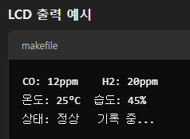

### 준비물
보드 : arduino r4 wifi 호환
센서 : MQ-7 , MQ-9 , MQ-135 , DHT22
디스플레이 : 20X4 LCD
부저 : 능동부저
기록장치 : SD카드 모듈

### 필요 전압 / 전류 계산
- Arduino r4 wifi 호환 : 5V / 0.1 ~ 0.3A(코드 없는 상태 , 코드 실행시 0.2A, wifi 사용시 0.3A)
- 20X4 LCD : 5V / 0.05A
- DHT22 : 5V / 0.03A
- MQ-7 : 5V / 0.15A
- MQ-9 : 5V / 0.15A
- MQ-135 : 5V / 0.15A
- SD카드 모듈 : 5V / 0.1A
- 부저 : 5V / 0.1A
- 합계 : 5V / 1.73A

### MQ-7 센서의 감지되는 가스별 PPM 너비값과 환경청의 기준 PPM
주 감지 가스 : CO(일산화탄소) : 10 ~ 1000 ppm
부 감지 가스 : H2(수소) : 1 ~ 1000 ppm
부 감지 가스 : 이소부탄 , 메탄 ( 있지만 저항값의 변화가 적어 추천하지 않는다 )

### 일산화탄소 ppm에 대한 환경부 기준
- 1시간 평균 : 25ppm
- 8시간 평균 : 9ppm

### AI 추천 받은 소프트웨어 계획
- 기본 로직
    센서 초기화 및 데이터 수집
    모든 센서 데이터를 주기적으로 읽음 (예: 1초 간격)
- 데이터 처리
    센서 데이터(PPM)를 변환 및 평균 처리
    DHT22 온습도 데이터를 함께 기록
- 조건 검출 및 경고
    CO 농도가 환경부 기준 초과 시 부저 경고
    실시간 LCD 출력
- 데이터 기록
    SD 카드에 시간, 센서 값, 온습도 값 기록

### 추천 흐름도
[Start]
→ 센서 초기화
→ 센서 데이터 수집
→ 데이터 변환 및 출력
→ 기준 초과 여부 확인
  → 경고 (부저 활성화)
→ 데이터 SD 카드 저장
→ 반복 (루프)

### LCD 출력 예시

### 일정 계획
단계	작업 내용	기간
1단계	하드웨어 연결 및 테스트	1주
2단계	센서 데이터 수집 및 변환 코드 작성	2주
3단계	LCD 및 경고 시스템 구현	1주
4단계	데이터 기록 및 최종 디버깅	1주
5단계	프로젝트 최종 테스트 및 발표 준비	1주

### 확장 및 개선 아이디어
Wi-Fi 모듈 활용: 실시간 데이터 모니터링을 위한 웹 대시보드 구현
데이터 시각화: 수집 데이터의 그래프 분석
모바일 앱 알림: 기준 초과 시 모바일 알림 발송
정확도 개선: 여러 센서 데이터를 활용한 가스 식별 및 교차 검증

### 참고할 사이트
1. https://coding-yoon.tistory.com/98
2.

### 라이브러리 탐색
1. https://github.com/fjebaker/MQ7/blob/master/src/MQ7.h
2. (추천) https://github.com/miguel5612/MQSensorsLib/tree/master
   

### 모스펫 활용처
1. DC 모터 제어
2. 전력 공급 장치
3. 스위치 모드 전원 공급기
4. 인버터
5. 전동차 제어
6. 로봇 제어
7. 전력 변환기
8. 전기차 충전기
9. 전력 스위치
10. 고전류 제어 회로