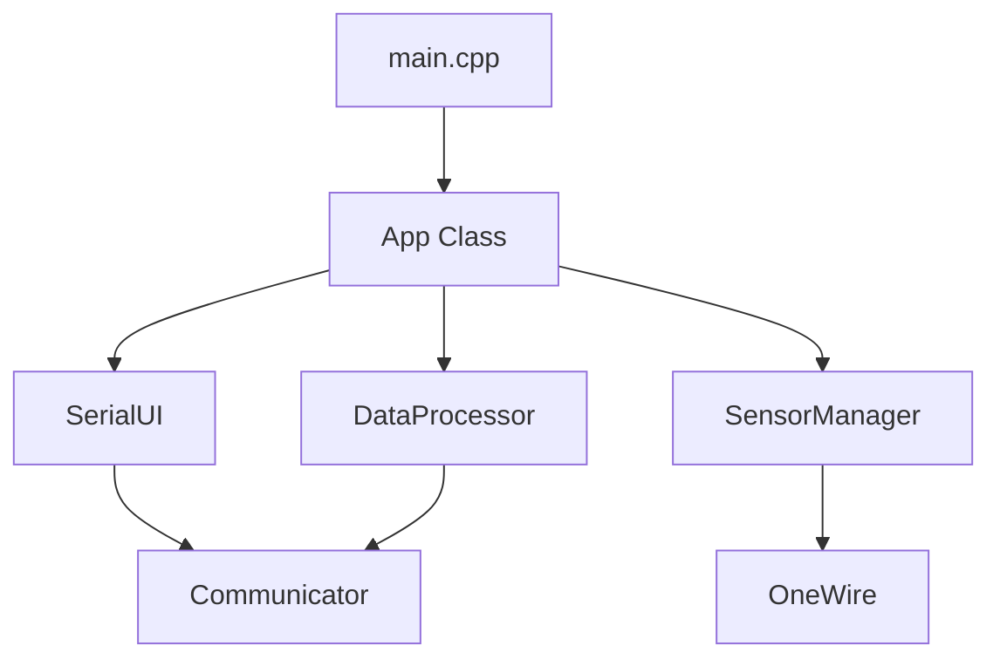

# Walkthrough - PlatformIO 환경 구축 및 빌드 성공

ESP32-C3 XIAO 보드를 위한 개발 환경을 PlatformIO로 이전하고 빌드에 성공했습니다.

## 1. 프로젝트 구조 재구성
기존 Arduino 스타일의 구조를 PlatformIO 표준 구조로 변경했습니다.
- `src/` 폴더를 생성하여 모든 소스 파일을 관리합니다.
- `.ino` 파일을 `.cpp`로 변환하여 컴파일 속도와 코드 정밀도를 높였습니다.

```
30_Firmware/
├── platformio.ini (설정 파일)
└── src/
    ├── main.cpp (기존 .ino 파일)
    ├── App.cpp / App.h
    └── ... 그 외 라이브러리 파일
```

## 2. 주요 문제 해결

### 라이브러리 충돌 (FreeRTOS)
- **문제**: Arduino IDE 라이브러리 폴더의 AVR용 FreeRTOS가 ESP32 빌드에 포함되어 충돌 발생 (`avr/io.h` 누락 에러).
- **해결**: `platformio.ini`에서 외부 라이브러리 참조를 제거하고, PlatformIO 전용 레지스트리에서 라이브러리를 직접 다운로드하도록 변경하여 환경을 격리했습니다.

### 함수 선언 누락 (Forward Declaration)
- **문제**: C++ 표준을 따르는 PlatformIO 환경에서는 함수가 사용되기 전 선언되어야 하나, `.ino`에서는 생략 가능했던 부분이 에러를 유발.
- **해결**: `main.cpp` 상단에 `printHelpMenu()` 등의 함수 선언을 추가했습니다.

## 3. 빌드 결과 확인
`pio run` 명령어를 통해 성공적으로 컴파일되었습니다.

- **빌드 성공 로그**:
```
Processing seeed_xiao_esp32c3 (platform: espressif32; board: seeed_xiao_esp32c3; framework: arduino)
...
Linking .pio\build\seeed_xiao_esp32c3\firmware.elf
Creating esp32c3 image...
[SUCCESS] Took 8.23 seconds
```

## 4. 향후 활용 가이드
- `platformio_best_practices.md` 문서를 참고하여 향후 Arduino Nano나 UNO R4 WiFi와 같은 다양한 보드들을 하나의 설정 파일(`platformio.ini`)에서 멀티 환경으로 관리할 수 있습니다.

## 5. 아키텍처 개선 (Refactoring 완료)

`serialVersion_02` 버전에서 대대적인 코드 리팩토링을 통해 상용 수준의 임베디드 코드로 고도화했습니다.

### 주요 개선 사항

| 항목 | 개선 내용 | 비고 |
| :--- | :--- | :--- |
| **메모리 최적화** | `String` 클래스 전면 제거, `char` 버퍼 및 `F()` 매크로 적용 | RAM 단편화 방지 |
| **UI 로직 분리** | 메뉴 및 출력 로직을 `SerialUI` 클래스로 독립 | 코드 가독성 및 유지보수성 향상 |
| **비차단 방식 전환** | 하드웨어 쓰기, 센서 검색 등을 상태 기반 비차단 로직으로 변경 | 시스템 반응성 극대화 |
| **캡슐화 강화** | `App` 클래스의 내부 메소드 은닉화 및 의존성 주입 구조 개선 | 아키텍처 정규화 |

### 시스템 구조도 (Mermaid)



이제 본 시스템은 메모리 효율성과 반응성이 뛰어나며, 장기 운용 시에도 안정적인 동작을 보장합니다.
