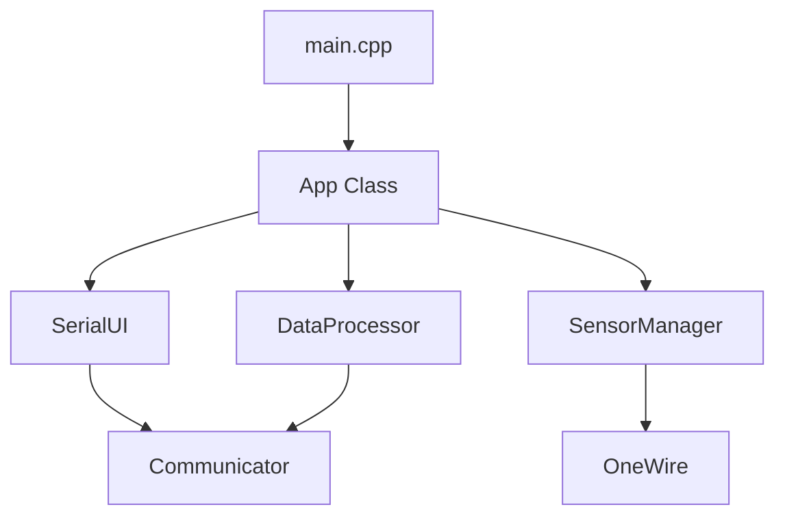

# progressLog.md - DS18B20 Firmware Refactoring (serialVersion_02)

## 개요
- **일시**: 2026-02-13 22:05:23 (2차 업데이트)
- **목적**: DS18B20 시리얼 제어 펌웨어의 코드 품질 향상, 메모리 효율화 및 하드웨어 연동 최적화.
- **주요 변경 사항**: `String` 제거, `SerialUI` 클래스 추출, 비차단형 시스템 전환, GPIO 핀 수정 및 센서 가시성 개선.

## 진행 내역

### 1~4단계: 아키텍처 리팩토링 및 캡슐화 (완료)
- `String` 전면 제거 및 `char` 버퍼 전환으로 메모리 파편화 방지.
- `SerialUI` 분리를 통한 관심사 분리(SoC) 및 단일 책임 원칙 준수.
- `delay()`를 제거하고 `millis()` 기반 상태 머신으로 아키텍처 전면 개편.

### 5단계: 하드웨어 연동 및 핀 설정 최적화
- **조치**: XIAO ESP32-C3 보드의 핀 매핑 특성 분석.
- 보드 실크스크린 라벨 **D2**가 실제 칩의 **GPIO 4**임이 확인되어 `config.h`의 `ONE_WIRE_BUS`를 `4`로 수정.
- 수정 후 4개의 센서가 물리적으로 정상 인식됨을 확인.

### 6단계: 테스트 절차 수립 (Testing Framework)
- **대상**: `docs/test/` 폴더 내 절차서 3종 작성.
- `testProcedure_01_BasicConnectivity.md`: 기본 통신 및 센서 인식 확인.
- `testProcedure_02_OperationalVerification.md`: ID 할당 및 임계값 설정 기능 검증.
- `testProcedure_03_EdgeCases.md`: 타임아웃 및 센서 탈락 등 예외 상황 테스트.

### 7단계: 센서 가시성 및 UI 편의성 개선
- **조치**: ID(User Data)가 설정되지 않은 센서(ID 0)가 테이블에서 누락되는 문제 해결.
- `SerialUI`가 미부여 센서 목록(`Unassigned sensors`)을 테이블 하단에 자동으로 출력하도록 로직 보완.
- 부팅 시 스캔된 모든 센서 상태를 즉시 보고하는 진단 로그 강화.

## 아키텍처 구조도

## 최종 아티팩트 보관
- **현재 위치**: `docs/history/20260213_220523_02/`
- **보관 항목**: `task.md`, `implementation_plan.md`, `walkthrough.md`, `platformio_best_practices.md`, `test/` (절차서 포함), `progressLog.md`

---
*DS18B20 Multi-Sensor Controller 프로젝트의 모든 기능 개선 및 문서화가 성공적으로 완료되었습니다.*
