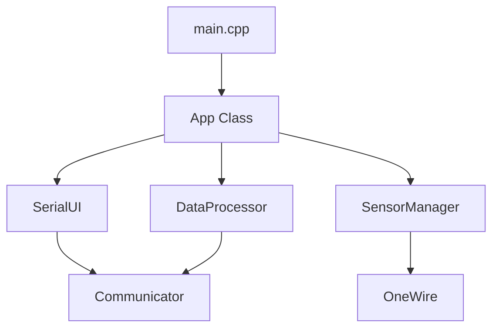

# progressLog.md - DS18B20 Firmware Refactoring (serialVersion_02)

## 개요
- **일시**: 2026-02-13 21:23:43
- **목적**: DS18B20 시리얼 제어 펌웨어의 코드 품질 향상, 메모리 효율화 및 아키텍처 개선.
- **주요 변경 사항**: `String` 제거, `SerialUI` 클래스 추출, 비차단형(Non-blocking) 상태 머신 전환.

## 진행 내역

### 1단계: 메모리 최적화 (Memory Optimization)
- **대상**: `Communicator`, `App`, `DataProcessor`, `main.cpp`
- **조치**: 
    - `String` 클래스 사용을 전면 금지하고 `char` 버퍼와 `const char*` 체계로 전환.
    - `String::toInt()`, `String::substring()` 등을 `atoi()`, `strcmp()` 등 표준 C 함수로 대체.
    - 문자열 리터럴에 `F()` 매크로 및 PROGMEM을 적극 적용하여 RAM 점유율 최소화.

### 2단계: UI 로직 분리 (UI Handler Separation)
- **대상**: `App` 클래스 내 메뉴 및 디스플레이 로직
- **조치**:
    - `SerialUI` 클래스를 신규 생성하여 모든 메뉴 출력 및 도움말 텍스트를 이관.
    - `App` 클래스는 센서 제어 및 상태 관리 본연의 비즈니스 로직에만 집중하도록 단일 책임 원칙(SRP) 강화.
    - 의존성 주입(Dependency Injection)을 통해 `App`이 `SerialUI`를 사용하도록 구조 개선.

### 3단계: 비차단형 시스템 전환 (Non-blocking System)
- **대상**: `delay()` 사용 구간 및 반복 검색 로직
- **조치**:
    - `processAutoAssignIds`, `resetAllSensorIds`, `performSensorSearch`의 `while` 및 `delay` 제거.
    - 상태(State)와 타이머(`millis`) 기반의 비차단형 비동기 처리 방식으로 전환.
    - 센서 검색 중이나 설정 중에도 시리얼 명령 입력 및 온도 모니터링이 중단되지 않도록 개선.

### 4단계: 캡슐화 및 상세 정리 (Encapsulation & Cleanup)
- **조치**:
    - `App` 클래스의 내부 처리용 메소드들을 `private`으로 이동하여 외부 노출 최소화.
    - 가독성 향상을 위해 주석 정리 및 아키텍처 구조도(Mermaid) 작성.
    - 빌드 경고 및 잠재적 보안 이슈(buffer overflow) 체크.

## 아키텍처 구조도

## 최종 아티팩트 보관
- **위치**: `docs/history/20260213_212343_01/`
- **보관 항목**: `task.md`, `implementation_plan.md`, `walkthrough.md`, `platformio_best_practices.md`, `progressLog.md`

---
*DS18B20 Multi-Sensor Controller 프로젝트의 Refactoring Phase가 성공적으로 마무리되었습니다.*
