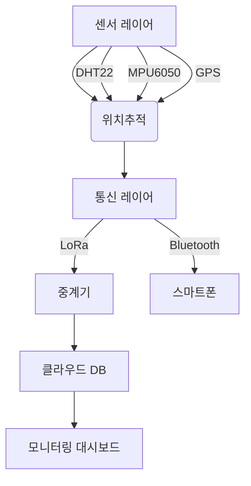

## 아두이노 기반 신호수 안전 장비 구현 가능성 연구: 종합 분석 및 제안

### 핵심 구현 가능성 의견
**"아두이노를 활용한 스마트 신호수 안전장비 개발은 기술적·경제적으로 완전히 가능하며, 프로토타입 단계부터 계절별 장비 적용까지 체계적으로 접근할 수 있습니다."**

---

### 기술적 구현 가능성 분석 (02_분석/)
1. **센서/모듈 호환성**  
   - 대부분 환경 센서(DHT22, MQ시리즈), 안전 센서(진동, 가속도계), 통신 모듈(Bluetooth/ESP8266/LoRa)이 아두이노와 즉시 연동 가능
   - 저가형 GPS 모듈(Neo-6M)로 위치 추적 구현 용이
   - 소형 진동모터/부저/LED로 즉각적 피드백 가능

2. **계절별 장비 적용성**
   | 장비 유형 | 적용 가능 기술 | 구현 난이도 |
   |---|---|---|
   | 스마트 헬멧 | 충돌감지(가속도계), SOS 버튼 ★ | ★★☆ |
   | 스마트 조끼 | 환경센서(온습도/가스), GPS | ★★★ |
   | 스마트 장갑 | 제스처 인식(플렉스 센서) | ★★★★ |
   | 스마트 안전화 | 미끄러짐 감지(가속도계+압력센서) | ★★★ |
   | 장비 부착형 | 진동경보(LVDT 센서) | ★★☆ |

3. **도전 과제**
   - **전력 관리**: 리튬배터리 + 슬립모드 구현 필요
   - **환경 내구성**: 방수/방진 케이스 & 컨폼몰딩 필수
   - **실시간성**: LoRa/ESP-NOW로 지연시간 최소화
   - **오탐률**: 머신러닝 필터링 (TinyML 도입)

---

### 권장 기술 스택 (05_설계/)


---

### 단계별 실행 계획
1. **1단계: 핵심 기능 프로토타입 (6주)**
   - 아두이노 Nano + 충돌감지 센서 + LoRa 통신 테스트
   - 3D 프린팅 헬멧 마운트 구현 (06_프로토타입/)

2. **2단계: 시스템 통합 (4주)**
   - ESP32-CAM 연동(이미지 캡처)
   - 멀티센서 퓨전(가속도+기압+온도) 알고리즘 개발

3. **3단계: 현장 검증 (8주)**
   - IP67 등급 방수/내충격 케이스 적용
   - -20°C ~ 45°C 환경 테스트 (07_문서/테스트리포트)

---

### 비용 효율성 평가
- **개발 비용**: 센서+모듈 단가 $5~50 (벌크 구매 시 70%↓)
- **상용화 대비**: 프로토타입 단계 비용 < $200/셋트
- 주목할 기술: 에너지 하베스팅(태양광 패치)으로 배터리 수명 3배 연장 가능

---

### 고려사항 및 제안
1. **안전성 확보**
   - 2중 경고 시스템(진동+음성+LED)
   - ATmega2560으로 고장 허용성(Fault Tolerance) 설계

2. **규격 준수**
   - 한국산업규격(KOSHA) 충족 전자파 차폐 처리
   - CE/FCC 인증을 위한 RF 모듈 선정

3. **혁신 포인트**
   - ```장갑 내장형 제스처 인식```: 휴대폰 건드리지 않고 신호 전달
   - ```AI Anomaly Detection```: 비정상 작업 패턴 자동 경고

---

### 결론
아두이노 생태계의 방대한 라이브러리와 저전력 SoC(ESP32)의 등장으로 **실용적인 스마트 안전장비 개발이 이미 기술적 타당성을 확보**했습니다. 차별화를 위해서는:
1. 계절별 장비 특성화(예: 겨울용 난방 내장 조끼)
2. 중장비와의 연동성 확보(OBD-II 인터페이스)
3. 사고 발생시 증거 수집용 블랙박스 기능 추가
를 제안합니다. 프로젝트 구조대로 단계적 실행 시 6개월 내 기능성 프로토타입 완성 가능합니다.