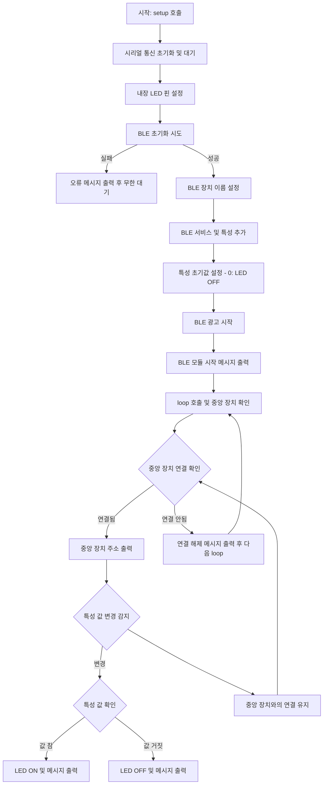

둘을 비교 해볼것 

Claude flowchart code

flowchart TD
    A[시작] --> B[시리얼 통신 초기화]
    B --> C{시리얼 준비됨?}
    C -->|아니오| C
    C -->|예| D[LED 핀 출력 모드 설정]
    D --> E{BLE 초기화 성공?}
    E -->|아니오| F[오류 메시지 출력] --> G[무한 대기]
    E -->|예| H[BLE 장치 이름 설정]
    H --> I[서비스에 특성 추가]
    I --> J[BLE 스택에 서비스 등록]
    J --> K[광고 서비스 설정]
    K --> L[특성 초기값 설정 -LED OFF]
    L --> M[BLE 광고 시작]
    M --> N[시작 메시지 출력]
    
    N --> O[중앙 장치 검사]
    O --> P{중앙 장치 연결됨?}
    P -->|아니오| O
    P -->|예| Q[연결된 장치 주소 출력]
    
    Q --> R{장치 연결 유지중?}
    R -->|아니오| S[연결 끊김 메시지 출력] --> O
    R -->|예| T{특성 값 변경됨?}
    
    T -->|아니오| R
    T -->|예| U{특성 값 = 1?}
    U -->|예| V[LED 켜기] --> W[LED ON 메시지 출력] --> R
    U -->|아니오| X[LED 끄기] --> Y[LED OFF 메시지 출력] --> R