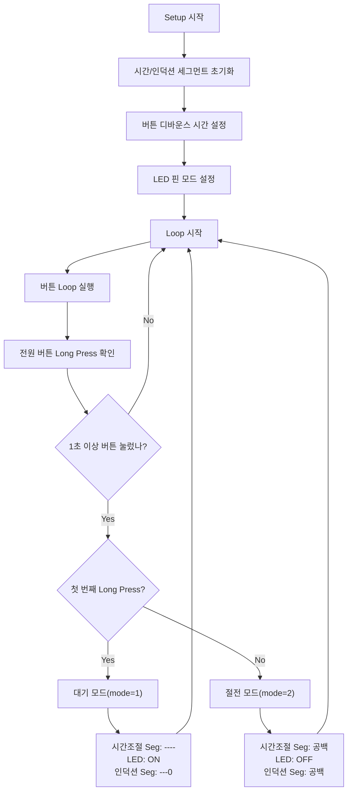

## 코드 리뷰 (아두이노 초보자 수준)

안녕하세요! 코드 리뷰 요청 감사합니다. 보내주신 코드를 아두이노 초보자 입장에서 꼼꼼하게 살펴보겠습니다. 전반적으로 코드가 잘 작성되었고, 초보자가 이해하기 쉽도록 노력하신 부분이 돋보입니다. 하지만 몇 가지 개선할 부분과 초보자가 헷갈릴 수 있는 부분에 대해 자세히 설명드리겠습니다.

**1. 코드의 전반적인 인상**

* **가독성:** 코드 전체적으로 주석이 충분히 달려 있어서 각 부분이 어떤 역할을 하는지 이해하기 쉽습니다. 변수 이름도 `timeSegment`, `inductionSegment`, `powerButton` 등 직관적으로 잘 지어져 있어서 초보자가 코드를 따라가기 좋습니다.
* **구조:** `setup()` 함수와 `loop()` 함수, 그리고 기능별로 분리된 함수 (`controlLED`, `timeSegmentDisplay`, `inductionSegmentDisplay`, `powerButtonLongPressed`)로 코드가 잘 구조화되어 있어서 초보자가 코드를 수정하거나 확장하기에 용이합니다.
* **기능 구현:** 코드 설명과 시뮬레이터 링크를 통해 코드가 의도하신 대로 "대기 모드"와 "절전 모드"를 잘 구현하는 것을 확인했습니다. 특히 전원 버튼 길게 누르기를 통해 모드를 변경하는 로직이 잘 구현되어 있습니다.
* **흐름도:**  제공해주신 순서도(flowchart)는 코드의 흐름을 시각적으로 잘 나타내고 있어서 코드 이해에 큰 도움이 됩니다.

**2. 초보자를 위한 개선 및 설명**

* **상수 이름 명확하게:**  `time_DIO`, `time_CLK`, `induction_DIO`, `induction_CLK` 와 같은 상수 이름은 어떤 핀을 의미하는지 명확하게 알 수 있지만, `powerButtonPin`, `powerPlusButtonPin`, `powerMinusButtonPin`, `voiceLEDPin` 처럼 `Pin`을 뒤에 붙이는 것보다 `POWER_BUTTON_PIN`, `POWER_PLUS_BUTTON_PIN`, `POWER_MINUS_BUTTON_PIN`, `VOICE_LED_PIN` 처럼 대문자와 언더스코어(_)를 사용하여 상수를 표현하는 것이  **코딩 관례** 이자 **가독성** 향상에 도움이 됩니다. 초보자에게는 이러한 코딩 스타일을 익히는 것이 중요합니다.

    ```c++
    // 변경 전
    const int time_DIO = 4;
    const int time_CLK = 5;
    const int induction_DIO = 10;
    const int induction_CLK = 11;
    const int powerButtonPin = 2;
    const int powerPlusButtonPin = 13;
    const int powerMinusButtonPin = 12;
    const int voiceLEDPin = 3;

    // 변경 후 (권장)
    const int TIME_DIO_PIN = 4;
    const int TIME_CLK_PIN = 5;
    const int INDUCTION_DIO_PIN = 10;
    const int INDUCTION_CLK_PIN = 11;
    const int POWER_BUTTON_PIN = 2;
    const int POWER_PLUS_BUTTON_PIN = 13;
    const int POWER_MINUS_BUTTON_PIN = 12;
    const int VOICE_LED_PIN = 3;
    ```

* **`mode` 변수 주석 추가:** `mode` 변수는 코드의 핵심적인 역할을 하는데, 초보자는 `mode` 변수가 어떤 상태를 나타내는지 직관적으로 알기 어려울 수 있습니다. `mode` 변수에 대한 주석을 추가하여 각 숫자가 어떤 모드를 의미하는지 설명해주면 초보자가 코드를 이해하는 데 훨씬 도움이 됩니다.

    ```c++
    // 모드 변수
    int mode = 0; // 0: 초기 상태, 1: 대기 모드, 2: 절전 모드  <-- 주석 추가
    ```

* **`static` 변수 설명:** `powerButtonLongPressed()` 함수 안의 `static unsigned long firstPressedTime = 0;` 와 `static int pressCount = 0;` 는 초보자가 이해하기 어려울 수 있는 부분입니다. `static` 키워드가 변수를 함수 내에서 **정적 변수** 로 선언하여 함수가 종료되어도 값이 유지되도록 하는 역할을 한다는 주석을 추가하면 초보자가 `static` 변수의 사용 의도를 파악하는 데 도움이 됩니다.

    ```c++
    void powerButtonLongPressed()
    {
      static unsigned long firstPressedTime = 0; // static 변수: 함수가 종료되어도 값이 유지됨, 처음 버튼 눌린 시간 저장
      static int pressCount = 0;                // static 변수: 함수가 종료되어도 값이 유지됨, long press 횟수 기록
      // ... (코드 계속)
    }
    ```

* **`switch-case` 문 설명:** `loop()` 함수 안의 `switch (mode)` 구문은 `mode` 변수의 값에 따라 다른 동작을 수행하는 중요한 부분입니다. 초보자를 위해 `switch-case` 문이 `if-else if-else` 문을 간결하게 표현하는 방법이며, 각 `case` 가 어떤 `mode` 에 해당하는지 주석으로 설명해주면 좋습니다.

    ```c++
    switch (mode)
    {
    case 1: // 대기 모드  <-- 주석 추가
      // 대기 모드로 진입하고
      timeSegmentDisplay();      // 시간 표시부에 "--" 표시
      controlLED(1);             // 음성 LED 점등
      inductionSegmentDisplay(); // 인덕션 1화구 표시부에 "0" 표시 한다.
      break;

    case 2: // 절전모드  <-- 주석 추가
      // 절전 모드로 진입하고
      // ... (코드 계속)
      break;

    default: // 초기 상태 (mode == 0) 또는 정의되지 않은 상태 <-- 주석 추가
      // nothing
      // Serial.println("DEFAULT");
      break;
    }
    ```

* **시리얼 통신 활용 팁:** 코드 곳곳에 `Serial.println()` 함수를 사용하여 시리얼 통신으로 디버깅 정보를 출력하는 부분이 있습니다. 이는 초보자가 코드를 이해하고 오류를 해결하는 데 매우 유용한 방법입니다.  초보자에게 시리얼 모니터를 열어서 코드 실행 결과를 확인하고, `Serial.println()` 을 활용하여 변수 값을 출력해보는 디버깅 방법을 알려주면 self-learning 능력을 키우는데 도움이 됩니다.

**3. 추가적인 조언**

* **함수 분리:** 코드가 짧아서 지금은 괜찮지만, 기능이 더 추가된다면 시간 표시, 인덕션 화구 표시, 버튼 처리 등 각 기능별로 함수를 더 세분화하는 것을 고려해보세요. 함수를 잘게 나누면 코드의 **재사용성** 과 **유지보수성** 이 향상됩니다.
* **라이브러리 활용:** `TM1637.h` 와 `ezButton.h` 라이브러리를 사용하신 것은 매우 좋은 선택입니다. 아두이노는 다양한 라이브러리를 제공하므로, 필요한 기능을 직접 구현하기보다 라이브러리를 활용하면 코드를 간결하게 만들고 개발 시간을 단축할 수 있습니다. 앞으로도 다양한 라이브러리를 적극적으로 활용해보세요.
* **주석 꾸준히 작성:** 지금처럼 코드에 주석을 꾸준히 작성하는 습관을 들이는 것은 매우 중요합니다. 특히 복잡한 로직이나 중요한 변수에 대한 설명을 주석으로 상세하게 남겨두면 나중에 코드를 다시 볼 때나 다른 사람이 코드를 이해할 때 큰 도움이 됩니다.

**4. 결론**

전반적으로 코드가 아두이노 초보자가 보기에 **매우 훌륭한 수준** 입니다. 코드 구조, 가독성, 기능 구현 모두 잘 되어 있으며, 주석도 충분히 작성되어 있습니다.  위에 언급한 몇 가지 개선 사항들을 반영하면 코드가 더욱 완벽해지고, 초보자 교육 자료로도 손색이 없을 것 같습니다.

**참고:** 아래는 위에 언급된 개선 사항들을 반영하여 수정한 코드입니다. (실제 동작은 동일합니다.)

```c++
#include <TM1637.h>
#include <ezButton.h>

// 시간, 인덕션 화구 표시 7 세그먼트 모듈 핀 및 객체 선언
const int TIME_DIO_PIN = 4;
const int TIME_CLK_PIN = 5;
const int INDUCTION_DIO_PIN = 10;
const int INDUCTION_CLK_PIN = 11;
TM1637 timeSegment(TIME_CLK_PIN, TIME_DIO_PIN);
TM1637 inductionSegment(INDUCTION_CLK_PIN, INDUCTION_DIO_PIN);

// 버튼 핀 및 객체 선언
const int POWER_BUTTON_PIN = 2;
const int POWER_PLUS_BUTTON_PIN = 13;
const int POWER_MINUS_BUTTON_PIN = 12;
ezButton powerButton(POWER_BUTTON_PIN);
ezButton powerPlusButton(POWER_PLUS_BUTTON_PIN);
ezButton powerMinusButton(POWER_MINUS_BUTTON_PIN);

// 음성 LED 핀
const int VOICE_LED_PIN = 3;

// 모드 변수
int mode = 0; // 0: 초기 상태, 1: 대기 모드, 2: 절전 모드

void setup()
{
  Serial.begin(9600); // 컴퓨터와 시리얼 통신 시작
  Serial.println("Setup 시작");

  // 7 세그먼트 모듈 초기화 및 밝기 설정(라이브러리 상수)
  timeSegment.init();
  timeSegment.set(BRIGHT_TYPICAL);

  inductionSegment.init();
  inductionSegment.set(BRIGHT_TYPICAL);

  // 버튼 디바운스 시간 설정
  powerButton.setDebounceTime(50);
  powerPlusButton.setDebounceTime(50);
  powerMinusButton.setDebounceTime(50);

  // LED 핀 모드 설정 (음성 표시용)
  pinMode(VOICE_LED_PIN, OUTPUT);
}

void controlLED(int turnOnFlag)
{
  if (turnOnFlag)
  {
    digitalWrite(VOICE_LED_PIN, HIGH);
  }
  else
  {
    digitalWrite(VOICE_LED_PIN, LOW);
  }
}

void timeSegmentDisplay()
{
  timeSegment.display("----");
}

void inductionSegmentDisplay()
{
  inductionSegment.display("---0");
}

void powerButtonLongPressed()
{
  static unsigned long firstPressedTime = 0; // static 변수: 함수가 종료되어도 값이 유지됨, 처음 버튼 눌린 시간 저장
  static int pressCount = 0;                // static 변수: 함수가 종료되어도 값이 유지됨, long press 횟수 기록

  // 버튼이 누르기 시작하면 시간 기록
  if (powerButton.isPressed() && firstPressedTime == 0)
  {
    firstPressedTime = millis();
  }

  // 버튼이 해제되었을 때, 누른 시간이 1초 이상이면 처리
  if (powerButton.isReleased() && firstPressedTime != 0)
  {
    unsigned long pressedDuration = millis() - firstPressedTime;
    if (pressedDuration >= 1000)
    {
      pressCount++; // long press 횟수 증가
      if (pressCount == 1)
      {
        mode = 1; // 첫 번째 long press 시 대기 모드
      }
      else if (pressCount == 2)
      {
        mode = 2; // 두 번째 long press 시 절전 모드
        pressCount = 0; // 필요에 따라 카운터 초기화
      }
    }
    // 시작 시간 초기화
    firstPressedTime = 0;
  }
}

void loop()
{
  // 버튼 루프
  powerButton.loop();
  powerPlusButton.loop();
  powerMinusButton.loop();

  powerButtonLongPressed();

  switch (mode)
  {
  case 1: // 대기 모드
    // 대기 모드로 진입하고
    timeSegmentDisplay();      // 시간 표시부에 "--" 표시
    controlLED(1);             // 음성 LED 점등
    inductionSegmentDisplay(); // 인덕션 1화구 표시부에 "0" 표시 한다.
    break;

  case 2: // 절전모드
    // 절전 모드로 진입하고
    // 시간 표시부에 공백표시
    // 화력 표시구에 공백 표시
    controlLED(0); // 음성 LED 소등

    timeSegment.display("    ");
    inductionSegment.display("    ");

    break;

  default: // 초기 상태 (mode == 0) 또는 정의되지 않은 상태
    // nothing
    break;
  }
}

/*

*/
```

[Image of Flowchart of the Arduino code logic]

계속해서 아두이노 코딩 즐겁게 하시길 바랍니다! 궁금한 점이 있다면 언제든지 다시 질문해주세요.