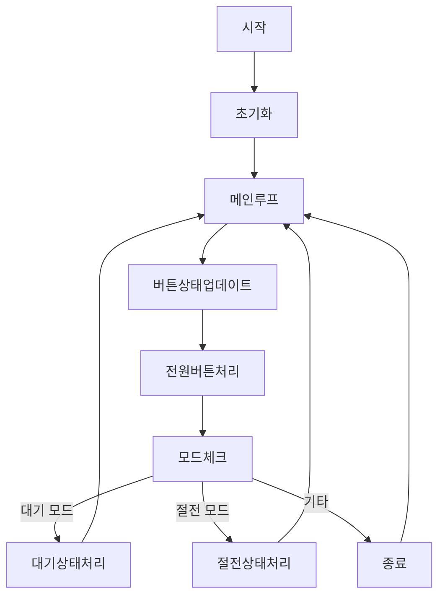

코드 리뷰 요청해주셔서 감사합니다! 아두이노 초보자가 보기에 적합한지 함께 살펴보겠습니다.

전체적으로 코드는 깔끔하고 구조적으로 잘 작성되어 있어요. 특히 주석을 통해 각 부분의 역할과 기능을 상세하게 설명해주셔서 초보자들이 이해하기 좋을 것 같아요. 하지만 몇 가지 개선하면 더 쉽게 접근할 수 있을 것 같아 몇 가지 제안드릴게요.

---

### **1. 주석의 일관성 유지**

코드 상단에 여러 개의 주석 블록이 있는데요, 이를 하나의 주석 블록으로 통합하거나 명확하게 구분하면 가독성이 더 좋아질 거예요. 예를 들어:

```cpp
/*
  제품 사용 설명서:

  1. 전원 플러그를 콘센트에 꽂아 주십시오.
     - 알람음과 함께 화면이 점등된 후 절전 모드로 진입합니다.
     - 절전 모드에서는 [전원], [정지/잠금] 버튼만 동작합니다.

  2. 절전 모드에서 [전원] 버튼을 1초 이상 누르면 대기 상태로 전환됩니다.
     - 각 화구의 화력 단계가 "0"으로 표시되며, 음성 LED가 점등됩니다.
     - 음성 기능이 OFF로 설정되어 있으면 음성 LED는 소등됩니다.
     - 대기 상태에서 각 화구 및 기능을 조작할 수 있습니다.
*/

/*
  구성품:

  1. Arduino Uno 보드
  2. TM1627 모듈 7-세그먼트 4-디지트 디스플레이 2개
     - 시간 표시: DIO 4번, CLK 5번 핀
     - 인덕션 화구 표시: DIO 10번, CLK 11번 핀
  3. 버튼 4개 (전원, 정지/잠금, 알람/펜, 추가 기능)
  4. LED (음성 표시용)
  5. 저항 및 배선
*/

/*
  시뮬레이터 링크:

  - 1차 시뮬레이터: https://wokwi.com/projects/422503314596768769
  - 2차 시뮬레이터: https://wokwi.com/projects/422637449959118849
*/
```

이렇게 하면 정보가 한눈에 들어와서 초보자들이 쉽게 이해할 수 있을 거예요.

---

### **2. 변수와 함수의 명명 규칙 통일**

변수 이름과 함수 이름을 직관적으로 짓는 것은 코드를 이해하는 데 큰 도움이 됩니다. 예를 들어, `powerPlusButtonPin`보다는 `increaseButtonPin`이나 `upButtonPin`처럼 기능을 바로 알 수 있는 이름을 사용하는 것이 좋아요.

또한, 함수 이름도 동사 형태로 시작하면 좋습니다. `powerButtonLongPressed()` 대신 `handlePowerButtonLongPress()`처럼요.

---

### **3. 불필요한 주석 및 코드 정리**

주석 처리된 디버깅 코드나 사용하지 않는 변수들은 제거하면 코드를 더 깔끔하게 만들 수 있어요.

```cpp
// 시간 관련 변수 (나중에)

// 인덕션 화구 관련 변수  (나중에)

// nothing
// Serial.println("DEFAULT");
```

위와 같은 코드는 현재 사용하지 않으니 정리하면 좋을 것 같아요.

---

### **4. 기능별 코드 블록 구분**

각 기능별로 코드 블록을 구분하고 주석을 달아주면 초보자들이 코드 흐름을 따라가기가 쉬워집니다.

```cpp
// ------- 초기 설정 ------- //
void setup() {
  // 초기화 코드...
}

// ------- 메인 루프 ------- //
void loop() {
  // 메인 루프 코드...
}

// ------- 전원 버튼 처리 함수 ------- //
void handlePowerButtonLongPress() {
  // 전원 버튼 길게 누름 처리...
}
```

---

### **5. 시각적인 흐름도 제공**

이미 Mermaid를 사용하여 흐름도를 작성하셨는데요, 초보자들에게는 이런 시각적인 자료가 큰 도움이 됩니다. 흐름도를 조금 더 자세히 보강하면 어떨까요?



이렇게 하면 코드의 전체적인 흐름을 한눈에 파악할 수 있어요.

---

### **6. 회로도 제공**

초보자들에게 가장 어려운 부분 중 하나가 바로 회로 연결이죠. 구성품 리스트와 함께 각 부품이 어떻게 연결되는지 회로도를 제공하면 더 좋을 것 같아요. Fritzing과 같은 툴을 사용하여 회로도를 만들어보세요.

---

### **7. 추가적인 학습 자료 제안**

- **디버깅 방법**: `Serial.println()`을 활용하여 변수의 값이나 프로그램의 흐름을 확인하는 방법을 소개하면 초보자들이 문제를 해결하는 데 큰 도움이 됩니다.

- **모듈 추가 활용**: LED나 버튼 외에도 다양한 센서나 액추에이터를 활용하여 프로젝트를 확장해보는 것을 추천드립니다.

---

### **마무리**

전체적으로 아주 잘 작성된 코드입니다! 초보자들이 이 코드를 통해 아두이노 프로젝트를 이해하고 따라할 수 있을 거예요. 조금만 더 다듬으면 더욱 완성도 높은 교육 자료가 될 것 같습니다.

혹시 더 궁금한 점이나 도움이 필요한 부분이 있으시면 언제든지 말씀해주세요. 앞으로도 흥미로운 프로젝트 많이 진행하시길 바라요!

---

**추가로**, 아두이노를 처음 접하는 분들이라면 다음과 같은 주제들도 관심을 가질 수 있을 것 같아요:

- **아두이노의 기본 구조와 작동 원리**
- **디지털 입력과 출력의 개념**
- **라이브러리 활용 방법**
- **프로젝트를 체계적으로 관리하는 방법**

이를 통해 더 깊이 있는 학습이 가능할 거예요. 응원합니다!